[toc]

# 云计算基本概念——第一次课

## 云计算的产生和发展

### 重点小结

1. 体现了云计算需求并导致其形成的主要商业驱动力：容量规划、降低成本和组织灵活性。
2. 影响并启发了云计算关键特征的主要技术创新：集群技术、网格计算和传统虚拟化技术

### 云计算的特点	

利用云计算技术，可以管理、调度、整合、优化分布在网络上的各种资源，并以统一界面为用户提供各类计算服务。

- 按需服务：云为用户提供想要的服务，用户可以按照自己的需求来获取计算资源，就像现实生活中使用自来水、煤气、电力资源一样。

- 通用性：云计算并不是一种特定的计算方式，可以在云端支持下衍生出千变万化的应用，且适用范围广。

- 超大规模计算能力：现在各大云计算提供商为用户提供了非常多且强大的云服务器，这些云服务器赋予用户前所未有的计算能力。

- 实时在线：云支持在任何位置、使用各种终端来获取实时服务，请求的资源来源于云而不是固定的有形实体。

- 高可靠性：绝大部分云计算提供商采用了多副本容错、计算节点同构可互换等措施来保障服务可靠性，使用户计算、数据更加可靠。

- 虚拟化：虚拟化云计算支持用户在任意位置、使用各种终端获取应用服务。

- 低成本：由于云的特殊容错措施可以采用极其廉价的节点来构成云，云的自动化集中式管理使大量企业无需负担日益高昂的数据中心管理成本，云的通用性使资源的利用率较之传统系统大幅提升，因此用户可以充分享受云的低成本优势。

### 云计算的定义

- Gartner公司：一种计算方式，能通过Internet技术将可扩展的和弹性的IT能力作为服务交付给外部用户。

- Forrester Research公司：一种标准化的IT性能（服务、软件或者基础设施），以按使用付费和自主服务方式，通过Internet技术进行交付。

- 美国国家标准与技术研究院（NIST）：云计算是一种模型，可以实现随时随地、便捷的、按需的从可配置计算资源共享池中获取所需的资源（例如，网络、服务器、存储、应用程序及服务），资源可以快速供给和释放，使管理的工作量和服务提供者的介入降低至最少。这种云模型由五个基本特征、三种服务模型和四种部署模型构成。

- **本课程：云计算是分布式计算的一种特殊形式，它引入效用模型来远程供给可扩展和可测量的资源。**

## 云计算的基础知识

### 云计算的概念

1. 用户视角：关心云提供的服务
   1. 云平台提供硬件服务，软件服务，数据资源服务以及可配置的平台服务
   2. 用户操作简单，付费后即可使用
2. 云计算提供商视角：解决三个实质的问题
   1. 大规模问题
   2. 低成本问题
   3. 服务运营问题
3. 从平台技术角度：多种技术的聚集
   1. 计算角度：内部互联的物理服务器组成的并行和分布式计算系统
   2. 服务角度：通过互联网提欧共弹性的硬件，软件和数据服务
   3. 存储角度：将信息永久的存储在云上的服务器中
   4. 配置角度：本质是一个对虚拟化的计算和存储资源池进行动态部署

### 基本术语

1. IT资源：指一个与IT相关的物理或虚拟的事物，可以是软件也可以是硬件
2. 企业内部的：指不基于云的可控的IT环境内部的
3. 云用户：使用基于云的IT资源的一方
4. 云提供者：提供基于云的IT资源的一方。
5. 可扩展性：指IT资源可以处理增加或减少的使用需求的能力。
   1. 水平扩展(horizontal scaling)：指分配和释放IT资源，其中分配资源称为向外扩展(scaling out)，释放资源称为向内扩展(scaling in)。
   2. 垂直扩展(vertical scaling)：指现有IT资源被具有更大或更小容量的资源代替，分别称为向上(scaling up)扩展和向下(scaling down)扩展。
6. 云服务(cloud service)：指任何可以通过云远程访问的IT资源
7. 云服务用户(cloud service consumer)：是一个临时的运行时角色，由访问云服务的软件程序承担。

## 目标与收益

### 重点小结

属于云计算收益的是：

1. 降低成本
2. 提高扩展性
3. 提高可靠性和可用性

## 风险与挑战

### 重点小结

属于云计算特有风险的有：

1. 云环境会引入不同的安全挑战，其中的一些与信任边界重叠有关，这些重叠是由于多个云用户共享一个云提供者的IT资源造成的。
2. 根据云提供者在其平台上提供的控制，云用户的运营控制受限于云环境。
3. 云的私有特征可能会抑制云IT资源的移植。
4. 当数据和IT资源被第三方云提供者处理时，其地理位置可能会在云用户控制之外，这可能会引起各种法律和法规问题。

# 云计算基本概念和模型——第二次课

## 重点小结

1. 与基于云的交互和关系相关的常见角色包括云提供者、云用户、云服务拥有者和云资源管理者。（云公司法人，云公司客户，云使用者都不是云角色）
2. 组织边界代表着一个组织拥有和管理的IT资源的物理范围。
3. 信任边界是逻辑范围，包括一个组织信任的IT资源。

## 角色和边界

#### 角色

1. 云提供者(cloud provider)：提供基于云的IT资源的组织机构
2. 云用户(cloud consumer)：是组织机构或人，他们与云提供者签订正式合同或者约定，使用云提供者提供的可用的IT资源。
3. 云服务拥有者(cloud service owner)：在法律上拥有云服务的个人或组织。
4. 云资源管理者(cloud resource administrator)：负责管理基于云的IT资源（包括云服务）的人或组织。

云服务拥有者可以是云用户，也可以是拥有该云服务所在云的云提供者。

#### 边界

1. 组织边界(organizational boundary)：是一个物理范围，指由一家组织拥有和管理的IT资源集合。

2. 信任边界(trust boundary)：是一个逻辑范围，通常会跨越物理边界，表明IT资源受信任的程度。

## 云特性

1. 按需使用:云用户能够通过自主服务来使用所需的基于云的服务，而无需与云提供者交互。这一特性与可测量的使用有关者
2. 可测量的使用:表示的是云对其IT资源使用进行测量的能力。
3. 泛在接入:即随处访问，允许基于云的服务能够被各种云服务用户访问，
4. 多租户指一个IT资源的一个实例可以同时透明的服务多个云用户的能力。
5. 弹性特性表示云能够透明的和自动的扩展IT资源。
6. 可恢复性与云内在的故障转移特性相关。

## 云交付模型

## 重点小结

1. IaaS云交付模型向云用户提供对基于“原始的”基础设施IT资源的高等级管理控制。

2. PaaS云交付模型使得云提供者可以提供预先配置好的环境，云用户可以使用这个环境来构建和部署云服务和解决方案，不过管理控制权有所下降。(**==例如轻量化网站托管服务==**)

3. SaaS是共享云服务的交付模型，这些共享云服务可以是云承载的商业产品。（**==例如百度网盘==**）

IaaS、PaaS和SaaS可以有不同的组合，取决于云用户和云提供者如何选择利用三种基本的云交付模型建立起自然的层次结构。

### 基本概念

云交付模型(cloud delivery model)：是云提供者提供的具体的、事先打包好的IT资源组合，公认的和被形式化描述了的三种常见云交付模型是：

1. 基础设施即服务(IaaS)：基础设施可以包括硬件、网络、连通性、操作系统、以及其他一些原始的IT资源，这些资源是虚拟化的并打包成包，使得运行时扩展和定制基础设施变的简单。

2. 平台即服务(PaaS)：是预先定义好的就绪可用(ready-to-use)的环境，一般由已经部署好和配置好的IT资源组成

3. 软件即服务(SaaS)：把软件程序定位成共享的云服务，作为“产品”或通用工具进行提供。

## 云部署模型

### 重点小结

1. 公有云是第三方所有的（**==不是多个组织共有==**），通常向云用户提供商业化的云服务和IT资源。

2. 私有云是仅被==**一家组织拥有**==的，并且位于该组织范围内的云。

3. 社区云一般只能被一组共享拥有权和责任的云用户访问。

4. 混合云是两种或多种云部署模型的组合。由两个或者更多不同部署模型组成的云环境，如云用户把敏感信息部署在私有云，非敏感信息部署在公有云。

# 云使能技术——第三次课

## 宽带网络和Internet架构

### 重点小结

1. 云用户和云提供者通常利用Internet进行通信，Internet以无中心的供给和管理模型为基础，不受任何集中式实体的控制。
2. 网络互联架构的主要组件是使用网络路由器和交换机的无连接分组交换与基于路由器的互联。网络带宽和延迟是影响QoS的因素，而网络拥塞对其有巨大影响。

## 数据中心技术

### 重点小结

1. 数据中心是专门的IT基础设施，用于集中存放IT资源，如服务器、数据库和软件系统。

2. 数据中心的IT硬件通常由标准商用服务器构成，其具有增强的计算能力和存储容量
   1. 存储系统技术包括了磁盘阵列和存储虚拟化（**==磁盘阵列，I/O高速缓存，热插拔硬盘==**）
   2. 增加存储容量的技术包括DAS(Direct Attached Storage，直接连接存储，只用于一台主机服务器)、SAN和NAS。

3. 计算硬件技术包括机架式服务器阵列和多核CPU架构。专用的高容量网络硬件和技术(如内容感知的路由、==**LAN和SAN光网络及NAS网关**==等，==**没有NASA**==)可以提高网络互联性。

### 存储硬件

1. 硬盘阵列(hard disk array)
2. I/O高速缓存(I/O caching)
3. 热插拔硬盘(hot-swappable hard disk)
4. 存储虚拟化(storage virtualization)
5. 快速数据复制机制(fast data replication mechanism)

## 网络硬件

1. 运营商和外网互联
2. Web层负载均衡和加速
3. LAN光网络
4. SAN(storage area networking)光网络
5. NAS(网络存储器)网关

# 第四次课——基本云安全

## 基本术语和概念

### 重点小结

1. **保密性、完整性、可用性、真实性、不可抵赖性、可问责性**是与衡量安全性相关联的特性。

2. **威胁、漏洞、风险**是与衡量和评估不安全性或安全性缺乏相关联的。

3. **安全控制、机制、策略**是与建立支持改进安全性的对策和保护措施相关联的。

### 术语和概念

1. 脆弱性：系统在设计、实现、操作或管理中的缺陷或弱点，可被攻击者利用以至于给系统造成损失或危害。比如软硬件漏洞，访问权限设置缺陷等
2. 威胁：存在于环境、能力、行动或事件中可能会破坏安全并造成伤害的安全隐患，也就是说，威胁可能利用脆弱性并造成损失。比如勒索软件、蠕虫等恶意程序为有意威胁，地震、洪涝灾害为自然威胁，误操作为无意威胁等。

1. 威胁：指潜在的安全性违反，可能试图破坏隐私并/或导致危害，以此挑战防护。
2. 漏洞：是一种可能被利用的弱点，可能是因为安全控制保护不够，也可能是因为攻击击败了现有的安全控制。
3. 风险：指执行一个行为带来损失或危害的可能性
4. 安全需求
   1. 三个基本安全需求：保密性，完整性，可用性
   2. 一些延伸的安全需求：真实性，不可抵赖性，可问责性。
5. 保密性：指事物只有被授权才能访问的特性。
   1. 云环境中的保密性，主要是关于对传输和存储的数据进行访问限制的。
   2. 互联网语义下的保密性主要指计算机存储数据的保密性以及计算机之间通信数据（请求和响应）的保密性。
   3. 防御方法：加密解密算法
6. 完整性：指未被未授权方篡改的特性。
   1. 数据完整性：信息在存储或传输的过程中保持未经授权不能篡改的特性。
   2. 系统完整性：确保系统免于未经授权的操作，预期功能不受损害，也可理解为系统的可靠正确地实现功能。
   3. 云计算语义下：能否向云用户保证：传送到云服务的数据和云服务接收到的数据完全一致
   4. 互联网语义下：个人计算机与服务器存储的数据的完整性、计算机之间通信数据（请求和响应）的完整性、网络、服务器的系统完整性
7. 可用性：指特定时间段内可以访问和可以使用的特性
   1. 云计算语义下，是云提供者和云运营商共同的责任。当基于云的解决方案扩展到云服务用户时，可用性也是云用户的责任。
   2. 互联网语义下指数据可用性，业务可用性（提供数据服务，本质上也是数据可用性）。
8. 真实性：指事务是由经过授权的源提供的特性 or 能够识别/实体认证及确定数据来源
   1.  云计算语义下指不可否认性，即一方不能否认或质疑一次交互的真实性。真实性提供了一种证明，证明这些交互是否是唯一链接到一个经过授权的源的，这意味着系统需要验证用户或设备的身份，该验证过程称为“认证”。（例如：在收到一个不可否认的文件后，如果不产生一条对此访问的记录，那么用户就不能访问该文件。）
   2. 互联网语义下主要聚焦用户认证
   3. 防御方法：密码方案，数字签名，Hash函数，消息认证码，质询-响应协议
9. 可问责性(Accountability)：不能声称自己没有发送消息
   1. 指对特定行为能唯一地跟踪到行为主体，是一项综合的安全需求。
   2. 系统的绝对安全是一个不可达到的目标，因此需要将破坏安全的行为追溯到责任方，以便于后续的责任追溯以及纠纷解除。
   3. 可问责性支持不可抵赖性，同时可以产生对破坏安全属性行为的威慑，帮助故障排除，入侵检测与防御，事后恢复等。
10. 安全控制：用来预防或响应安全威胁，以及降低或避免风险的对策。
    1. 安全对策包括一组规则和行为，指定如何实现一个系统、服务或安全规划，尽最大可能保护敏感和关键的IT资源。**保持信息的保密性、完整性和可用性。**
11. 安全机制：对策通常以安全机制的形式来描述，
    1. 安全机制是构成保护IT资源、信息和服务的防御框架的组成部分
    2. 例如：数据加密机制。
12. 安全策略：建立了一套安全规则和规章。

### 补充

#### 造成IT资源漏洞的原因

配置缺陷、安全策略弱点、用户错误、硬件或者固件缺陷、软件漏洞、安全架构薄弱等等

#### 风险度量

风险一般由它的威胁等级和可能/已知的漏洞数量来衡量。

#### 确定IT资源风险的标准

威胁利用IT资源中漏洞的概率

如果IT资源被损害，预期会造成的损失。

#### **机密性和完整性有什么不同**

## 威胁作用者

### 重点小结

1. 匿名攻击者是不被信任的威胁作用者，通常试图从云边界的外部进行攻击

2. 恶意服务作用者截取网络通信，试图恶意地使用或篡改数据。

3. 授信的攻击者是经过授权的云服务用户，具有合法的证书，他们会使用这些证书来访问基于云的IT资源或攻击其他资源。

4. 恶意的内部人员是试图滥用对云资源范围的访问特权的人。

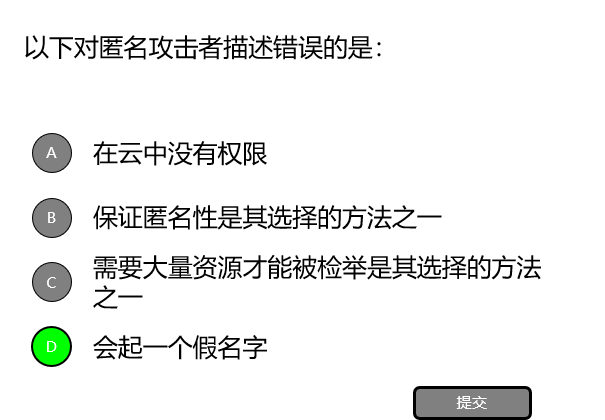

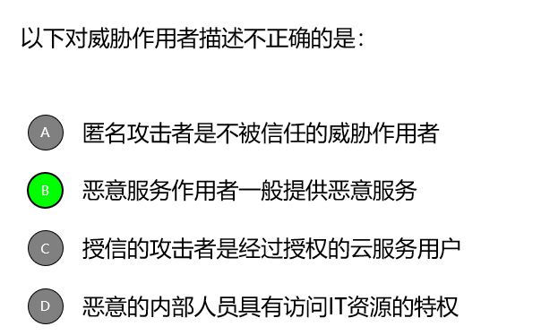

### 角色

1. 威胁作用者(threat agent)：是引发威胁的实体，因为它能够实施攻击。
2. 匿名攻击者(anonymous attacker)：是云中**没有权限**、**不被信任**的云服务用户。（不是起一个假名字）
   1. 通常是一个外部软件程序，通过公网发动网络攻击。
   2. 特点：往往诉诸绕过用户账号或窃取用户证书的手段，同时使用能确保匿名性或需要大量资源才能被检举的方法。
3. 恶意服务实施者(malicious service agent)：能截取并转发云内的网络流量。（不是提供恶意服务）
   1. 通常是带有被损害的或恶意逻辑的服务代理（或伪装成服务代理的程序）
   2. 也可能是能够远程截取并破坏消息内容的外部程序
4. 授信的攻击者(trusted attacker)：又称恶意租户(malicious tenant)，与同一云环境中的云用户共享IT资源，试图利用合法的证书来把云提供者、以及与他们共享IT资源的云租户作为攻击目标。
   1. **特点：滥用合法证书、挪用敏感和保密信息**
   2. 常见攻击方式：非法入侵认证薄弱的进程、破解加密、往电子邮件账号发送垃圾邮件、发起拒绝服务
5. 恶意的内部人员(malicious insider)：是人为的威胁作用者，他们的行为代表云提供者，或者与之有关
   1. 通常是现任或前任雇员，或是能够访问云提供者资源范围的第三方
   2. 会带来**极大的破坏可能性**，因为恶意的内部人员可能拥有访问云用户IT资源的管理特权。

## 云安全威胁

### 重点小结

1. **流量窃听**和**恶意媒介**攻击通常是由截取网络流量的恶意服务作用者实施的

2. **拒绝服务攻击**的发生是当目标IT资源由于请求过多而**负载过重**，这些请求意在使IT资源性能陷入瘫痪或不可用。
3. **授权不足攻击**是指错误的授予了攻击者访问权限或是授权太宽泛，或是使用了弱密码。

3. 虚拟化攻击利用的是虚拟化环境的漏洞，获得了对底层物理硬件未被授权的访问。
4. 重叠的信任边界**潜藏了一种威胁**，攻击者可以利用多个云用户共享的、基于云的IT资源。

### 流量窃听(traffic eavesdropping)

1. 指当数据在传输到云中或在云内部传输时（通常是从云用户到云提供者），被==**恶意的服务作用者**==被动地截获，用于非法的信息收集，破坏保密性。

2. 由于这种攻击被动的性质，其更容易长时间进行而不被发现。
3. 特点：==**被动**==截取通信流量的攻击

### 恶意媒介(malicious intermediate)

1. 是指消息被恶意服务作用者截获并篡改，因此可能会破坏消息的==**保密性和完整性**==。
2. 它还有可能在把消息转发到目的地**==之前==**插入有害数据

### 拒绝服务(DoS)

攻击的目标是使IT资源过载至无法正确运行，发起形式包括：

1. 云服务上的负载由于伪造的消息或重复的通信请求不正常的增加。

2. 网络流量过载，降低了响应性，性能下降。

3. 发出多个云服务请求，每个请求都设计成消耗过量的内存和处理资源。
4. 能导致不具有权限的底层IT资源异常（包括非法访问和运行异常）

### 授权不足

1. 是指错误的授予了攻击者访问权限，或是授权太宽泛，导致攻击者能够访问本应该受到保护的IT资源。

2. 这种攻击的一种变种称为弱认证(weak authentication)，如果用弱密码或共享账户来保护IT资源，就可能导致这种攻击。

### 虚拟化攻击(Virtualization attack)

利用虚拟化平台的漏洞来危害虚拟化平台的保密性、完整性和可用性。

### 信任边界重叠

如果云中的物理IT资源是由不同的云服务共享的，那么这些云服务用户的信任边界是重叠的。恶意的云服务用户可以把目标设定为共享的IT资源，意图损害其他共享同样信任边界的云服务用户或IT资源。

## 云安全中的其他考量

### 重点小结

1. 云用户需要意识到，部署有缺陷的基于云的解决方案，可能会引入安全风险。
2. 在选择云提供厂商时，理解云提供者如何定义和强加所有权，以及可能的不兼容的云安全策略，是形成评估标准的关键部分。

3. 在云用户和云提供者签署的法律协议中，需要明确定义和相互理解对潜在的安全泄露的责任、免责和问责。
4. 对于云用户来说，在理解具体针对某个特定云环境的安全相关的可能问题之后，对识别出的风险进行相应的评估是很重要的。

### 第四章作业

1. 列举威胁作用者有哪些，并简要说明。

2. 列举云安全威胁有哪些，并简要说明。

### 有缺陷的实现

1. 云服务部署不合规范的设计、实现或配置会有不利的后果，而不仅仅是运行时的异常和失效。

2. 云提供者的软件或硬件有内在的安全缺陷或操作弱点，攻击者便会利用这些漏洞来损害云提供者的IT资源和由托管给云提供者的云用户的IT资源的完整性、保密性和可用性。

### 安全策略不一致

1. 当云用户把IT资源放到公有云提供者那里时，就需要接受云提供者提供的信息安全方法，其与传统方法可能不完全相同，甚至不相似。

2. 有些公有云中，其他第三方（如安全代理和证书授权方）可能会引入他们自己不同的安全策略和措施。

### 合约

1. 云用户需要很小心的检查云提供者提出的合约和SLA，确保涉及资产安全的策略和其它相关保障令人满意。

2. 需要有明确的语言指明云提供者承担的责任和 / 或云提供者可能要求的免赔等级。云提供者承担的责任越大，云用户的风险就越低。

3. 需要指明云用户和云提供者资产之间的界限在哪里。

### 风险管理

1. 风险评估(risk assessment)：分析云环境，识别出威胁可能会利用的签字的漏洞和缺陷。

2. 风险处理(risk treatment)：在风险处理阶段设计的风险减轻策略，计划如何处理在风险评估阶段发生的风险。

3. 风险控制(risk control)：风险控制阶段是与风险监控相关的，含有一个三阶段处理过程，包括调查相关事件，审阅这些事件来决定前期评估和处理的有效性，确认是否需要进行策略调整。

# 第五次课——云基础设施机制

## 重点小记

**重点概念**

- 逻辑网络边界

- 虚拟服务器机制
- 云存储机制
- 云使用监控机制
- 资源复制
- 已就绪环境

## 逻辑网络边界

1. 定义：将一个网络环境与通信网络的其他部分分割开来，形成一个虚拟网络边界，包含并隔离了一组关于云的IT资源，这些资源可能是分布式的

2. 通常由提供和控制数据中心连接的网络设备来建立，一般包括：

   - 虚拟防火墙(virtual firewall)
   - 虚拟网络(virtual private network)：VLAN，VPN

3. **作用**

   - 将云中的IT 资源与非授权用户隔离;

   - 将云中的IT 资源与非用户隔离; 

   - 将云中的IT 资源与云用户隔离; 

   - 控制被隔离IT 资源的可用带宽

   
   
   

### 虚拟防火墙

1. 定义：一种IT资源，可以主动过滤被隔离网络的流量，并控制其与Internet的交互。

2. 技术特点
   - 每个虚拟防火墙独立维护一组安全区域。
   - 每个虚拟防火墙独立维护一组资源对象(地址/地址组、服务/服务组等)。 
   -  每个虚拟防火墙独立维护自己的包过滤策略。
   -  每个虚拟防火墙独立维护自己的 ASPF策略、NAT 策略、ALG 策略。 
   - 可限制每个虚拟防火墙占用的资源数

### VPN（虚拟专用网络virtual private network）

1. 定义：虚拟专用网络(VPN)是一种通过公用网络(例如Internet)连接专用网络(例如办公 室网络)的方法

2. VPN系统的主要特点

   - 安全保障
   - 服务质量保障
   - 可扩充性和灵活性
   - 可管理性 

   

## 虚拟服务器

### 虚拟服务器的特性

1. **多实例：**一台物理机上可以运行多个虚拟服务器
2. **隔离性：**虚拟服务器可以将同一台物理服务器上的多个虚拟机完全隔离开来, 多个虚拟机之间就像多个物理机器之间一样。
3. **封装性**

### 虚拟服务器的优点

1. 实时迁移
2. 快速部署
3. 高兼容性
4. 提高资源利用率
5. 动态调动资源

## 云存储设备

1. 定义：专门为云配置所设计的存储设备。
2. 云存储等级：指数据存储的逻辑单元
   - 文件：数据集合分组存放在文件夹中的文件里。
   - 块： 存储的**最低等级**，最接近硬件，是可被独立访问数据的最小单位。
   - 数据集 ： 基于表格、以分隔符分割或以记录形式组织的数据集合。
   - 对象：将数据及相关的元数据组织为Web的资源。
3. **主要问题**>:数据的安全性、完整性和保密性。

### 网络存储接口

1. **文件**存储和**块**存储通常通过网络存储接口来访问。

2. **文件存储**需要将独立的数据存入不同的文件，当数据发生变化时，原来的文件要被生成的新文件替换。

3. **云存储设备机制**是基于文件接口时，数据搜索和抽取性能很可能不是最优的。存储水平和阈值都是由文件系统本身决定。

4. 不论是逻辑单元号（LUN）还是虚拟卷，**==块存储==**与文件集存储相比，拥有更好的性能。

### 对象存储接口

1. 各种类型的数据可以作为Web资源被引用和存储。
2. 实现这种接口的云存储设备机制通常可以通过以**https为主要协议**的REST或基于Web服务的云服务来访问。

### 数据库存储接口

#### 关系数据存储

1. 依靠表格，将相似的数据组织为行列的形式，表格之间的关系可以用于保护数据的完整性，避免冗余（规范化)

2. **基于云的关系数据库的主要挑战来自于扩展和性能**：
   - 垂直扩展比水平扩展更加复杂
   - 远程访问时，大量数据的表可能会出现更高的处理开销和延迟

**关系型数据库的存储等级为：数据集**

**关系型数据库的存储接口为：数据库存储接口**

#### 非关系数据存储

1. 采用更松散的结构存储数据，避免关系数据库带来可能的复杂性和处理成本，**可以进行更多的水平扩展。**

2. 限于有限的或原始的模式或数据模型。

3. 非关系存储倾向于不支持关系数据库的功能，如事务或连接。

4. 将规范化数据导出到非关系存储后，数据大小一般会增加。

5. 非关系数据存储机制是专有的，严重**限制了数据的可移植性**

## 云使用监控

### 监控代理

1. 一种中间的事件驱动程序，作为服务代理驻留在已有通信路径上，对数据流进行透明的监控和分析。

2. 这种类型的云使用监控通常用来**计量网络流量和消息指标**。

### 资源代理

1. 一种处理模块，通过专门的资源软件进行事件驱动的交互来收集数据。
2. 它在资源**软件级**上，监控预定义的且可观测事件的**使用指标**，比如启动、暂停、恢复和垂直扩展。

==主动监测：actively monitoring==

==资源代理：resource agent==

==日志数据库：log database==

###  轮询代理

1. 一种处理模块，通过**轮询**IT资源来收集云服务使用数据。

2. 通常被用于**周期性**地监控IT资源状态，比如正常运行时间与停机时间。

## 资源复制

在需要加强IT资源的可用性和性能时，使用资源复制技术对同一个IT资源创建多个实例

## 已就绪环境

1. 已就绪环境机制**PaaS**云交付模型定义的组件，它代表的是预定义的基于云的平台。
2. 该平台有一组已安装的IT资源（如数据库，中间件，开发工具）组成，可以被云用户使用和定制。
3. 使用这些环境在云内远程开发和配置自身的服务与应用程序。

# 第六次课——虚拟化

## 虚拟化技术概述

### 定义

1. 虚拟化(Virtualization)是计算机资源的逻辑表示，主要目的是使上层计算或应用与下层的资源或管理解耦，把底层资源抽象成另一种形式的资源，从而提供给上层使用和分享。

2. 虚拟机监视器(Virtual Machine Monitor)为软件和硬件的复制提供必要的机制。

3. 虚拟机本质上是一套软件系统，它和物理机(Physical Machine)可形成对应。对虚拟机来说，也存在虚拟处理器、虚拟存储、虚拟网络的概念，其中处理器（计算）虚拟化的实现最为关键。

### 经典虚拟机

#### 经典虚拟机的实现方式

经典虚拟机的实现方式主要采取宿主型(Hosted VM)，即虚拟化软件直接安装在宿主机的OS中，虚拟内存、磁盘、I/O设备的状态都被封装成专用的文件保存在宿主机上。

#### 经典虚拟机的特点

1. 多态(Polymorphism)：支持多种类型的OS。

2. 重用(Manifolding)：虚拟机的镜像可以被反复复制和使用。

3. 复用(Multiplexing)：虚拟机能够对物理资源时分复用。

## 虚拟机核心原理和技术

### 系统接口

1. 计算机系统的组建离不开各式各样的接口，接口将两个不同的对象环境联系起来，使之得以协调运行。

####  指令集架构(ISA）

2. **最基本的接口**是微处理器指令集架构(Instruction Set Architecture, ISA)。
3. 应用程序一般不是借助于ISA直接运行在硬件平台之上的，多个软件应用一般也不完全隔离运行，它们共同运行在某个OS之上，并共享其服务。

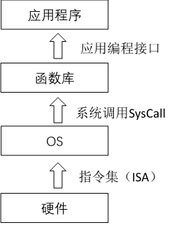

#### 应用程序二进制接口(ABI）

应用程序二进制接口(Application Binary Interface, ABI)给程序提供使用硬件资源和系统服务的接口，ABI包括所有用户指令和部分系统调用接口，应用程序和OS与硬件的交互都通过ISA接口完成，而应用程序与关键硬件资源的交互是**间接**的，需要OS通过系统调用方式实现。

#### 应用程序接口(API)

1. 应用程序接口(Application Programming Interface, API)通常由某种**高层次语言定义**，其关键元素是一个能够由应用程序调用来触发多种服务的系统标准库。
2. 一般来说，API的功能往往涉及一个或多个ABI层面的OS调用

#### 系统接口—从不同角度看机器

1. 从ISA角度看，机器可以指代整个计算机**硬件架构和设备**。

2. 从ABI接口层面看，机器可以指代整个硬件设备连同其上的**OS**。

3. 从API角度看，一个完整的机器还包括了关键的库函数，需要特定程序的支持

## 运行模式

各类接口的引入对于保护多用户多程序并发运行是有极大好处的，各类应用对资源的访问是间接的，需要通过OS并借助系统调用来完成

1. 为实现这一过程，大部分系统支持至少两种操作模式：==**Kernel Mode & User Mode**==。

2. 与之对应，ISA被设计为两大类： **==User ISA & System ISA==**。

   - User ISA：指对于应用程序完全可见的指令子集。

   - System ISA：仅为具有较高监控权限的系统（如OS）可见

### 虚拟机的分类

从某一接口出发，通过为底层机器配置一个耦合的软件而形成的、具有新的虚拟接口的系统，就是一个虚拟机。在这个虚拟机之上，原始上层软件可以无缝的运行。

#### 进程级虚拟机(Process VM)

是基于**操作系统**的VM，是应用程序二进制接口ABI层面设立的虚拟机，虚拟化软件需要为用户程序模拟所需要的主机硬件功能。

#### 系统级虚拟机(System VM)

是基于**硬件**的VM，是ISA层面设立的虚拟机，虚拟化软件设置在硬件设备和软件系统之间。

## Xen虚拟机技术

# 第七次课——Docker

## 重点小记

1. Docker镜像是==**只读的**==
2. Docker的两个基本部件是Docker engine 和Docker Hub

3. 虚拟机和容器技术的区别是

4. 容器技术属于**==操作系统==**级别的虚拟机

## 操作系统级虚拟化

定义：操作系统级虚拟化(Operating System Level Virtualization)：是一种虚拟技术，能够实现多个相互隔离的实例共享一个操作系统内核。

### 容器的概念

1. 包含相应应用程序组件的服务实例即为容器(Container)

2. 在一个容器中运行的程序无法看到容器外的程序进程，包括那些直接运行在宿主机(host)上的应用和其它容器中的应用。

3. 对一个应用程序而言，容器往往容纳了该程序运行所需要的全部文件，它可能包含自己的库、自己的/boot目录、/usr目录、/home目录等。然而，如果需要的话，运行中的容器甚至可能仅包含一个文件，比如运行一个不依赖任何文件的二进制程序。

### 与VM虚拟化的对比

1. VM虚拟化是虚拟化整个计算机
2. 容器虚拟化是虚拟化操作系统。

## Docker

1. Docker是一个工具，能帮助我们方便的创建、运行、部署软件。

2. Docker允许我们将一个软件和其依赖(运行环境)打包成一个单独的库，更利于移植可运行的软件。

#### 镜像

1. Docker镜像是一个构建容器的只读模板，提供了容器应用打包的标准格式，容器即为一个通过Docker镜像创建的运行时实例。

2. Docker 镜像包含Dockerfile、依赖和程序的代码

3. Dockerfile中包含一系列的指令用来创建Docker Image

4. 当启动一个容器时，Docker会在镜像栈的顶部增加一个新的、薄的读写层，这一层即“容器层”。当前运行容器的所有操作（比如写新文件、修改现有文件、删除文件）都写到这一读写层中。当这一容器被删除时，其读写层也被删除，而底层的镜像保持原状，而重新利用该镜像创建的应用也不保留此前的更改。这种只读层结合顶部读写层的组合被称为Union File System。在这样的架构下，多个容器可以安全的共享一个底层镜像。

#### 容器——镜像运行时的实体

容器是镜像运行时的实体。容器可以被创建、启动、停止、删除、暂停等 。

#### 数据卷

数据卷的提出是为了解决重要数据不能随意丢弃的问题

1. 数据卷是一个特殊设计数据访问接口，可以将其看作Docker宿主文件系统下的一个目录或文件，可直接加载到一个容器上。
2. 数据卷不受Docker存储驱动的管理，所有指向数据卷的读写操作都会绕过Union File System文件系统和存储驱动，直接以宿主机器的性能运行。
3. 当一个容器被删除时，任何存储在数据卷上的数据会在Docker宿主机器上持续保存。

#### 哈希函数

如果两个输入串的hash函数的值一样，则称这两个串是一个**碰撞**(Collision)。既然是把任意长度的字符串变成固定长度的字符串，所以必有一个输出串对应无穷多个输入串，碰撞是必然存在的。

### 容器与传统虚拟机

容器技术不是虚拟化的替代方案，它还不能取代全系统的服务器虚拟化技术

### 容器技术优缺点

#### 技术优点

1. 轻量级、易扩展：虚拟机自身是一个完备系统，拥有虚拟化的硬件和特定资源，如果每个VM有2GB容量，则10个虚拟机就需要20GB；若采用容器，因为共享其操作系统内核，因此并不会占据20GB空间。

2. 资源利用率高：虚拟机需要借助虚拟化软件层模拟硬件行为，而容器则直接运行在主机操作系统上。其启动时间也短。

3. 简化配置、提升效率：降低了硬件资源和应用环境的耦合度，并且可以给开发者提供理想的开发环境，提升开发效率。

#### 容器技术缺点

1. 安全性：容器极度依赖其主机操作系统，所以任何针对主机操作系统的攻击都会造成其安全问题。同时，主机操作系统能够看到容器中运行的一切资源。

2. 隔离型相比虚拟机差

### Docker对云的扩展

1. Docker的轻量级特性使其成为未来云计算的重要拓展方向之一——边缘计算(Edge Computing)的重要使能技术

2. 基于地理分布的边缘设备的计算方式，需要一种灵活可扩展的平台来实现应用和服务的部署。

3. 该平台应当能够部署适合小型边缘设备的轻量级可重用的服务，并且不依赖于异构硬件架构。

4. 该平台还应当能够有效的与云端进行交互，从而实现分布式大数据的边缘计算和云端存储。

5. 这一平台还应易于安装、配置、管理、升级、以及调试。

# 第八次课——云安全机制

## 重点小记

1. 用户发送的消息被监听破坏了==**保密性**==
2. 接收方和发送方对比数字签名是否一致属于保证通信机制的
3. 对称加密主要用来保证数据的**==保密性==**（加密算法都是为了保证保密性）

## 加密

明文：数据按照一种可读的格式进行编码，这种格式称为明文

加密：数据在网络上传输时，为避免未授权的恶意访问，可以使用称为加密部件 (cipher)的标准化算法，通过密钥把原始的明文数据转换为密文(ciphertext) ，这个过程称为加密(encryption)。

加密机制可以对抗：

- 流量窃听
- 恶意媒介
- 授权不足
- 信任边界重叠

### 网络通信的四个安全要素

1. 保密性
2. 完整性
3. 真实性
4. 不可抵赖性：

### 对称加密

定义：加密与解密时使用==**同一个密钥**==，这两个过程都是授权的各方用共享的密钥执行的

- 由于用一个密钥加密的消息只能用同一个密钥解密，因此拥有密钥的被授权方才能创建消息，因此保证了数据的保密性。 

- 对称加密不具备不可否认性，当有多方使用同一个密钥时，无法判断是哪一方执行的加密和解密

### 非对称加密

定义：使用两个不同的密钥，称为公钥和私钥；私钥为所有者私钥，公钥共享

1. **==私钥加密:==**只能通过对应的公钥解密，因此私钥加密提供了真实性、不可否认性和完整性保护
2. **==公钥加密:==**只能用对应的私钥进行解密，因此提供了保密性保护，但**==不提供==**完整性和真实性的保护。

## 哈希

定义：希一种单向、不可逆的数据保护机制，这种机制常见于密码的存储

- 利用哈希可以用来获得消息摘要，消息摘要附加在消息后面，用于验证消息是否发生篡改。
- 哈希可以用于保护存储数据、减轻恶意媒介和授权不足带来的云威胁，保证数 据完整性。

## 数字签名

数字签名是一种通过身份验证和不可否认性来提供数据真实性和完整性的手段。

`发送消息时，附加一个数字签名，如果消息被篡改，数字签名就会变得非法`

- 数字签名可以通过非对称加密（用私钥加密）和哈希实现。 
- 用私钥对消息摘要进行加密，附加到消息摘要后面
- 受者收到后对消息进行哈希得到一个消息摘要， 用公钥对加密后的消息摘要进行解密，如果一致则 保证了消息的==**完整性**==(解密一致则完整)

## 公钥基础设施

定义：公钥基础设施是一种管理费对称密钥办法的常用方法，是一个由协议，数据格式，规则和实施组成的系统

这个系统用来把公钥与对应私钥所有者对应起来（公钥身份识别）

## 身份与访问管理

身份与访问管理（Identity and Access Management, **==IAM==**）包括控制和追踪 用户身份以及IT资源、环境、系统访问特权的必要组件和策略。

IAM机制由四个主要部分组成：

- 认证：如用户名和密码的组合，还支持数字签名、数字证书、生物特征识别硬 件、把用户账号和注册IP或MAC地址进行绑定等。 
- 授权：授权组件定义正确的访问控制粒度，监管身份、访问控制权力和IT资源 可用性之间的关系。
- 用户管理：负责创建新的用户身份和访问组，重设密码、定义密码策略和管理 特权。
- 证书管理：建立对已定义的用户账号的身份和访问控制的规则

## 单点登录

定义（目的）：单点登录(Single Sign-On, SSO)是为了解决**==跨越多个云服务==**为云服务用户传 播认证和授权，特别是在需要大量的云服务或IT资源时的困难。

- 单点登录机制使得一个云服务用户能够被一个安全代理认证。
- 这个安全代理建立起一个安全上下文，当云用户访问其他云服务或IT资源时， 这个上下文被持久化。 – 否则，云用户需要在后续的每个请求中认证自己。
- 这个机制不直接抵抗任何云威胁，主要增强基于云的环境的访问并管理分布式 IT资源

## 基于云的安全组

定义：基于云的安全组(cloud-based security group)是不同用户和组创建各自的物 理和逻辑IT环境

##  强化的虚拟服务器映像

定义：强化是将不必要的软件从系统中剥离出来，避免了潜在的漏洞

例子：关闭不必要的端口，不使用的服务、内部根账户和宾客访问

作用： 强化的服务器映像能够帮助对抗拒绝服务、授权不足和信任边界重叠等威 胁。

# 第九次课——特殊云机制

## 自动伸缩监听器

自动伸缩监听器 （Automated scaling listener）是一个==**服务代理**==，它监控和追踪云服务用户和云服务之间的通信，用以动态伸缩。

1. 通常部署在靠近防火墙的位置，自动追踪负载状态信息
2. 负载量可以由前端请求量，也可以由请求引发的后端处理需求量决定。
3. 提供不同类型的响应：如通过预定义参数自动伸缩IT资源，或者负载超过或低于阈值时自动通知云用户。

## 负载均衡器

负载均衡器（Load balancer）机制是一个**==运行时代理==**，基本思想是把负载在更多的IT资源上做负载均衡，与单一IT资源相比，提升了性能和容量。

1. 负载均衡器可以执行一组特殊的运行时负载分配功能，包括：
   1. 非对称分配：较大的工作负载被送到具有较强处理能力的IT资源；
   2. 负载优先级：根据优先等级进行调度、排队、丢弃和分配；
   3. 上下文感知分配： 根据请求内容的指示把请求分配到不同IT资源。
2. 负载均衡的机制：
   1. 多层网络交换机
   2. 专门的硬件设备
   3. 专门的基于软件的系统
   4. 服务代理
   5. 负载均衡器通常位于产生负载的IT资源和负责执行负载IT资源之间的通信路径上。

## SLA监听器

SLA：Service-Level Agreement是服务等级协议。被用来专门观察云服务的运行时性能，确保他们履行SLA公布的QoS需求。

SLA监控器收集的数据由SLA管理系统处理并集成到SLA报告的标准中。

## 按使用付费监控器

n按使用付费监控器（Pay-per-use monitor）机制按照预先定义好的定价参数测量基于云的IT资源使用，并生成使用日志用于计算费用。主要参考：

1. 请求/响应消息数量
2. 传输的数据量
3. 带宽消耗

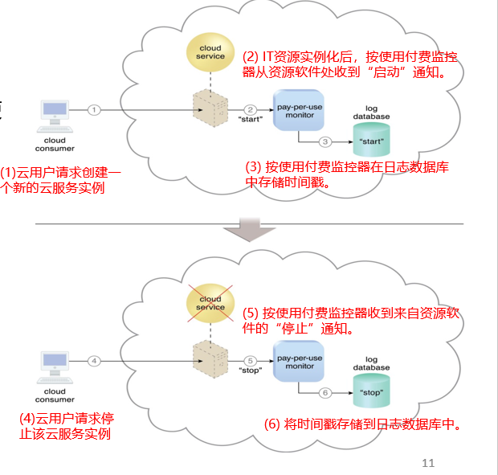

## 审计监控器

审计监控器机制（Audit monitor）用来收集网络和IT资源的审计记录数据，用以满足管理需要或合同义务。

下图审计监控器截获登录请求，在日志数据库中存储请求者的安全证书，以及成功和失败的登录尝试，以供今后审计报告之用。

## 故障转移系统

故障转移系统（Failover system）通过使用现有的集群技术==**提供冗余的实现**==来增加IT资源的可靠性和可用性。

### 两种类型

1. 主动-主动：IT资源的冗余实现会**主动地同步服务工作负载**；当发现故障时，将失效的实例从负载均衡调度器中剔除，有效的IT资源就会接管处理工作。
2. 主动-被动：待机或非活跃的实现会被激活，从不可用的IT资源处接管工作。

## 虚拟机监控器

虚拟机监控器（Hypervisor）机制是虚拟化基础设施中==**最基础**==的部分，主要用来在物理服务器上生成虚拟服务器实例。

## 资源集群

资源集群（Resource cluster）将多个分布的IT资源分为一组，使得他们能像同一个IT资源一样进行操作。这增强了集群化IT资源的组合计算能力、负载均衡能力和可用性。

### 分类——资源角度

从资源角度划分，常用资源集群类型包括：

1. 服务器集群：物理或虚拟服务器组成集群。

2. 数据库集群：用于改进数据的可用性，具有同步的特性，可以维持集群中各种存储设备上存储数据的一致性。

3. 大数据集集群：实现了数据的分区和分布，目标数据集可以有效的划分区域，而不需要破坏数据的完整性或计算的准确性。

### 分类——性能角度

从性能角度划分，资源集群的两个基本类型：

1. 负载均衡的集群：这种资源集群在集群节点中分布工作负载，既提高IT资源容量又保持资源的集中管理。

2. 高可用集群：在遇到多节点失效时，仍能维持系统的可用性，而且大多数或者所有集群的IT资源都有冗余实现。它实现一个故障转移系统机制，监控失效情况，并自动将工作负载重定向为远离故障节点。

## 多设备代理

 多设备代理（Multi-devise broker）来帮助运行时的数据转换，使得云服务能够被更广泛的云用户程序和设备所使用。可创建转化的逻辑层次包括：

1. 传输协议
2. 消息协议
3. 存储设备协议
4. 数据模式/数据模型

### 应用背景

一个云服务可能会被大量的云用户访问，他们对主机硬件设备和通信需求都不同。为了克服云服务和不同云服务用户之间的不兼容性，需要创建映射逻辑来改变运行时交换的信息。而**==多设备代理通常作为网关存在。==**

## 状态管理数据库

状态管理数据库（State management database）是一种用来暂时地保存软件程序的状态数据。软件程序可以把状态数据保存到数据库中，用以降低程序占用的运行时内存。

# 第十次课——基本云架构

## 负载分布架构

通过增加一个或多个相同的IT资源可以进行IT资源==**水平扩展**==，而提供运行中逻辑的负载均衡器能够在可用的IT资源上均匀分配工作负载。在一定程度上依靠复杂的负载均衡算法和运行时逻辑，减少IT资源的过度使用和使用率不足的情况。

负载分布常常可以用来支持分布式虚拟服务器、云存储设备和云服务

### 负载均衡分类

负载均衡可以根据网络协议的层数进行分类：二层负载均衡、三层负载均衡、 **四层负载均衡**、**七层负载均衡**

#### 二层负载均衡

1. 负载均衡服务器对外提供一个VIP（虚拟IP），集群中不同的机器采用相同IP地址，但机器的MAC地址不一样。当负载均衡服务器接受到请求之后，通过改写报文的目标MAC地址的方式将请求转发到目标机器实现负载均衡。

2. 特点： 控制粒度比较粗；负载均衡服务器**==压力小==**；吞吐量高

####  三层负载均衡

1. 负载均衡服务器对外依然提供一个VIP，但集群中不同的机器采用==**不同的IP地址**==。当负载均衡服务器接受到请求之后，根据不同的负载均衡算法，通过IP将请求转发至不同的真实服务器。
2. 特点： 控制粒度比较粗；请求响应经过负载均衡器服务器，其**==压力较大==**

#### 四层负载均衡

1. 工作在OSI模型的传输层，该层协议除了包含源IP、目标IP以外，**==还包含源端口号及目的端口号==**。四层负载均衡服务器在接受到客户端请求后，通过修改数据包的地址信息（IP+端口号）将流量转发到应用服务器。

2. 根据请求处理的模式，负载均衡方式可以分为：NAT, D-NAT, DR（Direct Routing, 直接路由模式）以及TUN隧道技术等。
3. 特点： 不理解应用层协议，请求响应经过负载均衡器服务器，其压力较大

#### 七层负载均衡

1. 基于应用层的负载均衡，可以根据请求的url进行转发负载，在四层负载的基础上，考虑应用层的特征。

2. 特点： 更灵活，控制粒度更细。

#### 例子—— Nginx

1. Nginx是一款轻量级的高性能web服务器，同时也是一款非常优秀的负载均衡器和反向代理服务器。由于它的内存占用少，启动极快，高并发能力强，在互联网项目中广泛应用。
2.  正向代理（Forward Proxy）；反向代理（Reverse Proxy）

#### 负载均衡算法——决定转发的地方

1. 负载均衡服务器在决定将请求转发到具体哪台真实服务器时，是通过负载均衡算法来实现的。

2. 负载均衡算法可以分为两类：静态和动态负载均衡算法。

- 静态负载均衡算法：轮询法、随机法、源地址哈希法、加权轮询法、键值范围法。

- 动态负载均衡算法：最少连接数、最快响应速度、观察方法、预测法等。

#### 静态负载均衡算法

1. **轮询法**：按请求顺序轮流分配。

- 优点：简单高效、易拓展

- 缺点：性能受限于木桶最短木板理论。

2. **随机法**：将请求随机分配到各个节点。

- 优缺点和轮询类似。

3. 源地址哈希法：根据客户端的IP地址，通过哈希函数计算得到一个数值，用该数值对服务器节点数进行取模，得到的结果便是要访问节点序号。

- 优点：可人为干预某客户端请求的节点。
-  缺点：无法保证高可用性，可能导致负载不均衡。

4. **加权轮询法**：根据机器的配置分配不同的权重，将请求顺序且按照权重分配到后端。

- 优点：可以将不同机器的性能问题纳入到考量范围，集群性能最优最大化

- 缺点：无法动态调整节点权重。

5. **加权随机法**：根据后端机器的配置，系统的负载分配不同的权重。
6. **键值范围法**：根据键的范围进行负债，比如0到10万的用户请求走第一个节点服务器，10万到20万的用户请求走第二个节点服务器

- 优点：容易水平拓展

- 缺点：容易负载不均、无法满足高可用性。

#### 补充——以下机制也是云架构的一部分

1. 审计监控器：分配运行时工作负载时，就满足法律和监管要求而言，处理数据的IT资源类型和地理位置可以决定监控是否是必要的。
2. 云使用监控器：各种监控器都能参与执行运行时工作负载的跟踪与数据处理。
3. 虚拟机监控器：虚拟机监控器与其托管的虚拟服务器之间的工作负载可能需要分配。
4. 逻辑网络边界：逻辑网络边界用于隔离、确定如何分布、以及在哪里分布工作负载相关的云用户网络边界。
5. 资源集群：支持不同集群节点间的负载均衡。
6. 资源复制：生成虚拟化IT资源的新实例。

## 资源池架构

1. 使用一个或多个资源池为基础，相同的IT资源由一个系统进行分组和维护，确保他们保持同步。

常见的资源池有：物理服务器池、虚拟服务器池、存储池、网络池、CPU池、内存池。

2. 资源池可以建立层次结构，形成资源池父子、兄弟和嵌套关系，从而满足不同的资源池需求。如同级的相互隔离，云用户访问各自的资源池。嵌套的可以满足组织的不同部门或不同组。

## 动态可扩展架构

1. 基于一个预先定义的可扩展条件的系统，触发条件会导致从资源池动态分配IT资源。

2. 动态扩展类型有

   - 动态水平扩展：指分配和释放IT资源，其中分配资源称为向外扩展(scaling out)，释放资源称为向内扩展(scaling in)。
   - 动态垂直扩展：垂直扩展(vertical scaling)：指现有IT资源被具有更大或更小容量的资源代替，分别称为向上(scaling up)扩展和向下(scaling down)扩展。
   - 动态重定位：将IT资源重放置到更大容量的主机上。

   

## 弹性资源容量架构

主要与虚拟服务器的动态供给相关，该架构可以分配和回收CPU与RAM资源，从而可以立即响应服务对IT资源的需求变化。

## 服务负载均衡架构

1. 是工作负载分布架构的变种，是专门针对云服务实现的。在动态工作负载上增加负载均衡系统，就创建了云服务的冗余部署。

2. 云服务实现的副本被组织为一个资源池，而负载均衡器则作为外部或内置组件，允许托管服务器自行平衡工作负载。

## 云爆发架构

1. 只要达到预先设定的容量阈值，就从企业内部的IT资源扩展或“爆发”到云中。

2. 相应的云IT资源是冗余性预部署，它们会保持非活跃状态，直到发生云爆发。

3. 当不再需要这些资源后，基于云的IT资源被释放，架构则“爆发入”企业内部，回到企业内部环境。

## 弹性磁盘供给架构

一个动态存储供给系统，确保按照云用户实际使用的存储量进行精确计费

## 冗余存储架构

引入了复制的辅云存储设备做为故障系统的一部分，它要与主运存储设备中的数据保持同步。当主设备失效时，就把请求转向辅设备。

# 第十一次课——高级云架构

1. 虚拟机监控器集群架构
2. 负载均衡的虚拟服务器实例架构
3. 不中断服务重定位架构
4. 零宕机架构
5. 云负载均衡架构
6. 资源预留架构
7. 动态故障检测和恢复架构
8. 裸机供给架构
9. 快速供给架构
10. 存储负载管理架构

## 虚拟机监控器集群架构

1. 虚拟机监控器可以负责创建和管理多个虚拟服务器，因为这种依赖关系，任何影响虚拟机监控器失效的状况，都会波及它管理的虚拟服务器。
2. 虚拟机监控器集群架构(Hypervisor clustering architecture)建立了一个跨多个物理服务器的高可用虚拟机监控器集群。如果一个虚拟监控器或底层物理服务器不可用，那么被其托管的虚拟服务器可迁移到另一物理服务器
3. 虚拟机监控器集群由中心VIM控制，VIM发送常规心跳消息来确认虚拟机监控器是否在运行。
4. 如果心跳消息未被应答，VIM将启动VM在线迁移程序，以动态地将受影响的虚拟机监控器移动到一个新的主机上。
5. **心跳**是虚拟机监控器之间、虚拟机监控器和虚拟服务器之间、虚拟机监控器和VIM之间相互交换的系统级消息

### 虚拟机监控器集群架构的核心机制

1. 虚拟机监控器

2. 资源集群机制
3. 受到集群环境保护的虚拟服务器

### 虚拟机监控器集群架构的相关机制

1. 逻辑网络边界(logical network perimeter)：确保没有其他云用户的虚拟机监控器被意外的包含到一个给定的集群。
2. 资源复制(resource replication)：同一集群中的虚拟机监控器相互告知其状态和可用性；在集群中创建或删除一个虚拟交换机之类的变化，需要通过VIM复制到所有的虚拟机监控器。

### 例子

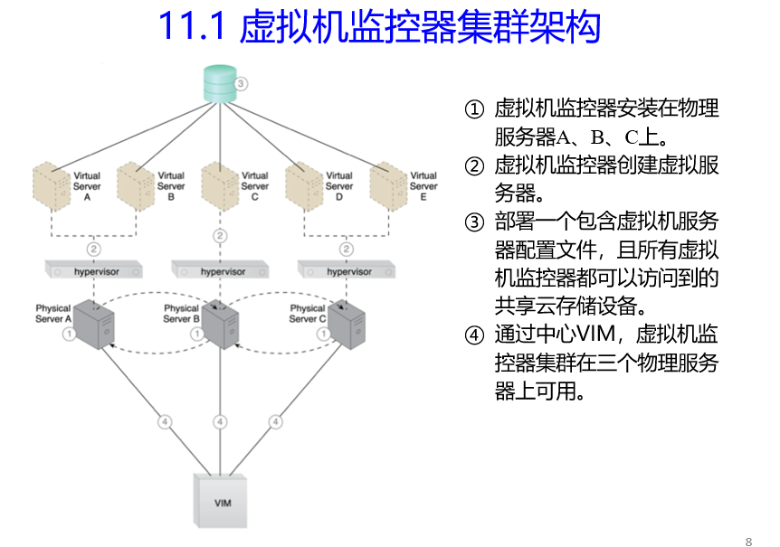

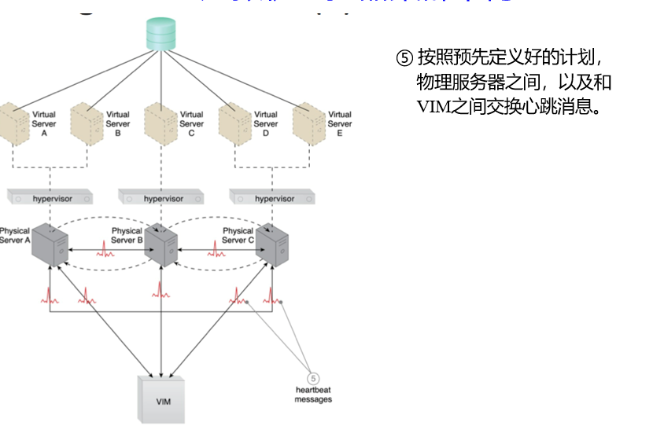

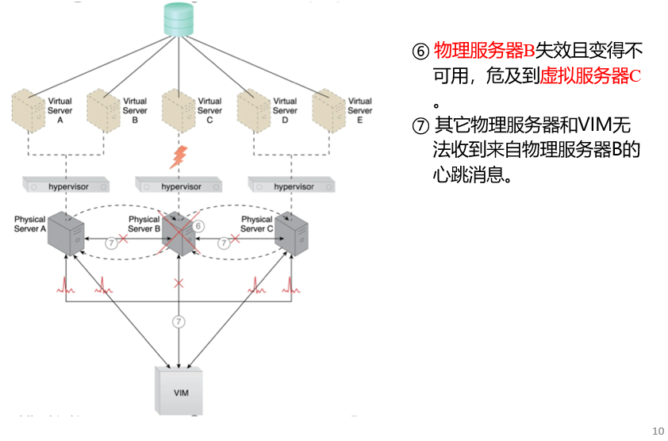

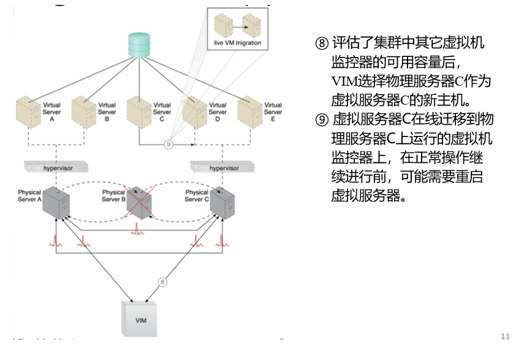

## 负载均衡的虚拟服务器实例架构

1. 物理服务器的运行和管理是相互隔离的，使得在物理服务器之间保持负载均衡变得困难。
2. 负载均衡的虚拟服务器实例架构(load balanced virtual server instances architecture)：建立了一个容量看门狗系统(capacity watchdog system)，会动态计算虚拟服务器实例及其相关工作负载，然后再均衡的分配负载到物理服务器。

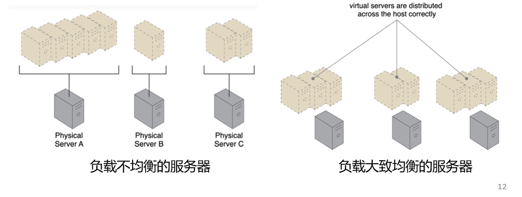

### 容量看门狗系统组成：

1. 容量看门狗监控器：追踪物理和虚拟服务器的使用，并向容量计划器报告任何明显的波动。

2. 容量计划器：负责动态的计算和比较物理服务器的计算能力，以及虚拟服务器的容量要求；如果容量计划器决定把一个虚拟服务器迁移到另一台主机上以分散工作负载，则发信号给VM在线迁移程序。
3. VM在线迁移程序：移动虚拟服务器。

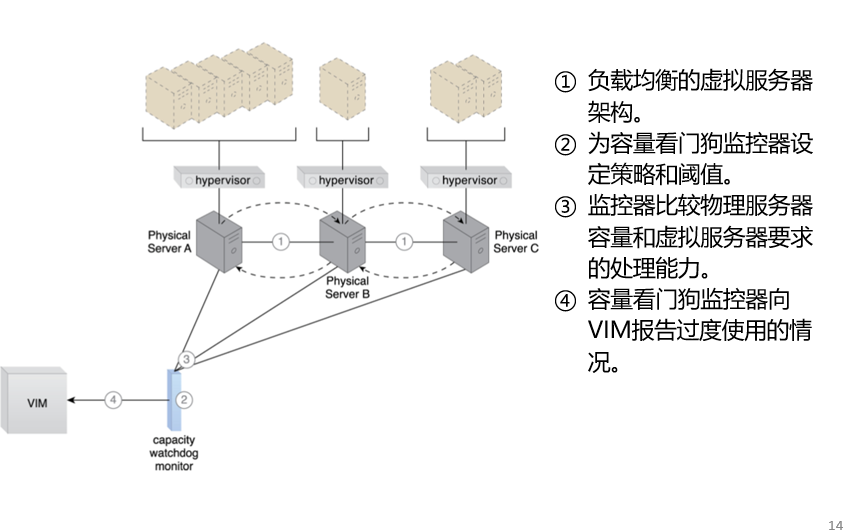

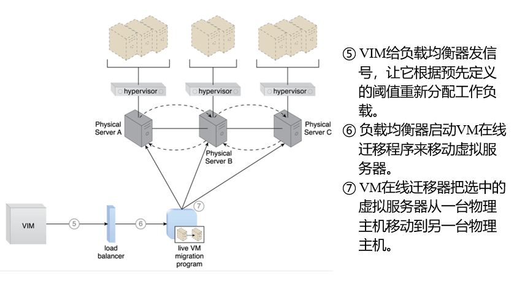

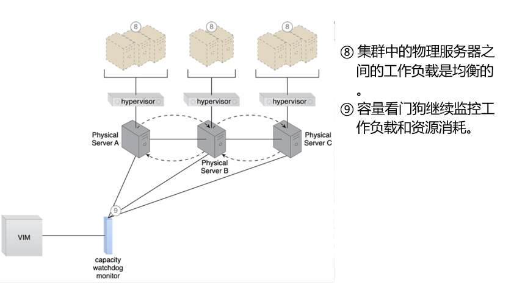

## 负载均衡的虚拟服务器实例架构相关机制：

1. 自动伸缩监听器(automated scaling listener)：可以用来启动负载均衡的过程，通过虚拟机监控器动态的监控进入每个虚拟服务器的工作负载。
2. 负载均衡器(load balancer)：负责在虚拟机监控器之间分配虚拟服务器的工作负载。
3. 逻辑网络边界(logical network perimeter)：确保一个虚拟服务器重新定位的目的地仍然遵守SLA和隐私规定。
4. 资源复制(resource replication)：虚拟服务器实例的复制是负载均衡功能的一部分。

## 不中断服务重定位架构

### 造成云服务不可用的原因

1. 运行时使用需求超出了它的处理能力。
2. 维护更新要求必须暂时中断。
3. 永久的迁移至新的物理服务器主机。

### 不中断服务重定位架构(non-disruptive service relocation architecture)

1. 预先定义的事件触发云服务实现的运行时复制或迁移，从而避免中断。

2. 通过在新主机上复制一个实现，云服务活动被暂时迁移，而不是通过冗余来实现伸缩。

3. 关键在于原始的云服务实现中断前，新的云服务实现能接收响应云服务用户的请求。

4. 一种常见方法是VM在线迁移，移动承载该云服务的虚拟服务器实例。

5. 触发自动伸缩监听器、负载均衡器机制任意一种都可以与VIM联系，发起VM在线迁移。

### 虚拟服务器迁移的两种方式

1. 根据虚拟服务器磁盘位置和配置，虚拟服务器迁移可能以如下两种方式之一发生：
2. 如果虚拟服务器的磁盘存储在一个本地存储设备，或者附加到源主机的非共享远程存储设备，那么就需要在目标主机上创建虚拟服务器磁盘副本；创建好副本后，两个虚拟服务器实例会进行同步，然后虚拟服务器的文件从源主机删除
3. 如果虚拟服务器的文件存储在源和目的主机间共享的远程存储设备上，那么就不需要拷贝虚拟服务器磁盘；只需要简单的将虚拟服务器的所有权从源转移到目的服务器主机，虚拟服务器的状态就会自动同步。

### 不中断服务例子

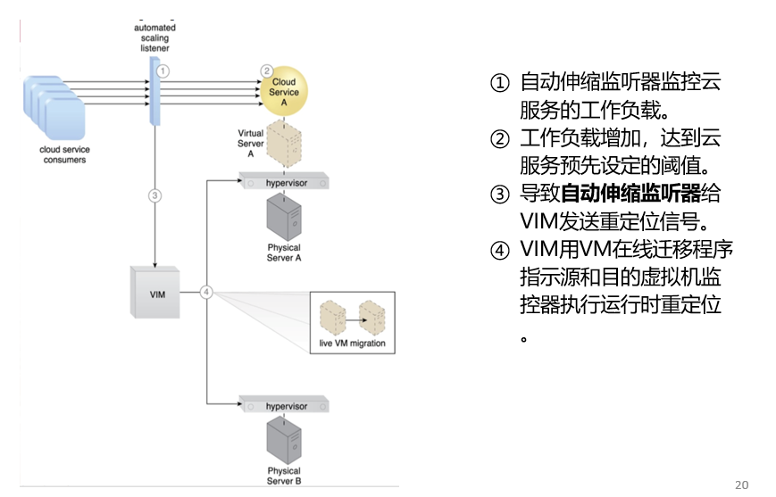

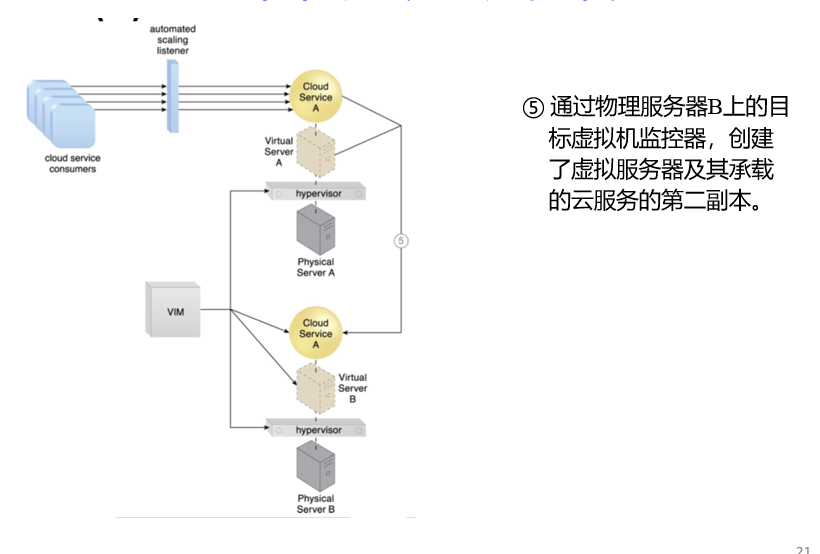

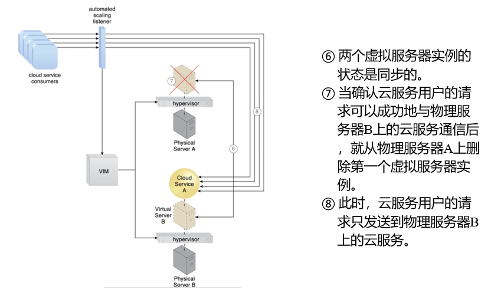

### 不中断服务重定位架构相关机制

1. 云使用监控器(cloud usage monitor)：可以使用不同类型的云使用监控器持续追踪IT资源的使用情况和系统行为。
2. 按使用付费监控器(pay-per-use monitor)：收集数据，由此计算源和目的位置的IT资源服务使用费。
3. 资源复制(resource replication)：用来在目的端实例化云服务的卷影副本(shadow copy)。
4. SLA管理系统(SLA management system)：在云服务复制或重定位期间及之后，负责处理SLA监控器提供的SLA数据，以获得云服务的可用性保证。
5. SLA监控器(SLA monitor)：收集SLA管理系统所需的SLA信息，如果可用性保证是依赖于此架构实现的，那么SLA监控器就是必不可少的。

## 零宕机架构

1. 物理服务器故障或被损害时，它承载的某些（或所有）虚拟服务器都会受到影响，这使得云提供者向云用户做出的零宕机时间的承诺变得非常困难。
2. 零宕机架构(zero downtime architecture)：允许虚拟机服务器原始的物理服务器失效时，动态迁移到其它物理服务器主机上。
3. 多个物理服务器聚成一组，由容错系统控制，容错系统具有把活动从一台物理服务器切换到另一台却不引起中断的能力。

### 零宕机架构相关机制

1. 审计监控器(audit monitor)：可能需要这个机制来检查虚拟服务器的重定位是否把它所承载的数据放置到了应该禁止的位置。
2. 云使用监控器(cloud usage monitor)：监控云用户对IT资源的实际使用情况，确保不超出云用户的虚拟服务器容量。
3. 虚拟机监控器(hypervisor)：每个受到影响的物理服务器的虚拟机监控器承载着受到影响的虚拟服务器。
4. 逻辑网络边界(logical network perimeter)：确保虚拟服务器重定位后，每个云用户都还在它自己的逻辑边界内。
5. 资源集群(resource cluster)：创建不同类型的主动-主动集群组，以协同改进虚拟服务器承载的IT资源的可用性。
6. 资源复制(resource replication)：在主虚拟服务器失效的时候，创建新的虚拟服务器和云服务实例。

### 云负载均衡架构

### 云负载均衡架构(cloud balancing architecture)

定义：IT资源可以在多个云之间实现负载均衡，云用户请求的跨云负载均衡可以帮助：

1. 提高IT资源的性能和可扩展性。
2. 增加IT资源的可用性和可靠性。
3. 改进负载均衡和IT资源优化。

### 云负载均衡架构机制

云负载均衡架构建立在自动伸缩监听器和故障转移系统机制结合的基础上，机制如下：

1. 根据当前的扩展性和性能要求，自动伸缩监听器把云服务用户的请求重定向到几个冗余的IT资源实现中的一个。
2. 故障转移系统保证在IT资源或底层承载故障时，冗余的IT资源能够进行跨云的负载均衡。IT资源失效时会被广播，这样自动伸缩监听器可以避免把云服务的用户请求路由到不可用或不稳定的IT资源上。

## 资源预留架构

### 资源受限(resource constraint)

由于IT资源使用共享，受限于其可用的容量等级，并发访问可能导致运行时的异常情况，称为资源受限。

1. 当两个或更多用户被分配到共享同一IT资源，而该IT资源没有足够的容量来容纳这些云用户的处理要求时，就会发生资源受限情况。

2. 资源受限发生时，一个或更多云用户会遇到性能下降或拒绝服务，云服务本身也会出现性能下降，并导致所有的云用户被拒绝服务。
3. 一个资源池可以临时从其他资源池借用IT资源，如果借用方拖延了使用时间而没有归还借用的IT资源时，会引起并发冲突，也会引起资源受限。

### 资源预留架构(resource reservation architecture)

专门为给定用户保留下述某种资源的系统，从而避免资源受限和资源借用情况：

1. 单个IT资源

2. 一个IT资源的一部分

3. 多个IT资源

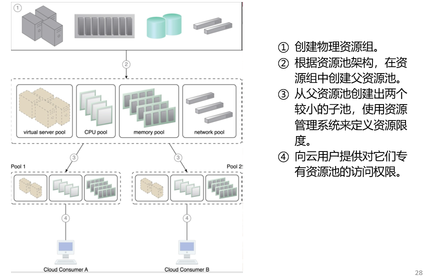

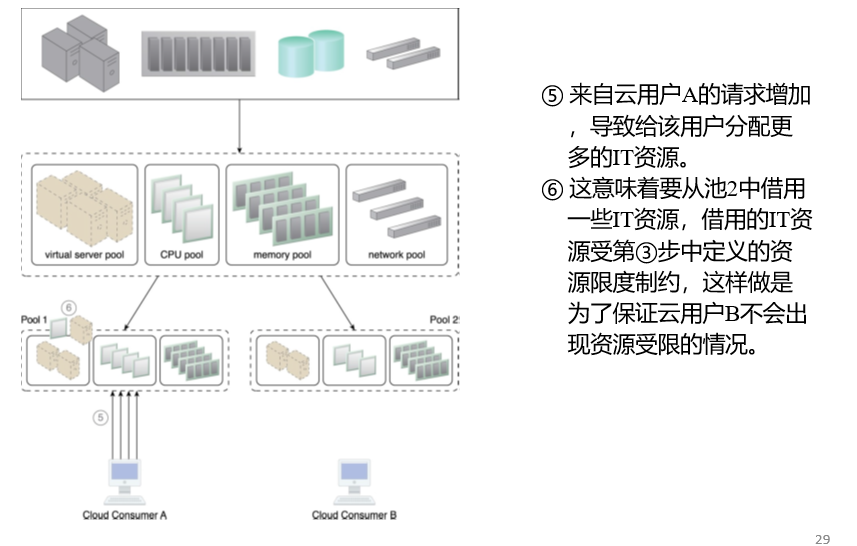

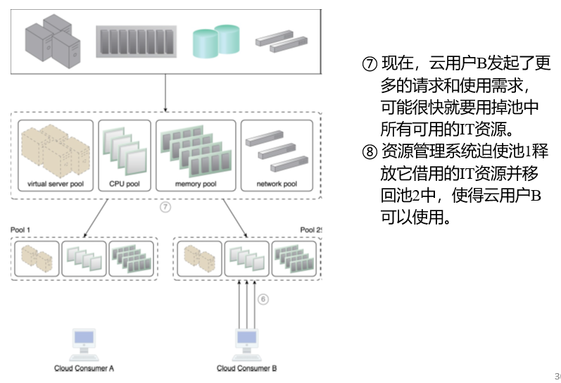

### 资源预留架构相关机制

1. 审计监控器(audit monitor)：用来检查资源预留系统是否遵守了云用户的审计、隐私和其它法规的要求。
2. 云使用监控器(cloud usage monitor)：监视触发分配预留IT资源的阈值。
3. 虚拟机监控器(hypervisor)：可以向不同的云用户提供预留，保证正确的给他们分配了保证过的IT资源。
4. 逻辑网络边界(logical network perimeter)：保证预留的IT资源仅对某些云用户可用。
5. 资源复制(resource replication)：需要持续的告知这个组件每个云用户的IT资源消耗的界限，以便能方便的复制和提供新的IT资源实例。

## 动态故障检测和恢复架构

原因：手动管理和解决IT资源故障通常效率很低且不切实际。

### 动态故障检测和恢复架构(dynamic failure detection and recovery architecture)

1. 建立了一个弹性的看门狗系统，以监控预先定义的故障场景，并对之作出响应。
2. 对于不能解决的故障情况，该系统会发出通知，并作升级处理。
3. 这个系统依赖于一个特殊的云使用监控器，称为智能看门狗监控器，主动地追踪IT资源，对预先定义的事件采取预先定义的措施。

### 弹性看门狗系统核心功能

弹性看门狗系统执行以下五个核心功能：

1. 监视
2. 选定事件
3. 对事件做出反应
4. 报告
5. 升级处理

### 弹性看门狗系统升级一个问题的处理最常采用的措施

1. 运行一个批处理问题
2. 发送一个控制台消息
3. 发送一条短信消息
4. 发送一封电子邮件消息
5. 发送一个SNMP陷阱
6. 记录一个通知单

### 动态故障检测和恢复架构例子

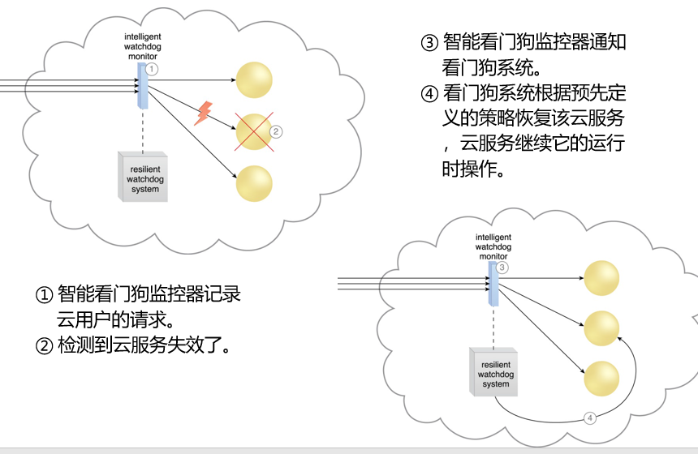

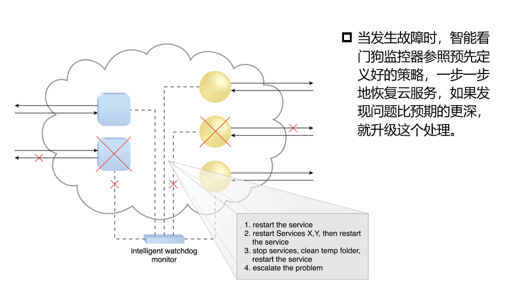

### 动态故障检测和恢复架构相关机制：

1. 审计监控器(audit monitor)：追踪数据的恢复是否遵守了法律或策略的要求。
2. 故障转移系统(failover system)：通常在最初尝试恢复失效的IT资源时，会使用故障转移系统机制。
3. SLA管理和SLA监控器(SLA management system and SLA monitor)：由于采用这个架构能实现的功能和SLA保证是密切相关的，所以这个系统通常依赖于SLA管理和SLA监控器机制管理并处理信息。

## 裸机供给架构

### 裸机服务器(bare-metal server)

裸机服务器(bare-metal server)指没有预装OS或其它任何软件的物理服务器。

1. 现代大多数物理服务器在其ROM中都提供远程安装管理软件支持。
2. 有些厂商需要扩展卡支持这个功能，也有些厂商把这个组件集成到芯片组里。
3. 基于Web或专用用户接口连接和管理物理服务器

### 裸机供给架构(bare-metal provisioning architecture)

提供一个自动部署的功能，允许云用户链接到部署软件，同时提供多个服务器或操作系统，这样裸机就变成了一个安装有管理代理的原始客户端

### 远程管理软件两个常见问题

远程管理软件虽然可以连接到物理服务器控制台，并部署OS，但有两个常见问题

1. 手动部署多台服务器容易出现人为的疏漏和配置错误。
2. 远程管理软件可能是时间密级型的，需要大量的运行时IT资源处理。

而裸机供给架构(bare-metal provisioning architecture)n裸机供给系统用下列组件解决上述问题：

1. 裸机供给系统用下列组件解决上述问题 
2. 发现代理(Discovery Agent)：搜索并找到可用的物理服务器，以分配给云用户
3. 部署代理(Deployment Agent)：安装在物理服务器的内存中，作为裸机提供给部署系统的客户端。
4. 发现区(Discovery Section)：扫描网络，定位可用的、要连接的物理服务器。
5. 管理加载器(Management Loader)：连接到物理服务器，为云用户加载管理选项
6. 部署组件(Deployment Component)：负责在选定的物理服务器上安装操作系统

### 例子

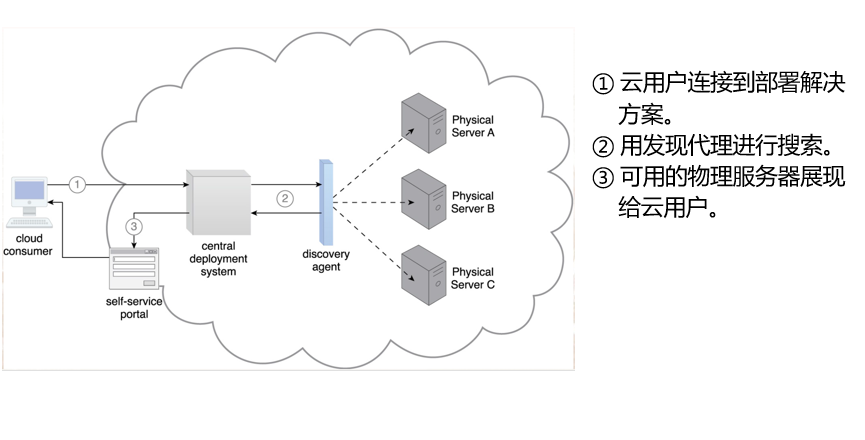

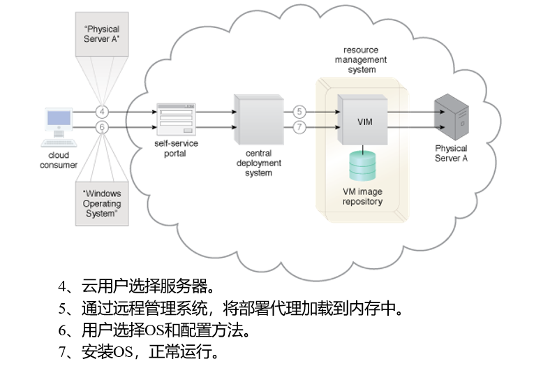

### 裸机供给架构相关机制

1. 云存储设备(cloud storage device)：存储OS模板和安装文件，以及供给系统的部署代理和部署包。
2. 虚拟机监控器(hypervisor)：可能会要求作为OS供给的一部分，在物理服务器上部署虚拟机监控器。
3. 逻辑网络边界(logical network perimeter)：确保物理裸机服务器只能被授权的云用户访问。
4. 资源复制(resource replication)：复制IT资源。
5. SLA管理系统(SLA management system)：保证物理裸机服务器的可用性与预先定义好的SLA条款一致。

## 快速供给架构

快速供给架构(rapid provisioning architecture)：建立的系统将大范围的IT资源供给进行了自动化，这些IT资源可以是单个的，也可以是联合起来的。

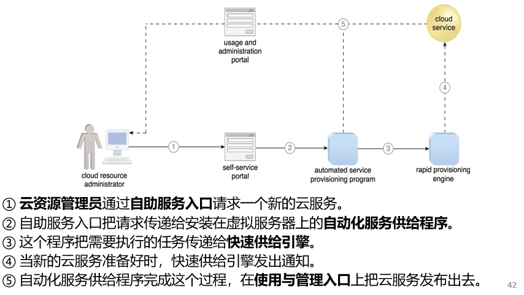

## 存储负载管理架构

### 云存储设备使用中可能出现的问题

1. 过度使用——增加工作负载
2. 使用过低——损失潜能

### LUN迁移

LUN迁移(Logical Unit Number, 通常说的LUN也指在SAN存储上创建的逻辑磁盘)：是一种特殊的存储程序，用来把LUN从一个存储设备移动到另一个上而无需中断，同时还对云用户保持透明。

### 存储负载管理架构

存储负载管理架构(storage workload management architecture)：使得LUN可以均匀地分布在可用地云存储设备上，而存储容量系统则用来确保运行时工作负载均匀地分布在LUN上。

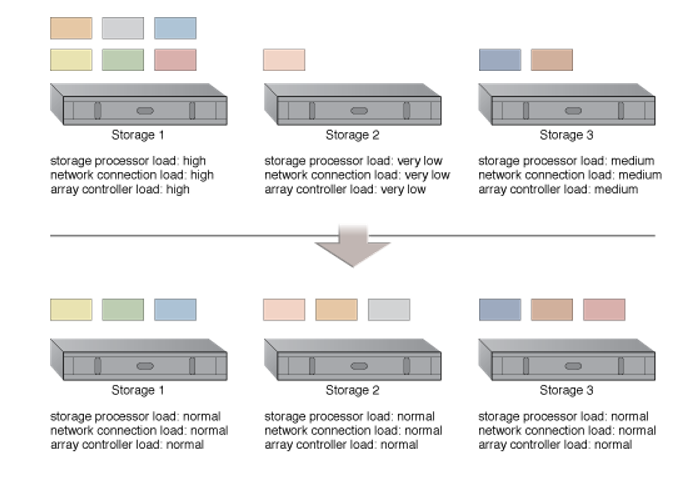

### 存储负载管理架构相关机制：

1. 审计监控器(audit monitor)：检查对法规、隐私和安全要求的遵守情况，因为这个架构建立起来的系统可以在物理上重新定位数据。
2. 自动伸缩监听器(automated scaling listener)：用来监视和响应工作负载的波动
3. 云使用监控器(cloud usage monitor)：追踪LUN的移动，并收集工作负载分布的统计数据。
4. 负载均衡器(load balancer)：用来在可用的云存储设备之间水平的对工作负载作均衡。
5. 逻辑网络边界(logical network perimeter)：确保数据重定位后，也能够对未授权方保持不可访问。

# 特殊云架构——第12次课

## 直接I/O访问架构

### I/O虚拟化

通过基于虚拟机监控器的处理层，向托管的虚拟服务器提供对物理I/O卡的访问。

### 直接I/O访问架构

允许虚拟服务器绕过虚拟机监控器直接访问物理服务器的I/O卡，而不用通过虚拟机监控器进行仿真连接。

### 直接I/O访问架构相关机制

1. 云使用监控器(cloud usage monitor)：由运行时监控器收集的云服务使用数据会包含直接I/O访问。
2. 逻辑网络边界(logical network perimeter)：确保被分配的物理I/O卡不允许云用户去访问其他云用户的IT资源。
3. 按使用付费监控器(pay-per-use monitor)：为分配的物理I/O卡收集使用成本信息。
4. 资源复制(resource replication)：用于使物理I/O卡取代虚拟I/O卡。

## 直接LUN访问架构

1. 存储LUN常常通过主机总线适配器(HBA)映射到虚拟机监控器中，其存储空间仿真为虚拟服务器上基于文件的存储。
2. 直接LUN访问架构(Direct LUN Access Architecture)：通过物理主机总线适配器HBA卡向虚拟服务器提供了基于块的LUN访问。

### 直接LUN访问架构相关机制

1. 云使用监控器(cloud usage monitor)：收集并跟踪直接使用LUN的存储使用信息

2. 按使用付费监控器(pay-per-use monitor)：为直接LUN访问收集使用成本信息。

3. 资源复制(resource replication)：该机制与虚拟存储器如何直接访问基于块的存储有关，这种存储取代了基于文件的存储。

## 动态数据规范化结构

### 冗余数据在基于云的环境会引起的问题

1. 增加存储和目录文件所需时间
2. 增加存储和备份所需空间
3. 由于数据量增加导致成本上升
4. 增加复制到辅存储设备所需时间
5. 增加数据备份所需时间

### 动态数据规范化架构(Dynamic Data Normalization Architecture)

动态数据规范化架构(Dynamic Data Normalization Architecture)建立了一个重复删除系统，它通过侦测和消除云存储设备上的冗余数据来阻止云用户无意识的保留冗余的数据副本。

1. 将数据传送给存储控制器之前，重复删除系统会检查该数据。
2. 作为检查的一部分，每个数据会分配一个哈希码，作为数据块的索引。
3. 新接收数据块的哈希与存储的哈希进行对比，判断该数据块是新的还是重复的
4. 新数据块将被保存，而复制数据块将被删除，同时产生并保存一个指向原始数据块的指针。

### 弹性网络容量架构

1. 即使云平台的IT资源是按需扩展的，当远程访问具有带宽限制时，其性能仍会受到抑制。
2. 弹性网络容量架构(Elastic Network Capacity Architecture)：能够给网络动态分配带宽，避免运行时瓶颈。自动扩展监听器和智能引擎脚本被用于检测流量何时达到带宽阈值，并在需要时动态分配。

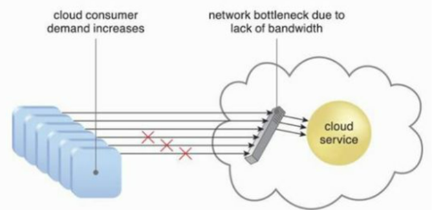

### 弹性网络容量架构相关机制：

1. 云使用监控器(cloud usage monitor)：在扩展前、扩展时和扩展后跟踪弹性网络容量。

2. 虚拟机监控器(Hypervisor)：通过虚拟交换机和物理上行链路向虚拟服务器提供对物理网络的访问。
3. 逻辑网络边界(logical network perimeter)：向单个云用户提供分配网络容量所需的边界。
4. 按使用付费监控器(pay-per-use monitor)：持续跟踪与动态网络带宽消耗相关的计费数据。
5. 资源复制(resource replication)：用于给物理和虚拟服务器增加网络端口，以响应工作负载的需求。
6. 虚拟服务器(Virtual Server)：管理IT资源和云服务，给这些云服务分配网络资源，且云服务本身也受到网络容量扩张的影响。

## 跨存储设备垂直分层架构

### 垂直拓展的问题 

云存储设备无法满足要求时，常规垂直拓展方式低效且费时，当增加的容量不再需要时，造成浪费。

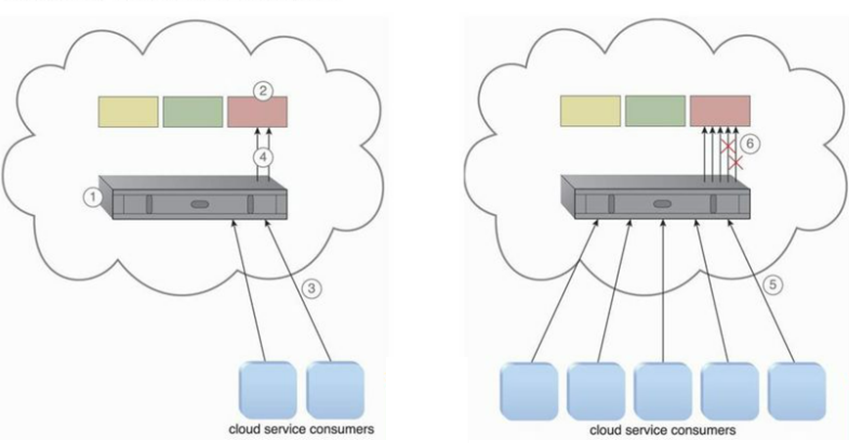

### 跨存储设备垂直分层架构(Cross-Storage Device vertical Tiering Architecture)

通过在容量不同的存储设备之间垂直扩展，使得该系统能够不受带宽和数据处理能力的限制。

自动扩展监听器监控发往特定LUN的请求，若已达到阈值，就驱动存储管理程序将LUN移动到更高容量的设备上。

跨存储设备垂直分层架构的相关机制：

1. 审计监控器(audit monitor)：实现审计，检查重定位的云用户数据是否与任何法律、数据隐私规范或政策冲突。
2. 云使用监控器(cloud usage monitor)：监控源存储端和目的存储端的数据传输和使用。
3. 按使用付费监控器(pay-per-use monitor)：收集源端与目的端的存储使用信息，并收集执行跨存储分层功能的IT资源使用信息。

## 存储设备内部垂直数据分层架构

**定义：**由于安全、隐私等原因，某些云用户可能会有明确的数据存储要求，数据分布于不同存储设备是不允许的。而**存储设备内部垂直数据分层架构**(Intra-Storage Device Vertical Data Tiering Architecture)建立了支持在单个云存储设备中进行垂直扩展的系统，这种设备内部的扩展系统优化了不同容量的各类磁盘的可用性。

### 负载均衡的虚拟交换机架构

**定义：**虚拟服务器通过虚拟交换机与外界相连，当虚拟交换机的上行链路端口的网络流量增加到会产生延迟、性能问题、数据包丢失以及时间滞后，就会产生带宽瓶颈。而**负载均衡的虚拟交换机架构**(Load Balanced Virtual Switches Architecture)建立了一负载均衡系统，提供了多条上行链路，或冗余路径之间的网络流量负载，从而有利于避免传输迟缓和数据丢失。

## 负载均衡的虚拟交换机架构的相关机制

1. 云使用监控器(cloud usage monitor)：监控网络流量和带宽使用情况。
2. 虚拟机监控器(Hypervisor)：控制并向虚拟服务器提供对虚拟交换机和外网的访问。
3. 负载均衡器(load balancer)：在不同上行链路上分配网络负载。
4. 逻辑网络边界(logical network perimeter)：保护和限制每个云用户对带宽的使用
5. 资源复制(resource replication)：用于为虚拟交换机创建额外的上行链路。
6. 虚拟服务器(virtual server)：控制由虚拟交换机额外的上行链路和带宽所带来的IT资源。

## 多路径资源访问架构

某些IT资源只能通过其确切位置的指定路径（或超链接）进行访问，一旦IT资源的超链接不再属于某个云用户，则该资源就无法访问。IT资源路径不能访问原因：

1. 路径丢失
2. 云用户错误的定义
3. 云提供者修改

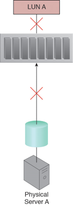

### 多路径资源访问架构(Multipath Resource Access Architecture)

### 定义

建立一个多路径系统，为IT资源提供可替换的路径。多路径系统驻留在服务器或虚拟监控器中，确保每个IT资源在被其每条可替换路径发现时都是相同的。

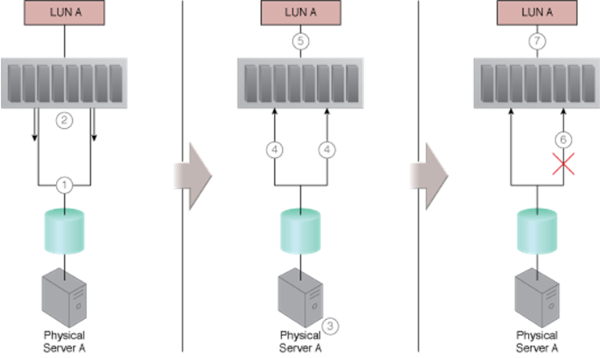

### 多路径资源访问架构的相关机制：

1. 云存储设备(cloud storage device)：云存储设备是常见的IT资源，为了维持依赖于数据访问解决方案的可访问性，需要可替换的访问路径。
2. 虚拟机监控器(Hypervisor)：为了与托管虚拟服务器之间有冗余链路，虚拟机监控器需要有可替换的路径。
3. 逻辑网络边界(logical network perimeter)：维护用户隐私，即使同一IT资源已具备多条路径也是如此。
4. 资源复制(resource replication)：当需要创建IT资源的新实例来产生可替换路径时，就需要资源复制机制。
5. 虚拟服务器(virtual server)：这些服务器管理可以通过不同链路或虚拟交换机进行多路径访问的IT资源，虚拟机监控器未虚拟服务器提供多路径访问。

## 持久虚拟网络配置架构

在托管物理服务器和虚拟监控器上创建虚拟交换机时，为虚拟服务器配置了网络并指定了端口，在虚拟服务器迁移到另一个主机上时，它就会失去网络连接，因为目的环境中没有分配所需要的端口和网络配置信息。

### 持久虚拟网络配置架构(Persistent Virtual Network Configuration Architecture)

1. 持久虚拟网络配置架构(Persistent Virtual Network Configuration Architecture)：网络配置信息集中存储，并复制到所有物理主机上；这使得一个虚拟服务器移动到另一个主机时，目的主机可以访问配置信息。

2. 该系统包括集中式虚拟交换机、VIM以及配置复制技术。

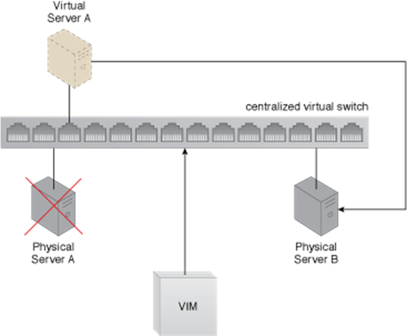

### 持久虚拟网络配置架构的相关机制

1. 虚拟机监控器(Hypervisor)：控制在物理主机间复制配置信息虚拟服务器。
2. 逻辑网络边界(logical network perimeter)：有助于在虚拟服务器迁移前后，确保被访问的虚拟服务器及其IT资源与正当云用户之间的隔离。
3. 资源复制(resource replication)：通过集中式虚拟交换机，在虚拟机监控器间复制虚拟交换机配置和网络容量分配信息。

## 虚拟服务器的冗余物理连接架构

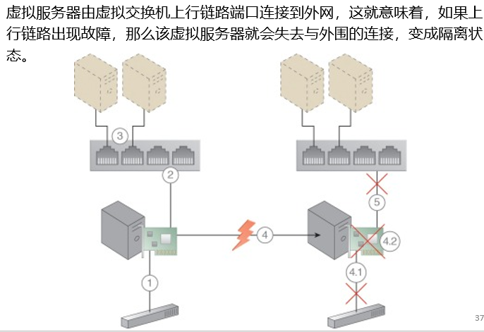

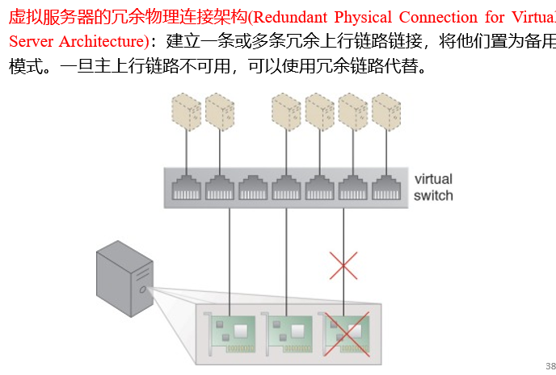

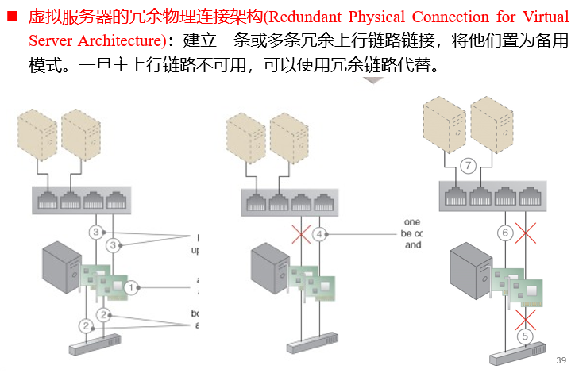

## 虚拟服务器的冗余物理连接架构的相关机制

1. 故障转移系统(Hypervisor)：实现从不可用上行链路向备用上行链路的转换。
2. 虚拟机监控器(Hypervisor)：管理部分虚拟服务器和部分虚拟交换机，并允许虚拟网络和虚拟交换机访问虚拟服务器。
3. 逻辑网络边界(logical network perimeter)：确保为每个云用户分配和定义的虚拟交换机是相互隔离的。
4. 资源复制(resource replication)：将有效上行链路的当前状态复制到备用上行链路上，以保持网络连接性。

## 存储维护窗口架构

由于维护和管理任务，云存储设备有时需要暂时关闭，这导致云服务用户和IT资源无法访问这些设备以及它们存储的数据。而**存储维护窗口架构(Storage Maintenance Window Architecture)**自动且透明地将云服务用户重定向到辅云存储设备上，这些用户不会感知到其主存储设备已经停机下线。

### 存储维护窗口架构的相关机制

1. 故障转移系统(Hypervisor)：用于将手动和自动启动故障转移加入本云架构中，即使迁移是预先安排的也是如此。
2. 资源复制(resource replication)：用于保持主存储设备辅存储设备之间的同步。

# 云交付模型考量——第十三次课

# 云计算技术-专题k8s——第14次课

