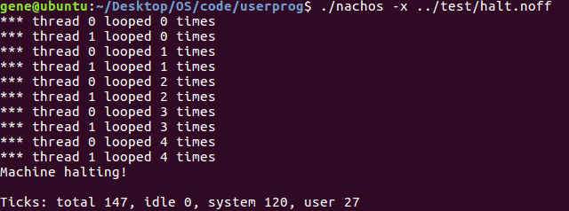
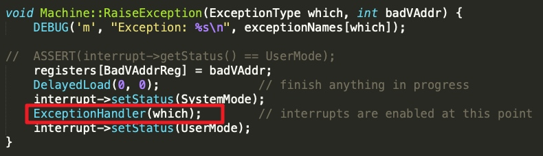
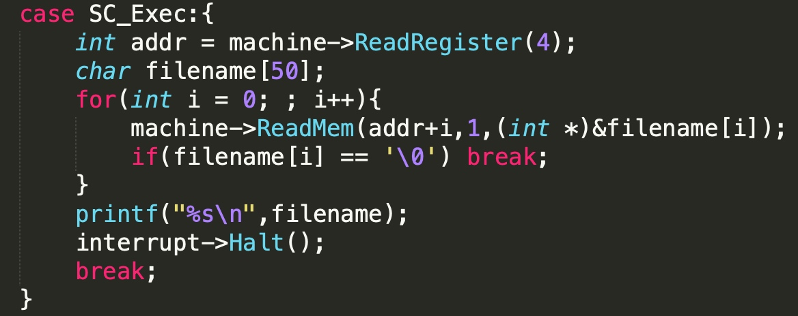
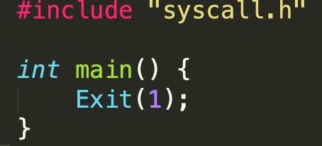
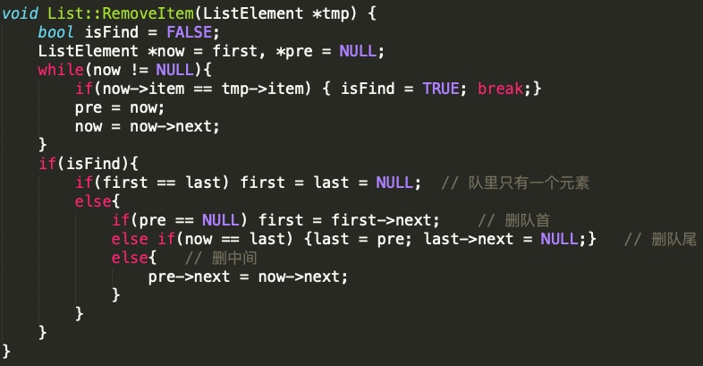
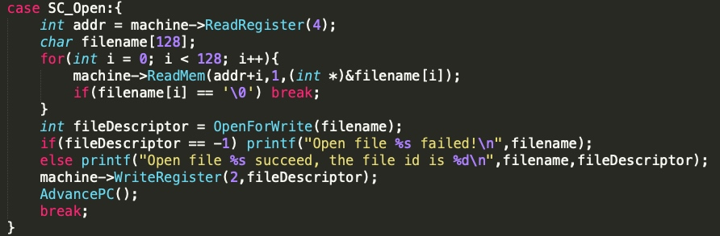
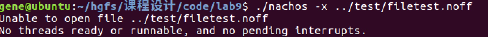

</br>
</br></br></br>


## 一、实验基础信息

#### 1.1 个人信息

201700130011 — 刘建东 — 17级菁英班

#### 1.2 实验信息

日期：2019.12.4

题目：Nachos 用户程序与系统调用、地址空间的扩展、系统调用 Exec() 与 Exit()

#### 1.3 实验目的

##### 1.3.1 实验六
1. 为后续实验中实现系统调用 Exec() 和 Exit() 奠定基础
2. 理解 Nachos 可执行文件的格式与结构
3. 掌握 Nachos 应用程序的编程语法，了解用户进程是如何通过系统调用与操作系统内核进行交互的
4. 掌握如何利用交叉编译生成 Nachos 的可执行程序
5. 理解系统如何为应用程序创建进程，并启动进程
6. 理解如何将用户进程映射到核心线程，核心线程执行用户程序的原理与方法
7. 理解当前进程的页表是如何与CPU使用的页表进行关联的

##### 1.3.2 实验七
1. 通过考察系统加载应用程序过程，如何为其分配内存空间、创建页表并建立虚页与实页帧的映射关系，理解 Nachos 的内存管理方法
2. 理解系统如何对空闲帧进行管理
3. 理解如何加载另一个应用程序并为其分配地址空间，以支持多进程机制
4. 理解进程的 pid
5. 理解进程退出所要完成的工作

##### 1.3.3 实验八

1. 理解用户进程是如何通过系统调用与操作系统内核进行交互的
2. 理解系统调用是如何实现的
3. 理解系统调用参数传递与返回数据的回传机制
4. 理解核心进程如何调度执行应用程序进程
5. 理解进程退出后如何释放内存等为其分配的资源
6. 理解进程号 pid 的含义与使用

#### 1.4 实验任务

##### 1.4.1 实验六

1. 阅读 ../bin/noff.h，分析 Nachos 可执行程序 .noff 文件的格式组成
2. 阅读 ../test 目录下的几个 Nachos 应用程序，理解 Nachos 应用程序的编程语法，了解用户进程是如何通过系统调用与操作系统内核进行交互的
3. 阅读 ../test/Makefile，掌握如何利用交叉编译生成 Nachos 的可执行程序
4. 阅读 ../threads/main.cc、../userprog/progtest.cc，根据对命令行参数 -x 的处理过程，理解系统如何为应用程序创建进程，并启动进程的
5. 阅读 ../userprog/protest.cc、../threads/scheduler.cc（Run()），理解如何将用户进程映射到核心线程，以及核心线程执行用户程序的原理与方法
6. 阅读 ../userprog/progtest.cc、../machine/translate.cc，理解当前进程的页表是如何与 CPU 使用的页表进行关联的

##### 1.4.2 实验七
1. 阅读 ../prog/protest.cc，深入理解 Nachos 创建应用程序进程的详细过程
2. 阅读理解类 AddrSpace，然后对其进行修改，使 Nachos 能够支持多进程机制，允许 Nachos 同时运行多个用户进程
3. 在类 AddrSpace 中添加完善的 Print() 函数（在实验六中已给出）
4. 在类 AddrSpace 中实例化类 BitMap 的一个全局对象，用于管理空闲帧
5. 如果将 SpaceId 直接作为进程号 Pid 是否合适？如果不合适，应该如何为进程分配相应的 Pid？
6. 为了实现 Join(pid)，考虑如何在该进程相关联的核心线程中保存进程号
7. 根据进程创建时系统为其所做的工作，考虑进程退出时应该做哪些工作
8. 考虑系统调用 Exec() 与 Exit() 的设计实现方案

##### 1.4.3 实验八

1. 阅读 ../userprog/exception.cc，理解系统调用 Halt() 的实现原理
2. 基于实验 6、7 中所完成的工作，利用 Nachos 提供的文件管理、内存管理及线程管理等功能，编程实现系统调用 Exec() 与 Exit()（至少实现这两个）。

Nachos 目前仅实现了系统调用 Halt()，其实现代码参见 ../userprog/exception.cc 中的函数 void ExceptionHandler(ExceptionType which)，其余的几个系统调用都没有实现。Nachos 系统调用对应的宏在 ../userprog/syscall.h 中声明如下。


</br>
</br>

## 二、实验基本方法


#### 2.1 运行 Nachos 应用程序的方法

Nachos 是一个操作系统，可以运行 Nachos 应用程序。Nachos 应用程序采用类 C 语言语法，并通过 Nachos 提供的系统调用进行编写。

由于 Nachos 模拟了一个执行 MIPS 指令的 CPU，因此需要利用 Nachos 提供的交叉编译程序 gcc-2.8.1-mips.tar.gz 将用户编写的 Nachos 应用程序编译成 MIPS 框架的可执行程序。

gcc MIPS 交叉编译器将 Nachos 的应用程序编译成 COFF 格式的可执行文件，然后利用 ../test/coff2noff 将 COFF 格式的可执行程序转换成 Nachos CPU 可识别的 NOFF 可执行程序。

运行 Nachos 应用程序的流程：

1. 在 ../test 目录下运行 make，将该目录下的几个现有的 Nachos 应用程序交叉编译，并转换成 Nachos 可执行的 .noff 格式文件。
2. 在 ../userprog 目录下运行 make 编译生成的 Nachos 系统，键入命令 ./nachos -x ../test/halt.noff 令 Nachos 运行应用程序 halt.noff，参数 -x 的作用是使 Nachos 运行相应应用程序。


#### 2.2 Nachos 应用程序

观察 ../test/Makefile 文件可知，Nachos 利用了交叉编译器提供的 gcc、as、ld 工具用于编译。


编译的目标文件是 .noff 文件和 .flat 文件，编译过程是先通过 .c 文件编译出 .o 文件，再通过 .o 文件编译出 .coff 文件，再通过 .coff 文件编译出 .noff 文件与 .flat 文件。


其中 .noff 文件头结构如下所示。

```cpp
// 下述内容为 Nachos 文件的结构。在 Nachos 中，只有三种类型的段文件，只读代码、已初始化数据、未初始化数据
#define NOFFMAGIC	0xbadfad      // Nachos 文件的魔数

typedef struct segment {
  int virtualAddr;              // 段在虚拟地址空间中的位置
  int inFileAddr;               // 段在文件中的位置
  int size;                     // 段大小
} Segment;

typedef struct noffHeader {
   int noffMagic;               // noff 文件的魔数
   Segment code;                // 可执行代码段 
   Segment initData;            // 已初始化数据段
   Segment uninitData;          // 未初始化数据段, 文件使用之前此数据段应为空
} NoffHeader;
```

我们可以继续观察 Addrspace 类的构造函数，观察 Nachos 是如何创建一个地址空间用于运行用户程序，以及如何打开 noff 文件进行文件空间计算。

```cpp
class AddrSpace {
  private:
    TranslationEntry *pageTable;    // 线性页表（虚拟页-物理页）
    unsigned int numPages;	         // 应用程序页数
};

AddrSpace::AddrSpace(OpenFile *executable) {
    // 可执行文件中包含了目标代码文件
    NoffHeader noffH;               // noff文件头
    unsigned int i, size;

    executable->ReadAt((char *)&noffH, sizeof(noffH), 0);   // 读出noff文件
    if ((noffH.noffMagic != NOFFMAGIC) && (WordToHost(noffH.noffMagic) == NOFFMAGIC))
    	SwapHeader(&noffH);		      // 检查noff文件是否正确
    ASSERT(noffH.noffMagic == NOFFMAGIC);
  	// 确定地址空间大小，其中还包括了用户栈大小
    size = noffH.code.size + noffH.initData.size + noffH.uninitData.size + UserStackSize;	
    numPages = divRoundUp(size, PageSize);  // 确定页数
    size = numPages * PageSize;             // 计算真实占用大小
    ASSERT(numPages <= NumPhysPages);       // 确认运行文件大小可以运行
	// 第一步，创建页表，并对每一页赋初值
    pageTable = new TranslationEntry[numPages];
    for (i = 0; i < numPages; i++) {
      pageTable[i].virtualPage = i;         // 虚拟页
      pageTable[i].physicalPage = i;        // 虚拟页与物理页一一对应
      pageTable[i].valid = TRUE;
      pageTable[i].use = FALSE;
      pageTable[i].dirty = FALSE;
      pageTable[i].readOnly = FALSE;        // 只读选项
    }
    // 第二步，清空文件数据
    bzero(machine->mainMemory, size);
    // 第三步，将noff文件数据拷贝到物理内存中
    if (noffH.code.size > 0) {
      executable->ReadAt(&(machine->mainMemory[noffH.code.virtualAddr]),
      	noffH.code.size, noffH.code.inFileAddr); // ReadAt调用了bcopy函数
    }
    if (noffH.initData.size > 0) {
      executable->ReadAt(&(machine->mainMemory[noffH.initData.virtualAddr]),
				noffH.initData.size, noffH.initData.inFileAddr);
    }
}
```


#### 2.3 页表

在 Nachos 中，页表实现了虚页与实页的对应关系，系统根据页表实现存储保护，页面置换算法根据页表信息进行页面置换。

我们查看 ../machine/translate.h 文件得到如下页表项结构。

```cpp
class TranslationEntry {
  public:
    int virtualPage;    // 虚拟内存中的页编号
    int physicalPage;   // 物理内存中的页编号（相对于主存位置）
    bool valid;         // valid = 1, 该转换有效（已经被初始化）
    bool readOnly;      // readOnly = 1, 该页内容不允许修改
    bool use;           // use = 1, 该页被引用或修改（变量由硬件修改）
    bool dirty;         // dirty = 1, 该页被修改（变量由硬件修改）
};
```

上述的这个数据结构用于管理 “虚页->实页” 的转换，用于管理存储用户程序的物理内存。而且该数据结构在 Nachos 有两个用途，一个是作为页表项使用，另一个是用作 TLB 项。 


#### 2.4 用户进程的创建与启动

##### 2.4.1 StartProcess 函数

查看 ../threads/main.cc 文件可以发现 Nachos 的参数 -x 调用了 ../userprog/progtest.cc 中的 StartProcess(char *filename); 函数。


具体函数内容如下。由于下述文件中出现了打开文件的操作，因此我们查看 ../userprog/Makefile.local 文件可以发现在用户程序中的宏定义为 FILESYS_STUB，即并非使用实验四、五中的文件系统对 DISK 上的文件进行操作，而是直接对 UNIX 文件进行操作。


```cpp
void StartProcess(char *filename) {             // 传入文件名
    OpenFile *executable = fileSystem->Open(filename);  // 打开文件
    AddrSpace *space;                           // 定义地址空间

    if (executable == NULL) {
      printf("Unable to open file %s\n", filename); // 无法打开文件
      return;
    }
    space = new AddrSpace(executable);  // 初始化地址空间
    currentThread->space = space;       // 将用户进程映射到一个核心线程
  
    delete executable;          // 关闭文件
    space->InitRegisters();     // 设置Machine的寄存器初值
    space->RestoreState();      // 将应用程序页表加载到了Machine中
    machine->Run();             // machine->Run()代码中有死循环，不会返回
    ASSERT(FALSE);
}

#define StackReg 29             // 用户栈指针
#define PCReg 34                // 当前存储PC值的寄存器 
#define NextPCReg 35            // 存储下一个PC值的寄存器 
#define PrevPCReg 36            // 存储上一次PC值的寄存器
void AddrSpace::InitRegisters() {
    for (int i = 0; i < NumTotalRegs; i++)      // 每个寄存器初值置0
      machine->WriteRegister(i, 0);
    machine->WriteRegister(PCReg, 0);           // PC寄存器初值为0 
    machine->WriteRegister(NextPCReg, 4);       // 下一个PC值为4
    // 栈指针赋初值, 减去一个数值避免越界
    machine->WriteRegister(StackReg, numPages * PageSize - 16);
}

void AddrSpace::RestoreState() {
    machine->pageTable = pageTable;     // 将应用程序页表赋给Machine
    machine->pageTableSize = numPages;
}
```

通过上述代码，我们可以发现系统要运行一个应用程序，需要为该程序创建一个用户进程，为程序分配内存空间，将用户程序数据装入所分配的内存空间，并创建相应的页表，建立虚页与实页的映射关系。然后将用户进程映射到一个核心线程。

为了使核心线程能够执行用户进程指令，Nachos 根据用户进程的页表读取用户进程指令，并将用户页表传递给了核心线程的地址变换机构。

##### 2.4.2 Instruction 类

Instruction 类封装了一条 Nachos 机器指令，具体信息如下。

```cpp
class Instruction {
  public:
    void Decode();	         // 解码二进制表示的指令
    unsigned int value;     // 指令的二进制表达形式
    char opCode;     		// 指令类型
    char rs, rt, rd; 		// 指令的 3 个寄存器
  	int extra;       		// 立即数（带符号） 或 目标 或 偏移量
};
```

##### 2.4.3 Machine::ReadMem() 函数

继续查看 Machine 类，可以看到将虚拟地址数据读取到实际地址的函数，Machine::ReadMem();，如下所示。

```cpp
// 此函数将虚拟内存addr处的size字节的数据读取到value所指的物理内存中，读取错误则返回false。
bool Machine::ReadMem(int addr, int size, int *value) {     // 虚拟地址、读取字节数、物理地址
    int data, physicalAddress;
    ExceptionType exception;        // 异常类型    
    // 进行虚实地址转换
    exception = Translate(addr, &physicalAddress, size, FALSE);
    if (exception != NoException) {
      machine->RaiseException(exception, addr);     // 抛出异常, 返回false
      return FALSE;
    }
    switch (size) {	        // 对字节大小进行分类处理
      case 1:               // 读取一个字节, 放入value所指地址
        data = machine->mainMemory[physicalAddress];
        *value = data;
        break;
      case 2:               // 读取两个字节，即一个short类型
        data = *(unsigned short *) &machine->mainMemory[physicalAddress];
        *value = ShortToHost(data);         // 短字转为主机格式
        break;
      case 4:               // 读取四个字节，即一个int类型
        data = *(unsigned int *) &machine->mainMemory[physicalAddress];
        *value = WordToHost(data);          // 字转为主机格式
        break;
      default: ASSERT(FALSE);
    }
    return (TRUE);      // 读取正确
}
```

##### 2.4.4 Machine()::Translate() 函数

可以看到在 ReadMem() 函数中调用了 Translate() 函数进行了虚实地址转换，因此我们继续查看 Machine::Translate() 函数，如下所示。

```cpp
/*  该函数主要功能是使用页表或TLB将虚拟地址转换为物理地址，并检查地址是否对齐以及其它错误。
	如果没有错误，则在页表项中设置use、dirty位初值，并将转换后的物理地址保存在physAddr变量中。
	virAddr - 虚拟地址，physAddr - 存储转换结果、size - 写或读的字节数
	writing - 可写标记，需要检查TLB中的"read-only"变量。 */
ExceptionType Machine::Translate(int virtAddr, int* physAddr, int size, bool writing) {
    int i;
    unsigned int vpn, offset, pageFrame;
    TranslationEntry *entry;	// 页表项
	// 检查对齐错误，即如果size = 4，则地址为4的倍数，即低两位为0；
	// 若size = 2，则地址为2的倍数，即最低位为0
    if (((size == 4) && (virtAddr & 0x3)) || ((size == 2) && (virtAddr & 0x1)))
        return AddressErrorException;
  	// TLB与页表必须有一个为空，有一个不为空
    ASSERT(tlb == NULL || pageTable == NULL);   // tlb、pageTable均定义在Machine类中
    ASSERT(tlb != NULL || pageTable != NULL)    // 通过虚拟地址计算虚拟页编号以及页内偏移量
    vpn = (unsigned) virtAddr / PageSize;       // 虚拟页编号
    offset = (unsigned) virtAddr % PageSize;    // 页内偏移量
  
    if (tlb == NULL) {          // TLB为空，则使用页表
      if (vpn >= pageTableSize)     // vpn大于页表大小, 即返回地址错误
        return AddressErrorException;
      else if (!pageTable[vpn].valid)   // vpn所在页不可用，即返回页错误
        return PageFaultException;            
      entry = &pageTable[vpn];	         // 获得页表中该虚拟地址对应页表项
    } else {									// TLB不为空，则使用TLB
        for (entry = NULL, i = 0; i < TLBSize; i++)     // 遍历TLB搜索
    	    if (tlb[i].valid && ((unsigned int)tlb[i].virtualPage == vpn)) {
            entry = &tlb[i];            // 找到虚拟地址所在页表项！
            break;
          }
        // 在TLB中没有找到，返回页错误
        if (entry == NULL) return PageFaultException;    
    }
    // 想要向只读页写数据，返回只读错误
    if (entry->readOnly && writing) return ReadOnlyException;
  	// 由页表项可得到物理页框号
    pageFrame = entry->physicalPage;
    // 物理页框号过大，返回越界错误
    if (pageFrame >= NumPhysPages) return BusErrorException;
    // 设置该页表项正在使用
  	entry->use = TRUE;
  	// 设置该页表项被修改了，即dirty位为true
    if (writing) entry->dirty = TRUE;
    // 得到物理地址
  	*physAddr = pageFrame * PageSize + offset;
  	// 物理地址不可越界
    ASSERT((*physAddr >= 0) && ((*physAddr + size) <= MemorySize));
  	// 返回没有错误
    return NoException;
}
```

##### 2.4.5 Machine::OneInstruction() 函数

Nachos 将虚拟地址转化为物理地址后，从物理地址取出指令放入 Machine::OneInstruction(Instruction *instr) 函数进行执行，该函数具体代码如下所示。

```cpp
#define PCReg 34 					// 当前存储PC值的寄存器 
#define NextPCReg 35 				// 存储下一个PC值的寄存器 
#define PrevPCReg 36 				// 存储上一次PC值的寄存器

// 执行一条用户态的指令。如果执行指令过程中有异常或中断发生，则调出异常处理装置，待其处理完成后再继续运行。
void Machine::OneInstruction(Instruction *instr) {
    int raw, nextLoadReg = 0, nextLoadValue = 0;  	// nextLoadValue记录延迟的载入操作，用于之后执行
    //	读取指令数据到raw中
    if (!machine->ReadMem(registers[PCReg], 4, &raw)) return;	  // 发生异常
    instr->value = raw; // 指令数据赋值
    instr->Decode();    // 指令解码
    int pcAfter = registers[NextPCReg] + 4; // 计算下下个PC指令地址
    int sum, diff, tmp, value;
    unsigned int rs, rt, imm;
    // 59条指令分类执行
    switch (instr->opCode) {
      case:		// 59个case
        ...
      default:
        ASSERT(FALSE);
    }
  	// 执行被延迟的载入操作
    DelayedLoad(nextLoadReg, nextLoadValue);
  	// 增加程序计数器（PC）
    registers[PrevPCReg] = registers[PCReg];    // 记录上一个PC值，用于之后调试
    registers[PCReg] = registers[NextPCReg];    // 将下一个PC值赋给NOW_PC寄存器
    registers[NextPCReg] = pcAfter;         // 将下下个PC值赋给NEXT_PC寄存器
}
```

##### 2.4.6 Machine::Run() 函数

Nachos 中调用了 Machine::Run() 函数循环调用上述 Machine::OneInstruction(Instruction *instr) 函数执行程序指令，具体函数代码如下所示。

```cpp
// 模拟用户程序的执行，该函数不会返回
void Machine::Run() {
    Instruction *instr = new Instruction;   // 用于存储解码后的指令
    interrupt->setStatus(UserMode);         // 将中断状态设为用户模式
    for (;;) {
      OneInstruction(instr);	           // 执行指令
      interrupt->OneTick();             // 用户模式下执行一条指令，时钟数为1
      // 单步调试
      if (singleStep && (runUntilTime <= stats->totalTicks))	Debugger();
    }
}
```

##### 2.4.7 AddrSpace::RestoreState() 函数

由上述执行过程中调用的函数代码可知，我们需要将用户进程的页表传递给 Machine 类维护的页表，才能执行用户程序指令。该过程由函数 AddrSpace::RestoreState() 实现，将用户进程的页表传递给 Machine 类，而用户进程的页表再为用户进程分配地址空间时就创建了。AddrSpace::RestoreState() 函数如下所示。

```cpp
// 通过一次上下文切换，保存machine的状态使得地址空间得以运行
void AddrSpace::RestoreState() {
    machine->pageTable = pageTable;     // 页表项
    machine->pageTableSize = numPages;  // 页表大小
}
```

为了便于上下文切换时保存与恢复寄存器状态，Nachos 设置了两组寄存器，一组是 CPU 使用的寄存器 `int registers[NumTotalRegs]`，用于保存执行完一条机器指令时该指令的执行状态；另一组是运行用户程序时使用的用户寄存器 `int userRegisters[NumTotalRegs]`，用户保存执行完一条用户程序指令后的寄存器状态。

##### 2.4.8 Machine 类

接下来我们通过查看 Machine 类来了解 CPU 使用的寄存器的定义，具体定义代码如下。

```cpp
/*
	模拟主机工作硬件，包括CPU寄存器、主存等。
	用户程序无法分辨他们运行在模拟器上还是真实的硬件上，除非他们发现了该模拟器不支持浮点运算。
	模拟器有10条系统调用，但UNIX有200条系统调用。
*/
class Machine {
  public:
    Machine(bool debug);        // 模拟硬件的构造函数，用于运行用户程序
    ~Machine();	                // 析构函数
    // 运行用户程序的函数
    void Run();                 // 运行用户程序
    int ReadRegister(int num);  // 读取CPU寄存器中的内容
    void WriteRegister(int num, int value); // 保存value到num编号的CPU寄存器中
	// 模拟硬件的实现过程
    void OneInstruction(Instruction *instr);    // 执行一条用户程序指令
    void DelayedLoad(int nextReg, int nextVal); // 延迟加载
    bool ReadMem(int addr, int size, int* value); // 读取虚拟地址处的size个字节到value所指物理地址处
    bool WriteMem(int addr, int size, int value); // 将size个字节的value数据写入addr的虚拟地址处
    // 将虚拟地址转换为物理地址，并检查是否有异常
    ExceptionType Translate(int virtAddr, int* physAddr, int size,bool writing);
	// 抛出异常，陷入系统态
    void RaiseException(ExceptionType which, int badVAddr);
    void Debugger();            // 调出用户程序调试器
    void DumpState();           // 打印出用户CPU和主存状态
	// 模拟硬件的数据结构
    char *mainMemory;           // 物理内存，用于存储用户程序、代码与数据
    int registers[NumTotalRegs];    // CPU寄存器，用于保存执行完机器指令时该指令执行状态
	// 虚、实地址转换（mainMemory首地址为0号地址）
    TranslationEntry *tlb;          // 快表，存在唯一，因此指针不可修改，类似于只读指针
    TranslationEntry *pageTable;    // 传统线性页表，可存在多个。
    unsigned int pageTableSize;     // 页表大小
  
  private:
    bool singleStep;                // 单步调试开关，即每次用户指令执行结束是否进入调试器
    int runUntilTime;               // 当运行时间到达该值时，进入调试器
};
```

##### 2.4.9 Thread 类

我们继续查看 Thread.h，来查看运行用户程序时使用的用户寄存器。

```cpp
/*
	该类定义了线程控制块。
	每个线程都拥有（1）线程执行栈（2）数组存储CPU寄存器状态（3）线程状态（运行、可运行、阻塞）
	用户进程拥有用户地址空间，仅运行在内核态的线程没有地址空间
*/
class Thread {
  private:
    // 下述两个变量用于上下文切换，位置不可更改
  	int* stackTop;                           // 当前栈指针
    _int machineState[MachineStateSize];    // 所有CPU寄存器状态

  public:
    Thread(char* debugName);                // 构造函数 
    ~Thread();                              // 析构函数，运行态线程不可析构
		// 基础线程操作
    void Fork(VoidFunctionPtr func, _int arg); // 使线程运行在 (*func)(arg) 函数位置
    void Yield();           // 当前线程，运行态 => 可运行态
    void Sleep();           // 当前线程，运行态 => 阻塞态
    void Finish();          // 线程运行结束    
    void CheckOverflow();   // 检查线程栈是否溢出
    void setStatus(ThreadStatus st) { status = st; }    // 设置线程状态
    char* getName() { return (name); }      // 获取线程名
    void Print() { printf("%s, ", name); }  // 输出线程名

  private:
    int* stack;             // 栈底指针，主线程栈底指针为NULL
    ThreadStatus status;    // 线程状态（运行、可运行、阻塞）
    char* name;	            // 线程名
    void StackAllocate(VoidFunctionPtr func, _int arg); // 为线程分配栈空间，用于Fork函数内部实现

#ifdef USER_PROGRAM         // 如果为用户程序
  	// 运行用户程序的线程有两组CPU寄存器，一个存储运行用户代码的线程状态，一个存储运行内核代码的线程状态
    int userRegisters[NumTotalRegs];    // 用户态下CPU寄存器状态

  public:
    void SaveUserState();       // 保存用户态下寄存器状态
    void RestoreUserState();    // 恢复用户态下寄存器状态
    AddrSpace *space;	          // 运行用户程序时的地址空间
#endif
};
```

由于 CPU 只有一个，因此 CPU 寄存器也只有一组。但每个用户程序至少需要映射到一个核心线程，因此每个核心线程都可能执行用户程序，所以每个核心线程都需要维护一组用户寄存器 userRegisters[]，用于保存与恢复相应的用户程序指令的执行状态。

##### 2.4.10 Scheduler::Run() 函数

当用户进程进行上下文切换时，即执行用户进程的核心线程发生了上下文切换时，Nachos 就会将老进程的 CPU 寄存器状态保存到用户寄存器 userRegisters[] 中，并将新用户进程的寄存器状态恢复到 CPU 寄存器中，使得 CPU 能够继续执行上次被中断的用户程序。

在 Scheduler::Run() 中，我们可以看到核心进程切换时对 CPU 寄存器与用户寄存器的保存与恢复，具体代码如下所示。

```cpp
// 给CPU分配下一个线程，即进行上下文切换，需要保存旧线程状态并加载新线程状态。
void Scheduler::Run (Thread *nextThread) {
    Thread *oldThread = currentThread;      // 旧线程
    
#ifdef USER_PROGRAM                         // 运行用户程序
    if (currentThread->space != NULL) {
        currentThread->SaveUserState();     // 保存用户态下寄存器状态
        currentThread->space->SaveState();  // 保存地址空间状态
    }
#endif
    
    oldThread->CheckOverflow();             // 检查旧线程是否有栈溢出
    currentThread = nextThread;             // 当前线程切换到下一个线程
    currentThread->setStatus(RUNNING);      // 设置当前线程为运行态
    SWITCH(oldThread, nextThread);          // 新旧线程上下文切换
  	// 一个线程运行结束时不可以直接删除，因为当前仍然运行在其栈空间中
    if (threadToBeDestroyed != NULL) {      // 如果之前设置了需要被删除的线程
        delete threadToBeDestroyed;         // 该变量在 Finish() 函数中设置
        threadToBeDestroyed = NULL;
    }
    
#ifdef USER_PROGRAM
    if (currentThread->space != NULL) {     // 如果新线程运行用户程序
        currentThread->RestoreUserState();  // 恢复运行用户程序时CPU寄存器状态
        currentThread->space->RestoreState();// 恢复运行用户程序时地址空间
    }
#endif
}
```

##### 2.4.11 应用程序创建与启动过程

回顾一下系统为应用程序创建进程与启动进程的过程。


整个过程一共分为四步，具体过程如下所示。

+ 第一步

第一步从文件系统中获得OpenFile。

+ 第二步

第二步是通过OpenFile分配地址空间。在这一步中，Nachos 为应用程序分配内存空间并将其装入所分配的内存空间中，然后建立页表，并建立虚页与实页的映射关系。

在此时，space就是该用户进程的标识，在 Nachos 中并没有像 UNIX 一样为每个进程分配一个进程号（pid）。因此此处可以进行扩展，为每个进程分配一个 pid，并建立 pid 与 space 的映射关系，且之后通过 pid 来标识该进程。

在该步之后，代码 `currentThread->space = space`，即将该进程映射到一个核心进程上。因此第一个用户进程即映射到核心的主线程 "main" 上。

每个线程维护一个私有变量 `AddrSpace *space`，当该线程与一个应用进程捆绑后，space 就会指向系统为该进程所分配的内存空间，以便被调度时执行该进程所对应的应用程序。

AddrSpace 的初始化过程也分为下述三步。


其中有几个注意点，用户程序页表初始化时，$i$ 号虚拟页直接对应于 Machine 的 $i$ 号物理页，也因为这个地方导致 Nachos 无法执行多个用户程序，此处可以进行修改。

其次在之后 Machine 执行用户程序指令时，都是通过将 PC 寄存器中的虚拟地址转换成物理地址之后，然后再从其物理内存的对应位置中取出指令执行，而程序指令加载到物理内存的过程就发生在 AddrSpace 初始化的时候。

+ 第三步

第三步首先执行 `space->InitRegisters()` 来初始化 CPU 的寄存器，包括数据寄存器、PC以及栈指针等。其中由于 Nachos 将应用程序的可执行文件转变为 .noff 格式时，将程序的入口地址设置为 0，因此应用进程从虚地址 0 开始执行，因此 PC = 0。

系统为应用程序栈分配了 1KB 的空间，将栈顶指针初始化为应用程序空间的尾部（栈向上生长），为防止发生偶然访问到程序地址空间外部，将栈指针从底部向上偏移了 16 字节。

然后执行 `space->RestoreState()` 来将用户进程的页表传递给系统核心（Machine 类），以便 CPU 能从用户进程的地址空间中读取应用程序指令。

+ 第四步

CPU的寄存器状态被设置后，就开始用户进程的执行。Machine::Run() 函数从程序入口开始，完成取指令、译码、执行的过程，直到进程遇到 Exit() 语句或异常才退出。

与常见OS不同的时，在Nachos中，一旦创建了一个用户进程，该用户进程就会立刻执行。而常见OS中，创建进程后应当将进程放入就绪队列，等待进程的调度。且当前 Nachos 不支持多线程运行。

在用户程序的执行过程中，如果与用户进程所关联的核心线程发生了上下文切换，则用户进程也会发生上下文切换。


#### 2.5 PCB

核心线程不需要单独分配内存，利用 Thread::Fork() 创建的线程，只需调用 Thread::StackAllocate() 为其分配栈空间，在几个 CPU 寄存器中设置线程入口 Thread::Root()，线程的执行体，以及线程知悉结束时需要做的工作（线程结束时调用 Thread::Finish()）。

Nachos 中没有显式定义 PCB，而是将进程信息分散到相应的类对象中；例如利用所分配内存空间的对象指针表示一个进程，该对象中含有进程的页表、栈指针以及与核心线程的映射等信息。进程的上下文保存在核心线程中，当一个线程被调度执行后，依据线程所保存的进程上下文中执行所对应的用户进程，仍然有较大的改进空间。


#### 2.6 用户进程映射到核心线程

在实现系统调用 Fork() 之前，Nachos 不支持用户多线程机制，因此目前的 Nachos 系统就只是简单的一对一映射关系，仍然具有很大的提升空间。


#### 2.7 线程调度算法

目前 Nachos 默认的线程调度算法是 FCFS，如果在运行加上参数 -rs seed，也可以实现时间片调度算法。因此在当前的 Nachos 中，并不支持优先级调度算法，这也是之后可以进行优化和完善的一个方向。


#### 2.8 Nachos 调试命令

```cpp

./nachos -d m -x ../test/halt.noff      // 输出每一步执行的机器指令
./nachos -d m -s -x ../test/halt.noff   // 单步调试，每执行一条机器指令即暂停并输出所有寄存器状态
// 生成汇编代码
/usr/local/mips/bin/decstation-ultrix-gcc -I ../userprog -I ../threads -S halt.c
make exec.s

```


</br>
</br>


## 三、源代码及注释

#### 3.1 修改内容概述

实验六是读懂代码，实验七是扩展 AddrSpace 类，实验八是实现各系统调用并且继续修改了 AddrSpace、Thread、Scheduler、List、OpenFile、BitMap、FileHeader、FileSystem 类以及 exception.cc 文件，接下来依次列出各文件的修改内容。

此处需要注意 BitMap、FileHeader、FileSystem 的修改均为实验五中修改的内容，因此下面代码中不再重复列出。

#### 3.2 AddrSpace

##### 3.2.1 AddrSpace 类

在 AddrSpace 类中添加 spaceId，用于标识一个地址空间；userMap 用于分配物理页表；pidMap 用于分配 spaceId；Print() 用于输出该地址空间的页表。

FILESYS 部分的内容用于实现基于 FILESYS 的文件系统调用，主要是分配和释放文件 Id。

```cpp
class AddrSpace {
  public:
    AddrSpace(OpenFile *executable);	// 创建地址空间
    ~AddrSpace();			            // 析构函数

    void InitRegisters();		// 初始化CPU寄存器
    void SaveState();			// 保存、储存地址空间
    void RestoreState();		// 恢复地址空间
    void Print();               // 打印页表
    unsigned int getSpaceId() { return spaceId; }

#ifdef FILESYS
    OpenFile *fileDescriptor[UserProgramNum];   // 文件描述符，0、1、2分别为stdin、stdout、stderr
    int getFileDescriptor(OpenFile *openfile);
    OpenFile *getFileId(int fd);
    void releaseFileDescriptor(int fd);
#endif

  private:
    static BitMap *userMap, *pidMap;// 全局位图
    TranslationEntry *pageTable;	// 线性页表
    unsigned int numPages, spaceId; // 页表中的页表项以及地址编号
};
```

##### 3.2.2 AddrSpace::AddrSpace()

对于新添加的两个位图以及 FILESYS 部分内容在构造函数中进行初值赋予。

```cpp
#define MAX_USERPROCESSES 256

BitMap *AddrSpace::userMap = new BitMap(NumPhysPages);
BitMap *AddrSpace::pidMap = new BitMap(MAX_USERPROCESSES);

AddrSpace::AddrSpace(OpenFile *executable) {
    ASSERT(pidMap->NumClear() >= 1);  // 保证还有线程号可以分配
    spaceId = pidMap->Find()+100;     // 0-99留给内核线程

    // 可执行文件中包含了目标代码文件
    NoffHeader noffH;               // noff文件头
    unsigned int i, size;

    executable->ReadAt((char *)&noffH, sizeof(noffH), 0);   // 读出noff文件
    if ((noffH.noffMagic != NOFFMAGIC) && (WordToHost(noffH.noffMagic) == NOFFMAGIC))
        SwapHeader(&noffH);           // 检查noff文件是否正确
    ASSERT(noffH.noffMagic == NOFFMAGIC);
    // 确定地址空间大小，其中还包括了用户栈大小
    size = noffH.code.size + noffH.initData.size + noffH.uninitData.size + UserStackSize;   
    numPages = divRoundUp(size, PageSize);  // 确定页数
    size = numPages * PageSize;             // 计算真实占用大小
    ASSERT(numPages <= NumPhysPages);       // 确认运行文件大小可以运行

    DEBUG('a', "Initializing address space, num pages %d, size %d\n", numPages, size);
    // 第一步，创建页表，并对每一页赋初值
    pageTable = new TranslationEntry[numPages];

    ASSERT(userMap->NumClear() >= numPages);    // 确认页面足够分配 
    for (i = 0; i < numPages; i++) {
      pageTable[i].virtualPage = i;         // 虚拟页
      pageTable[i].physicalPage = userMap->Find();  // 在位图找空闲页进行分配
      pageTable[i].valid = TRUE;
      pageTable[i].use = FALSE;
      pageTable[i].dirty = FALSE;
      pageTable[i].readOnly = FALSE;        // 只读选项
    }
    // 第二步，将noff文件数据拷贝到物理内存中
    if (noffH.code.size > 0) {
      int pagePos = pageTable[noffH.code.virtualAddr/PageSize].physicalPage * PageSize;
      int offSet = noffH.code.virtualAddr % PageSize;

      executable->ReadAt(&(machine->mainMemory[pagePos+offSet]),
        noffH.code.size, noffH.code.inFileAddr); // ReadAt调用了bcopy函数
    }
    if (noffH.initData.size > 0) {
      int pagePos = pageTable[noffH.initData.virtualAddr/PageSize].physicalPage * PageSize;
      int offSet = noffH.initData.virtualAddr % PageSize;

      executable->ReadAt(&(machine->mainMemory[pagePos+offSet]),
                noffH.initData.size, noffH.initData.inFileAddr);
    }
#ifdef FILESYS
    for(int i = 3; i < 10; i++) fileDescriptor[i] = NULL;
    OpenFile *StdinFile = new OpenFile("stdin");
    OpenFile *StdoutFile = new OpenFile("stdout");
    OpenFile *StderrFile = new OpenFile("stderr");
    /* 输出、输入、错误 */
    fileDescriptor[0] = StdinFile;
    fileDescriptor[1] = StdoutFile;
    fileDescriptor[2] = StderrFile;
#endif
}
```

##### 3.2.3 AddrSpace::~AddrSpace()

该函数需要将地址空间所分配到的物理空间、spaceId 等释放。

```cpp
AddrSpace::~AddrSpace() {
  pidMap->Clear(spaceId-100);
  for(int i = 0; i < numPages; i++)
    userMap->Clear(pageTable[i].physicalPage);
  delete [] pageTable;
}
```

##### 3.2.4 AddrSpace::Print()

该函数用于打印地址空间分配的页表。

```cpp
void AddrSpace::Print() {
    printf("page table dump: %d pages in total\n",numPages);
    printf("============================================\n");
    printf("\tVirtPage, \tPhysPage\n");

    for(int i = 0; i < numPages; i++)
        printf("\t%d,\t\t%d\n",pageTable[i].virtualPage,pageTable[i].physicalPage);
    printf("============================================\n\n");
}
```

##### 3.2.5 AddrSpace 中寄存器保存与恢复

下述两部分代码用于 CPU 寄存器的保存与恢复。

```cpp
void AddrSpace::SaveState() {
  pageTable = machine->pageTable;
  numPages = machine->pageTableSize;
}

void AddrSpace::RestoreState() {
    machine->pageTable = pageTable;
    machine->pageTableSize = numPages;
}
```

##### 3.2.6 AddrSpace 中基于 FILESYS 实现的函数

```cpp
#ifdef FILESYS
int AddrSpace::getFileDescriptor(OpenFile *openfile) {
  for(int i = 3; i < 10; i++)
    if(fileDescriptor[i] == NULL){
      fileDescriptor[i] = openfile;
      return i;
    }
  return -1;
}

OpenFile* AddrSpace::getFileId(int fd) {
  ASSERT((fd >= 0) && (fd < UserProgramNum));
  return fileDescriptor[fd];
}

void AddrSpace::releaseFileDescriptor(int fd) {
  ASSERT((fd >= 0) && (fd < UserProgramNum));
  fileDescriptor[fd] = NULL;
}
#endif
```

#### 3.3 Thread

##### 3.3.1 Thread 类

在 Thread 类中，首先增加了 TERMINATED 进程状态，并定义了 waitProcessSpaceId、 waitProcessExitCode、exitCode 等变量用于 Join() 系统调用的实现，以及一系列函数关于这三个变量的访问与设定。

```cpp
// 线程状态
enum ThreadStatus { JUST_CREATED, RUNNING, READY, BLOCKED, TERMINATED };

class Thread {
  private:
    // 下述两个变量用于上下文切换，位置不可更改
    int* stackTop;			 // 当前栈指针
    _int machineState[MachineStateSize];  // 所有CPU寄存器状态

    int* stack;             // 栈底指针，主线程栈底指针为NULL
    char *name;
    ThreadStatus status;    // 线程状态（运行、可运行、阻塞）
    // 为线程分配栈空间，用于Fork函数内部实现
    void StackAllocate(VoidFunctionPtr func, _int arg);

#ifdef USER_PROGRAM
    // 运行用户程序的线程有两组CPU寄存器，一个存储运行用户代码的线程状态，一个存储运行内核代码的线程状态

    int userRegisters[NumTotalRegs];    // 用户态下CPU寄存器状态
    int waitProcessSpaceId, waitProcessExitCode, exitCode;    
#endif

  public:
    AddrSpace *space;			// 运行用户程序时的地址空间
    Thread(char* debugName);		// 构造函数 
    ~Thread(); 				// 析构函数，运行态线程不可析构
    
    // 下述为基础线程操作
    void Fork(VoidFunctionPtr func, _int arg); 	// 使线程运行在 (*func)(arg) 函数位置
    void Yield();  		// 当前线程，运行态 => 可运行态，调度其它线程
    void Sleep();  		// 当前线程，运行态 => 阻塞态，调度其它线程
    void Finish();  	// 线程运行结束
    
    void CheckOverflow();   	// 检查线程栈是否溢出
    void setStatus(ThreadStatus st) { status = st; }    // 设置线程状态
    char* getName() { return (name); }      // 获取线程名
    void Print() { printf("%s\n", name); }  // 输出线程名

#ifdef USER_PROGRAM
    void SaveUserState();		// 保存用户态下寄存器状态
    void RestoreUserState();	// 恢复用户态下寄存器状态
    void Join(int SpaceId);
    void Terminated();
    int userProgramId() { return space->getSpaceId(); }
    int ExitCode() { return exitCode; }
    int waitExitCode() { return waitProcessExitCode; }
    int setWaitExitCode(int tmpCode) { waitProcessExitCode = tmpCode; }
    int setExitCode(int tmpCode) { exitCode = tmpCode; }
#endif
};
```

##### 3.3.2 Thread::Thread()

针对 Thread 类成员的增加，构造函数也需要作出一定的修改。

```cpp
Thread::Thread(char* threadName) {
    name = new char[50];
    strcpy(name,threadName);
    stackTop = NULL;
    stack = NULL;
    status = JUST_CREATED;
#ifdef USER_PROGRAM
    space = NULL;
#endif
}
```

##### 3.3.3 Thread::Finish()

该函数用于结束一个进程，并将其对应的 Joiner 从等待队列中唤醒。

```cpp
void Thread::Finish () {
    (void) interrupt->SetLevel(IntOff);		
    ASSERT(this == currentThread);
#ifdef USER_PROGRAM
    // 运行结束, 执行Exit()命令时已获取退出码
    // Joinee 运行结束, 唤醒 Joiner
    List *waitingList = scheduler->getWaitingList();
    // 检查 Joiner 是否在等待队列中
    ListElement *first = waitingList->listFirst(); // 队列首
    while(first != NULL){
        Thread *thread = (Thread *)first->item;     // 强转成Thread指针
        if(thread->waitProcessSpaceId == userProgramId()){       // 在队列中
            // printf("yes\n");
            // 将子线程退出码赋给父进程的等待退出码
            thread->setWaitExitCode(exitCode);
            scheduler->ReadyToRun((Thread *)thread);
            waitingList->RemoveItem(first);
            break;
        }
        first = first->next;
    }
    Terminated();
#else
    DEBUG('t', "Finishing thread \"%s\"\n", getName());
    threadToBeDestroyed = currentThread;
    Sleep();
#endif
}
```

##### 3.3.4 Thread::Join()

该函数也属于 Join() 系统调用实现的一部分。

```cpp
void Thread::Join(int SpaceId) {
    IntStatus oldLevel = interrupt->SetLevel(IntOff);       // 关中断
    waitProcessSpaceId = SpaceId;                        // 设置当前线程所等待进程的spaceId
    List *terminatedList = scheduler->getTerminatedList();  // 终止队列
    List *waitingList = scheduler->getWaitingList();        // 等待队列
    // 确定Joinee在不在终止队列中
    bool interminatedList = FALSE;
    ListElement *first = terminatedList->listFirst(); // 队列首
    while(first != NULL){
        Thread *thread = (Thread *)first->item;     // 强转成Thread指针
        if(thread->userProgramId() == SpaceId){       // 在队列中
            interminatedList = TRUE;
            waitProcessExitCode = thread->ExitCode();  // 设置父线程等待子线程退出码
            break;
        }
        first = first->next;
    }
    // Joinee不在终止队列中, 可运行态或阻塞态
    if(!interminatedList){
        waitingList->Append((void *)this);  // 阻塞Joiner
        currentThread->Sleep();             // Joiner阻塞
    }
    // 被唤醒且Joinee在终止队列中，在终止队列中删除Joinee
    scheduler->deleteTerminatedThread(SpaceId);
    (void) interrupt->SetLevel(oldLevel);   // 开中断
}
```

##### 3.3.5 Thread::Terminated()

该函数为将一个进程终止并加入终止队列的具体代码。

```cpp
void Thread::Terminated() {
    List *terminatedList = scheduler->getTerminatedList();
    ASSERT(this == currentThread);
    ASSERT(interrupt->getLevel() == IntOff);
    status = TERMINATED;
    terminatedList->Append((void *)this);
    Thread *nextThread = scheduler->FindNextToRun();
    while(nextThread == NULL){
        // printf("yes\n");
        interrupt->Idle();
        nextThread = scheduler->FindNextToRun();
    }
    scheduler->Run(nextThread);
}
```

#### 3.4 Scheduler

##### 3.4.1 Scheduler 类

在 Scheduler 类中，增加了进程等待、终止队列并添加了这两个队列所对应的函数，具体代码如下所示。

```cpp
class Scheduler {
  public:
    Scheduler();			// 初始化调度队列
    ~Scheduler();			// 析构函数

    void ReadyToRun(Thread* thread);	// 将线程放入可运行队列
    Thread* FindNextToRun();		  // 找到第一个可运行态线程
    void Run(Thread* nextThread);	// 运行线程
    void Print();			// 打印可运行线程队列
    
  private:
    List *readyList;      // 可运行态线程的队列

#ifdef USER_PROGRAM
  public:
    List *getReadyList() { return readyList; }
    List *getWaitingList() { return waitingList; }
    List *getTerminatedList() { return terminatedList; }
    void deleteTerminatedThread(int deleteSpaceId);
    void emptyList(List *tmpList) { delete tmpList; }
  private:
    List *waitingList;    // 等待运行线程的队列
    List *terminatedList; // 终止运行但未释放线程的队列
#endif
};
```

##### 3.4.2 Scheduler::Scheduler()

由于添加了新的类成员，因此需要在构造函数对类成员进行初始化。

```cpp
Scheduler::Scheduler() { 
    readyList = new List; 
#ifdef USER_PROGRAM
    // 如果 Joinee 没有退出，Joiner 进入等待
    waitingList = new List;
    // 线程调用 Finish() 进入该队列，Joiner 通过检查该队列确定 Joinee 是否已经退出
    terminatedList = new List;
#endif
} 
```

##### 3.4.3 Scheduler::~Scheduler()

对于新定义的类成员，需要在类的析构函数中将这些变量清除。

```cpp
Scheduler::~Scheduler() { 
    delete readyList; 
    delete waitingList;
    delete terminatedList;
} 
```
##### 3.4.4 Scheduler::deleteTerminatedThread()

该函数用于将一个线程从终止队列中移除，依然用于 Join() 系统调用的实现。

```cpp
#ifdef USER_PROGRAM
void Scheduler::deleteTerminatedThread(int deleteSpaceId) {
    ListElement *first = terminatedList->listFirst();
    while(first != NULL){
        Thread *thread = (Thread *)first->item;
        if(thread->userProgramId() == deleteSpaceId){
            terminatedList->RemoveItem(first);
            break;
        }
        first = first->next;
    }
}
#endif
```

#### 3.5 List

该部分内容的修改主要是辅助 Scheduler 中针对队列操作，具体修改部分如下所示。

##### 3.5.1 List 类

在该类中主要添加了两个函数，分别是 `void RemoveItem(ListElement *tmp)` 与 `ListElement *listFirst()`，均用于 Scheduler 中的队列操作。 

```cpp
class List {
  public:
    List();		// 初始化 List
    ~List();    // 析构函数 

    void Prepend(void *item); 	// 将 item 放到 List 首
    void Append(void *item); 	// 将 item 放到 List 尾
    void *Remove(); 	 // 将 item 从 List 首移除
    void Mapcar(VoidFunctionPtr func);	// 对 List 中每个元素应用 "func"
    bool IsEmpty();		// List 是否为空
    void RemoveItem(ListElement *tmp);  // 移除 List 中一个元素
    
    // Routines to put/get items on/off list in order (sorted by key)
    void SortedInsert(void *item, int sortKey);	// Put item into list
    void *SortedRemove(int *keyPtr); 	  	   // Remove first item from list
    ListElement *listFirst() { return first; }

  private:
    ListElement *first;  	// List 首，NULL 则为空
    ListElement *last;		// List 尾
};
```

##### 3.5.2 List::RemoveItem()

该函数用于从 List 中删除一个 ListElement，用于实现 Scheduler 类中从终止队列中移除一个元素的功能。

```cpp
void List::RemoveItem(ListElement *tmp) {
    bool isFind = FALSE;
    ListElement *now = first, *pre = NULL;
    while(now != NULL){
        if(now->item == tmp->item) { isFind = TRUE; break;}
        pre = now;
        now = now->next;
    }
    if(isFind){
        if(first == last) first = last = NULL;  // 队里只有一个元素
        else{
            if(pre == NULL) first = first->next;    // 删队首
            else if(now == last) {last = pre; last->next = NULL;}   // 删队尾
            else{   // 删中间
                pre->next = now->next;
            }
        }
    }
}
```

#### 3.6 OpenFile

该部分内容的修改主要是用于基于 FILESYS 的文件系统调用的实现，具体修改部分如下所示。

##### 3.6.1 OpenFile 类

该类的修改主要针对于后续基于 FILESYS 实现的文件系统调用的实现。

```cpp
#ifdef FILESYS	
class FileHeader;

class OpenFile {
  public:
    OpenFile(int sector);   // 打开一个文件头在 sector 扇区的文件（DISK）
    ~OpenFile();			// 关闭文件

    void Seek(int position); 	// 定位文件读写位置
    // 读取 numBytes 字节数据到 into 中，返回实际读取字节
    int Read(char *into, int numBytes);
    // 将 from 中 numByters 数据写入 OpenFile 中
    int Write(char *from, int numBytes);
    // 从 OpenFile 的 pos 位置读取字节到 into 中
    int ReadAt(char *into, int numBytes, int position);
    // 从 from 中的 pos 位置读取字节到 OpenFile 中 
    int WriteAt(char *from, int numBytes, int position);
    int Length();       // 返回文件字节数
    void WriteBack();   // 将文件头写回 DISK 中

#ifdef FILESYS
    OpenFile(char *type) {}
    int WriteStdout(char *from, int numBytes);
    int ReadStdin(char *into, int numBytes);
#endif
    
  private:
    FileHeader *hdr;	// 文件头
    int seekPosition, hdrSector; // 文件当前读取位置，文件头所在扇区号
};
#endif
```

##### 3.6.2 OpenFile::WriteStdout()

将数据写入输出对应的 OpenFile 中。

```cpp
int OpenFile::WriteStdout(char *from, int numBytes) {
    int file = 1;
    WriteFile(file,from,numBytes);  // 将from文件数据写入file中
    return numBytes;
}
```


##### 3.6.3 OpenFile::ReadStdin()

将 OpenFile 中的数据写入对应的 into 文件中。

```cpp
int OpenFile::ReadStdin(char *into, int numBytes) {
    int file = 0;
    return ReadPartial(file,into,numBytes); // 将file文件数据写入into中
}
```


#### 3.7 exception.cc

该代码主要实现了实验中要求实现的各个系统调用，包括 Exec()、Exit()、Join()、Yield() 基础系统调用以及基于文件系统的 Create()、Open()、Write()、Read()、Close() 系统调用，此处分别实现了基于 FILESYS_STUB 与 FILESYS 两套文件系统的文件系统调用。

##### 3.7.1 Exec()

该系统调用主要用于执行一个新的 Nachos 文件，在 FILESYS 中从 DISK 中寻找该文件，在 FILESYS_STUB 中则在 UNIX 系统中寻找文件。

```cpp
void AdvancePC(){
    machine->WriteRegister(PrevPCReg,machine->ReadRegister(PCReg));		// 前一个PC
    machine->WriteRegister(PCReg,machine->ReadRegister(NextPCReg));		// 当前PC
    machine->WriteRegister(NextPCReg,machine->ReadRegister(NextPCReg)+4);	// 下一个PC
}

void StartProcess(int spaceId) {
	// printf("spaceId:%d\n",spaceId);
    ASSERT(currentThread->userProgramId() == spaceId);
    currentThread->space->InitRegisters();     // 设置寄存器初值
    currentThread->space->RestoreState();      // 加载页表寄存器
    machine->Run();             // 运行
    ASSERT(FALSE);
}

case SC_Exec:{
	printf("This is SC_Exec, CurrentThreadId: %d\n",(currentThread->space)->getSpaceId());
	int addr = machine->ReadRegister(4);
	char filename[50];
	for(int i = 0; ; i++){
		machine->ReadMem(addr+i,1,(int *)&filename[i]);
		if(filename[i] == '\0') break;
	}
	OpenFile *executable = fileSystem->Open(filename);
	if(executable == NULL) {
		printf("Unable to open file %s\n",filename);
		return;
	}
	// 建立新地址空间
	AddrSpace *space = new AddrSpace(executable);
	// space->Print();   // 输出新分配的地址空间
	delete executable;	// 关闭文件
	// 建立新核心线程
	Thread *thread = new Thread(filename);
    printf("new Thread, SpaceId: %d, Name: %s\n",space->getSpaceId(),filename);
	// 将用户进程映射到核心线程上
	thread->space = space;
	thread->Fork(StartProcess,(int)space->getSpaceId());
	machine->WriteRegister(2,space->getSpaceId());
	AdvancePC();
	break;
}
```

##### 3.7.2 Exit()

该系统调用用于一个用户程序的退出，具体代码如下所示。

```cpp
case SC_Exit:{
    printf("This is SC_Exit, CurrentThreadId: %d\n",(currentThread->space)->getSpaceId());
	int exitCode = machine->ReadRegister(4);
	machine->WriteRegister(2,exitCode);
	currentThread->setExitCode(exitCode);
	// 父进程的退出码特殊标记，由 Join 的实现方式决定
	if(exitCode == 99)
		scheduler->emptyList(scheduler->getTerminatedList());
	delete currentThread->space;
	currentThread->Finish();
    AdvancePC();
	break;
}
```

##### 3.7.3 Join()

该系统调用用于一个父线程（Joiner）等待一个子线程（Joinee）运行结束后再继续运行，常用于同步设计中。

```cpp
case SC_Join:{
    printf("This is SC_Join, CurrentThreadId: %d\n",(currentThread->space)->getSpaceId());
	int SpaceId = machine->ReadRegister(4);
	currentThread->Join(SpaceId);
	// waitProcessExitCode —— 返回 Joinee 的退出码
	machine->WriteRegister(2, currentThread->waitExitCode());
	AdvancePC();
	break;
}
```

##### 3.7.4 Yield()

该系统调用用于一个线程从运行态变成可运行态，将 CPU 调度给另一个线程执行，具体实现代码如下。

```cpp
case SC_Yield:{
    printf("This is SC_Yield, CurrentThreadId: %d\n",(currentThread->space)->getSpaceId());
    currentThread->Yield();
    AdvancePC();
    break;
}
```

##### 3.7.5 FILESYS_STUB - Create()

该系统调用基于 FILESYS_STUB 实现了文件系统调用 Create()，即在 UNIX 系统中创建一个新文件，具体代码如下所示。

```cpp
case SC_Create:{
    int addr = machine->ReadRegister(4);
    char filename[128];
    for(int i = 0; i < 128; i++){
        machine->ReadMem(addr+i,1,(int *)&filename[i]);
        if(filename[i] == '\0') break;
    }
    int fileDescriptor = OpenForWrite(filename);
    if(fileDescriptor == -1) printf("create file %s failed!\n",filename);
    else printf("create file %s succeed, the file id is %d\n",filename,fileDescriptor);
    Close(fileDescriptor);
    // machine->WriteRegister(2,fileDescriptor);
    AdvancePC();
    break;
}
```

##### 3.7.6 FILESYS_STUB - Open()

该系统调用基于 FILESYS_STUB 实现了文件系统调用 Open()，即在 UNIX 系统中打开一个已经存在的文件，具体代码如下所示。

```cpp
case SC_Open:{
    int addr = machine->ReadRegister(4);
    char filename[128];
    for(int i = 0; i < 128; i++){
        machine->ReadMem(addr+i,1,(int *)&filename[i]);
        if(filename[i] == '\0') break;
    }
    int fileDescriptor = OpenForWrite(filename);
    if(fileDescriptor == -1) printf("Open file %s failed!\n",filename);
    else printf("Open file %s succeed, the file id is %d\n",filename,fileDescriptor);                
    machine->WriteRegister(2,fileDescriptor);
    AdvancePC();
    break;
}
```

##### 3.7.7 FILESYS_STUB - Write()

该系统调用基于 FILESYS_STUB 实现了文件系统调用 Write()，即在 UNIX 系统中将数据写入一个已经存在的文件中，具体代码如下所示。

```cpp
case SC_Write:{
    // 读取寄存器信息
    int addr = machine->ReadRegister(4);
    int size = machine->ReadRegister(5);       // 字节数
    int fileId = machine->ReadRegister(6);      // fd
    
    // 打开文件
    OpenFile *openfile = new OpenFile(fileId);
    ASSERT(openfile != NULL);

    // 读取具体数据
    char buffer[128];
    for(int i = 0; i < size; i++){
        machine->ReadMem(addr+i,1,(int *)&buffer[i]);
        if(buffer[i] == '\0') break;
    }
    buffer[size] = '\0';

    // 写入数据
    int writePos;
    if(fileId == 1) writePos = 0;
    else writePos = openfile->Length();
    // 在 writePos 后面进行数据添加
    int writtenBytes = openfile->WriteAt(buffer,size,writePos);
    if(writtenBytes == 0) printf("write file failed!\n");
    else printf("\"%s\" has wrote in file %d succeed!\n",buffer,fileId);
    AdvancePC();
    break;
}
```

##### 3.7.8 FILESYS_STUB - Read()

该系统调用基于 FILESYS_STUB 实现了文件系统调用 Read()，即在 UNIX 系统中将数据从一个已经存在的文件中读出，具体代码如下所示。

```cpp
case SC_Read:{
    // 读取寄存器信息
    int addr = machine->ReadRegister(4);
    int size = machine->ReadRegister(5);       // 字节数
    int fileId = machine->ReadRegister(6);      // fd

    // 打开文件读取信息
    char buffer[size+1];
    OpenFile *openfile = new OpenFile(fileId);
    int readnum = openfile->Read(buffer,size);

    for(int i = 0; i < size; i++)
        if(!machine->WriteMem(addr,1,buffer[i])) printf("This is something Wrong.\n");
    buffer[size] = '\0';
    printf("read succeed, the content is \"%s\", the length is %d\n",buffer,size);
    machine->WriteRegister(2,readnum);
    AdvancePC();
    break;
}
```

##### 3.7.9 FILESYS_STUB - Close()

该系统调用基于 FILESYS_STUB 实现了文件系统调用 Close()，即将一个已经分配的文件 Id 关闭，但不是删除这个文件。再次使用该文件需要重新打开，具体代码如下所示。

```cpp
case SC_Close:{
    int fileId = machine->ReadRegister(4);
    Close(fileId);
    printf("File %d closed succeed!\n",fileId);
    AdvancePC();
    break;
}
```

##### 3.7.10 FILESYS - Create()

该系统调用基于 FILESYS 实现了文件系统调用 Create()，即在 Nachos 系统中创建一个新文件，具体代码如下所示。

```cpp
case SC_Create:{
    int addr = machine->ReadRegister(4);
    char filename[128];
    for(int i = 0; i < 128; i++){
        machine->ReadMem(addr+i,1,(int *)&filename[i]);
        if(filename[i] == '\0') break;
    }
    if(!fileSystem->Create(filename,0)) printf("create file %s failed!\n",filename);
    else printf("create file %s succeed!\n",filename);
    AdvancePC();
    break;
}
```

##### 3.7.11 FILESYS - Open()

该系统调用基于 FILESYS 实现了文件系统调用 Open()，即在 Nachos 系统中打开一个已经存在于 模拟硬盘 DISK 中的文件，具体代码如下所示。

```cpp
case SC_Open:{
    int addr = machine->ReadRegister(4), fileId;
    char filename[128];
    for(int i = 0; i < 128; i++){
        machine->ReadMem(addr+i,1,(int *)&filename[i]);
        if(filename[i] == '\0') break;
    }
    OpenFile *openfile = fileSystem->Open(filename);
    if(openfile == NULL) {
        printf("File \"%s\" not Exists, could not open it.\n",filename);
        fileId = -1;
    }
    else{
        fileId = currentThread->space->getFileDescriptor(openfile);
        if(fileId < 0) printf("Too many files opened!\n");
        else printf("file:\"%s\" open succeed, the file id is %d\n",filename,fileId);
    }
    machine->WriteRegister(2,fileId);
    AdvancePC();
    break;
}
```

##### 3.7.12 FILESYS - Write()

该系统调用基于 FILESYS 实现了文件系统调用 Write()，即在 Nachos 系统中将数据写入模拟硬盘 DISK 中已经存在的文件中，具体代码如下所示。

```cpp
case SC_Write:{
    // 读取寄存器信息
    int addr = machine->ReadRegister(4);       // 写入数据
    int size = machine->ReadRegister(5);       // 字节数
    int fileId = machine->ReadRegister(6);      // fd
    
    // 创建文件
    OpenFile *openfile = new OpenFile(fileId);
    ASSERT(openfile != NULL);

    // 读取具体写入的数据
    char buffer[128];
    for(int i = 0; i < size; i++){
        machine->ReadMem(addr+i,1,(int *)&buffer[i]);
        if(buffer[i] == '\0') break;
    }
    buffer[size] = '\0';


    // 打开文件
    openfile = currentThread->space->getFileId(fileId);
    if(openfile == NULL) {
        printf("Failed to Open file \"%d\".\n",fileId);
        AdvancePC();
        break;
    }
    if(fileId == 1 || fileId == 2){
        openfile->WriteStdout(buffer,size);
        delete []buffer;
        AdvancePC();
        break;
    }

    // 写入数据
    int writePos = openfile->Length();
    openfile->Seek(writePos);

    // 在 writePos 后面进行数据添加
    int writtenBytes = openfile->Write(buffer,size);
    if(writtenBytes == 0) printf("Write file failed!\n");
    else if(fileId != 1 & fileId != 2)
        printf("\"%s\" has wrote in file %d succeed!\n",buffer,fileId);
    AdvancePC();
    break;
}
```

##### 3.7.13 FILESYS - Read()

该系统调用基于 FILESYS 实现了文件系统调用 Read()，即在 Nachos 系统中将数据从模拟硬盘 DISK 中一个已经存在的文件中读出，具体代码如下所示。

```cpp
case SC_Read:{
    // 读取寄存器信息
    int addr = machine->ReadRegister(4);
    int size = machine->ReadRegister(5);       // 字节数
    int fileId = machine->ReadRegister(6);      // fd

    // 打开文件
    OpenFile *openfile = currentThread->space->getFileId(fileId);

    // 打开文件读取信息
    char buffer[size+1];
    int readnum = 0;
    if(fileId == 0) readnum = openfile->ReadStdin(buffer,size);
    else readnum = openfile->Read(buffer,size);

    // printf("readnum:%d,fileId:%d,size:%d\n",readnum,fileId,size);
    for(int i = 0; i < readnum; i++)
        machine->WriteMem(addr,1,buffer[i]);
    buffer[readnum] = '\0';

    for(int i = 0; i < readnum; i++)
        if(buffer[i] >= 0 && buffer[i] <= 9) buffer[i] = buffer[i]+0x30;
    char *buf = buffer;
    if(readnum > 0){
        if(fileId != 0)
            printf("Read file (%d) succeed! the content is \"%s\", the length is %d\n",fileId,buf,readnum);
    }
    else printf("\nRead file failed!\n");
    machine->WriteRegister(2,readnum);
    AdvancePC();
    break;
}
```

##### 3.7.14 FILESYS - Close()

该系统调用基于 FILESYS 实现了文件系统调用 Close()，即将一个已经分配的文件 Id 清楚，但不是删除这个文件。再次使用该文件需要重新打开，具体代码如下所示。

```cpp
case SC_Close:{
    int fileId = machine->ReadRegister(4);
    OpenFile *openfile = currentThread->space->getFileId(fileId);
    if(openfile != NULL) {
        openfile->WriteBack(); // 将文件写入DISK
        delete openfile;
        currentThread->space->releaseFileDescriptor(fileId);
        printf("File %d closed succeed!\n",fileId);
    }
    else printf("Failed to Close File %d.\n",fileId);
    AdvancePC();
    break;
}
```


</br>
</br>

## 四、实验测试方法及结果

（实验六）

#### 4.1 Nachos 应用程序与可执行程序

##### 4.1.1 ../test/Makefile

下述代码为 ../test/Makefile 的主要的编译依赖部分。仔细观察不难发现编译 .coff 文件需要 .o 文件；编译 .noff 文件需要 .coff 文件；编译 .flat 文件需要 .coff 文件；编译 .s 文件需要 .c 文件；而生成 .o 文件需要 .c 文件。因此 Nachos 可执行程序 .noff 文件的生成路径便如下图所示。


```makefile
...
$(all_coff): $(obj_dir)/%.coff: $(obj_dir)/start.o $(obj_dir)/%.o
	@echo ">>> Linking" $(obj_dir)/$(notdir $@) "<<<"
	$(LD) $(LDFLAGS) $^ -o $(obj_dir)/$(notdir $@)

$(all_noff): $(bin_dir)/%.noff: $(obj_dir)/%.coff
	@echo ">>> Converting to noff file:" $@ "<<<"
	$(coff2noff) $^ $@
	ln -sf $@ $(notdir $@)

$(all_flat): $(bin_dir)/%.flat: $(obj_dir)/%.coff
	@echo ">>> Converting to flat file:" $@ "<<<"
	$(coff2flat) $^ $@
	ln -sf $@ $(notdir $@)

%.s: %.c
	@echo ">>> Compiling .s file for" $< "<<<"
	$(CC) $(CFLAGS) -S -c -o $@ $<
endif # MAKEFILE_TEST
```

##### 4.1.2 修改 ../test/halt.c 并重新编译

将 halt.c 文件内容修改为下图所示代码。并在命令行中输出 make 命令，使 halt.c 文件重新编译。


##### 4.1.3 生成 halt.s 文件

使用下述命令生成 halt.s 文件。

```shell
/usr/local/mips/bin/decstation-ultrix-gcc -I ../userprog -I ../threads -S halt.c
```

halt.s 文件如下所示。

```makefile
	.file	1 "halt.c"
gcc2_compiled.:
__gnu_compiled_c:
	.text
	.align	2
	.globl	main
	.ent	main
main:
	.frame	$fp,40,$31		# vars= 16, regs= 2/0, args= 16, extra= 0
	.mask	0xc0000000,-4
	.fmask	0x00000000,0
	subu	$sp,$sp,40		# 创建栈指针
	sw	$31,36($sp)
	sw	$fp,32($sp)
	move	$fp,$sp
	jal	__main
	li	$2,3			     # 0x00000003, k
	sw	$2,24($fp)
	li	$2,2			     # 0x00000002, i
	sw	$2,16($fp)
	lw	$2,16($fp)
	addu	$3,$2,-1
	sw	$3,20($fp)
	lw	$2,16($fp)
	lw	$3,20($fp)
	subu	$2,$2,$3
	lw	$3,24($fp)
	addu	$2,$3,$2
	sw	$2,24($fp)
	jal	Halt
$L1:
	move	$sp,$fp
	lw	$31,36($sp)
	lw	$fp,32($sp)
	addu	$sp,$sp,40		# 撤销栈指针
	j	$31
	.end	main
```

在上述代码中可以清楚的看到创建与撤销栈指针的位置，并且能够看到 nachos 编译过程中调用的寄存器为 \$2、\$3 等。并主要由这两个寄存器将数存在帧中并取出计算获得答案。

##### 4.1.4 进入目录 ../userprog

运行 make 编译 Nachos 内核之后，在 ../test 中可以看到指向 ../arch/unknown-i386-linux/bin/halt.noff 文件的符号链接是 halt.noff，因此我们运行 ./nachos -x ../test/halt.noff 命令来运行 Nachos 的应用程序 halt，输出结果如下所示。





我们再使用 ./nachos -d m -x ../test/halt.noff 命令来查看进一步的输出结果。如下图所示，我们可以看到每一步执行的机器指令，有利于进一步的调试。


接下来再使用 ./nachos -d m -s -x ../test/halt.noff 命令来查看进一步的输出结果。该命令实现了单步调试，每执行一步就会暂停并输出当前所有寄存器的结果，非常便于之后的程序调试。


#### 4.2 Nachos 可执行程序格式

Nachos 可执行程序格式我们在第二部分实验方法中已经分析的比较清楚了，因此在此部分不再赘述，直接放上 .noff 文件头的具体结构。

```cpp
/* 下述内容为 Nachos 文件的结构。在 Nachos 中，只有三种类型的段文件，只读代码、已初始化数据、未初始化数据 */

#define NOFFMAGIC	0xbadfad  // Nachos 文件的魔数

typedef struct segment {
  int virtualAddr;          // 段在虚拟地址空间中的位置
  int inFileAddr;           // 段在文件中的位置
  int size;                 // 段大小
} Segment;

typedef struct noffHeader {
   int noffMagic;           // noff 文件的魔数
   Segment code;            // 可执行代码段 
   Segment initData;			// 已初始化数据段
   Segment uninitData;		// 未初始化数据段, 文件使用之前此数据段应为空
} NoffHeader;
```


#### 4.3 页表的系统转储

在后续的设计任务中需要在 Nachos 中运行多道程序，因此我们需要在该实验中理解用户进程的创建过程。在第二部分实验方法中我们可以看到当前 Nachos 中的用户进程是用一个地址空间进行标记的。

而 Nachos 的存储管理采用分页管理方式，因此我们在类 AddrSpace 中添加成员函数 Print()，在为一个应用程序新建一个地址空间后即会调用该函数，输出该程序的页表（页面与帧的映射关系），该函数具体代码如下图所示。


接下来我们再修改 ../userprog/progtest.cc 中的 StartProcess 函数，使得当为一个应用程序新建一个空间后，调用 Print() 函数来输出页表信息，具体修改结果如下所示。


进行上述修改操作之后，我们再运行 ./nachos -x ../test/halt.noff 命令，查看 halt.noff 页面与帧的对应关系，以及 Nachos 为该程序分配的实页数。


可以看到 Nachos 为该程序分配了 11 个实页。


#### 4.4 应用程序进程的创建与启动

##### 4.4.1 Nachos 为应用程序创建进程的过程

Nachos 主要通过 StartProcess() 函数中的 `space = new AddrSpace(executable)` 这一段代码创建了进程，即在 Nachos 中用户进程并没有设立专门的 PCB 文件，而是用一个用户地址空间来指代这个进程。

创建进程地址空间的主要过程分为三步。（1）创建用户程序页表；（2）清空 Machine 物理空间数据；（3）将 noff 文件拷贝到 Machine 的物理内存中。具体代码如下所示。


##### 4.4.2 理解系统为用户进程分配内存空间、建立页表的过程，分析目前的处理方法存在的问题？

在 Nachos 中，核心线程不需要单独分配内存，利用 Thread::Fork() 创建的线程，只需调用 Thread::StackAllocate() 为其分配栈空间，在几个 CPU 寄存器中设置线程入口 Thread::Root()，线程的执行体，以及线程知悉结束时需要做的工作（线程结束时调用 Thread::Finish()）。

+ 分配过程

如上图地址空间的构造函数可以得知，在应用程序运行时，需要为其创建一个用户进程，为程序分配内存空间，将用户程序装入所分配的内存空间，创建相应的页表，建立虚页与实页的映射关系。

分配内存空间、建立页表的过程在第二部分中关于 AddrSpace 函数的内容中说明的比较明确。其中需要先确定地址空间大小，再创建页表、清空文件数据、将noff文件拷贝到物理内存中。

+ 存在的问题

但 Nachos 的这种处理方法仍有其不足之处，如果根据常规的实现方法，应用程序运行时，系统应该首先为应用程序分配一个 PCB，存放应用程序进程的相应信息，进程号可以是 PCB 数组的索引号。然后再根据应用程序的文件头计算所需的实页数，根据内存的使用情况为其分配足够的空闲帧，将应用程序的代码与数据读入内存所分配的帧中，创建页表，建立虚页与实页的映射关系，然后再为应用程序分配栈与堆并且在PCB中建立打开文件的列表，列表的索引即为文件描述符。最后将 pid、页表位置、栈位置及堆位置等信息记录在 PCB 中，在 PCB 中建立三个标准设备的映射关系，并记录进程与线程的映射关系，以及进程的上下文等。

并且常规的实现方法中，进程被创建后不应立即执行，应该将程序入口等记录到 PCB 中，一旦相应的核心线程引起调度，就从 PCB 中获取所需的信息来执行该进程。

然后目前 Nachos 并不是这样实现，Nachos 的实现较为简单，没有显式定义 PCB，而是将进程信息分散到相应的类对象中；例如利用所分配内存空间的对象指针表示一个进程，该对象中含有进程的页表、栈指针以及与核心线程的映射等信息。进程的上下文保存在核心线程中，当一个线程被调度执行后，依据线程所保存的进程上下文中执行所对应的用户进程。


##### 4.4.3 理解应用进程如何映射到一个核心线程

在 StartProcess 函数中，在为用户程序初始化了地址空间之后，执行一条命令 `currentThread->space = space`，此命令即将用户进程映射到了核心线程之上。


##### 4.4.4 如何启动主进程（父进程）

通过 Machine::Run() 函数，通过 PC 所指向的虚拟地址，再通过 Machine 中的页表将虚拟地址转化为物理地址，然后从物理地址中取出指令，最后执行指令。在这过程中，PC取出指令后便进行自增，指向下一条指令，Run() 函数具体代码如下所示。


##### 4.4.5 理解当前进程的页表是如何与CPU使用的页表进行关联的

在创建用户进程的时候先根据 noff 文件创建用户进程的地址空间，在地址空间中创建了用户进程的页表，具体创建过程的代码如下所示。


创建完页表之后，回到 StartProcess 函数中，调用了 `space->RestoreState()` 命令，该命令将用户进程的页表赋值给了 Machine 页表，具体代码如下所示。


之后程序运行的过程就是通过 PC 寄存器中的虚拟地址通过 Machine 中的页表转化为物理地址，然后在将根据指令类型执行该指令。


##### 4.4.6 思考如何在父进程中创建子进程，实现多进程机制

创建子进程，实现多进程机制比较关键的问题就是帧的分配问题，而该问题可以调用 BitMap 类用位图来完成。


##### 4.4.7 思考进程退出要完成的工作有哪些？

我们在 Run 函数中加上下述两条输出，查看用户程序在何时退出。


程序运行结果如下图所示。


可以发现 Nachos 在执行用户程序第 28 条指令之后退出了程序，因此我们运行 ./nachos -d m -x ../test/halt.noff 命令，查看最后一条运行的指令是什么。


因此我们在 OneInstruction 函数中定位到了 SYSCALL 指令，具体指令执行过程如下所示。


因此我们继续定位 RaiseException 函数，如下所示。

```cpp
#define BadVAddrReg 39          // The failing virtual address on an exception
void Machine::RaiseException(ExceptionType which, int badVAddr) {
    registers[BadVAddrReg] = badVAddr;		
    DelayedLoad(0, 0);          // finish anything in progress
    interrupt->setStatus(SystemMode);
    ExceptionHandler(which);    // interrupts are enabled at this point
    interrupt->setStatus(UserMode);
}
```

仔细观察该函数后，我们继续定位 DelayedLoad(0,0) 函数，如下所示。

```cpp 
#define LoadReg 37              // The register target of a delayed load.
#define LoadValueReg 38         // The value to be loaded by a delayed load.
void Machine::DelayedLoad(int nextReg, int nextValue) {
    registers[registers[LoadReg]] = registers[LoadValueReg];
    registers[LoadReg] = nextReg;
    registers[LoadValueReg] = nextValue;
    registers[0] = 0;           // and always make sure R0 stays zero.
}
```

在该操作中，Nachos 将延迟寄存器中的数据放入指定寄存器后，就清空了延迟寄存器指定的数据与目标寄存器。


#### 4.5 分配更大的地址空间

如果我们的用户程序需要系统分配更大的地址空间，那么我们可以采用在程序中定义静态数组的方法。例如我们可以在 halt.c 中定义一个大小为 80 的整型数组，则系统便会为我们分配更大的地址空间，达到了13个页面。


（实验七）

#### 4.6 创建 exec 与 bar 程序

首先创建 exec.c 文件，如下所示。


再创建 bar.c 文件，具体代码如下所示。


然后再修改 ../test/Makefile 文件，修改结果如下所示。


至此在 test 文件夹中运行 make 命令即可编译出 exec.noff、bar.noff 文件。编译出这两个文件后，我们在 lab7-8 文件中运行 ../test/bar.noff，则会产生如下所示错误。


因此我们思考是哪个地方出了问题，根据实验六的内容不难发现主要原因在于 AddrSpace 的构造函数中，我们为一个应用程序创建一个地址空间时，采用了简单的虚、实页映射，即0号虚页直接映射到0号实页上，也因此使得原先的用户程序页表映射被破坏，多线程执行失败。因此我们下面将用位图的方式来实现虚、实页的映射分配。

#### 4.7 修改 AddrSpace 类

由于之前的虚实页分配是直接分配，如下图所示。


因此我们需要在 AddrSpace 类中定义一个静态全局位图来标记哪些页被占用了，具体定义如下图所示。


定义了静态全局变量之后，我们需要在 .cc 文件中对该变量赋初值，具体语句如下所示，其中 NumPhysPages 表示最大物理页，数值等于32。


接下来我们修改虚实页分配的部分代码，对于每一个虚页，我们在位图中找一个未被分配的页面作为虚页映射。除此之外，我们需要保证在分配之前物理内存中空闲页面数量大于等于我们需要的页面数量，具体代码如下所示。


分配完虚实页映射之后，我们需要将 noff 文件中的数据拷贝到 machine 的物理内存中，因此我们需要将虚拟地址所对应的物理地址求出，需要先定位具体的物理页面，再根据页面偏移量定义具体物理地址，具体求取过程如下所示。


最后我们需要修改 AddrSpace 类的析构函数，我们需要在 AddrSpace 析构的时候将对应的物理页面释放，具体代码如下所示。


#### 4.8 寻找编写系统调用代码的地方

首先系统调用只能发生在核心态中，即用户态下无法使用系统调用，因此在 Nachos 中进行系统调用的方法是当 Nachos 的 CPU 检测到该条指令是执行一个 Nachos 的系统调用时，则抛出一个异常 SyscallException 以便从用户态陷入到核心态去处理这个系统调用，具体代码如下：


继续搜索 RaiseException 函数，可以发现具体代码如下所示，其中该函数调用的关键函数为 ExceptionHandler 函数，用于处理系统调用。



因此继续查看 ExceptionHandler 函数，可以发现具体代码如下所示。仔细观察下述代码，不难发现系统将系统调用号保存在了 MIPS 的 2 号寄存器 \$2 中，语句 type = machine->ReadRegister(2) 即是从寄存器 \$2 中获取系统调用号。因此如果该条指令要调用 0 号系统调用（对应的宏是 SC_Halt），则执行 Halt() 系统调用的处理程序，执行 `interrupt->Halt()` 命令。


在上述代码中，由于只实现了 Halt 系统调用，因此执行其它系统调用时，Nachos 就会异常退出，因此我们需要仿照 Halt 的实现方式来实现其它系统调用的处理代码，具体的函数大体框架如下所示。注意，Nachos 在处理系统调用时，系统调用类型及相关参数的传递方式，是通过约定几个寄存器实现的。


#### 4.9 系统调用机制

##### 4.9.1 Nachos 系统调用执行过程

我们可以在 start.s 中查看各系统调用入口执行的汇编代码，如下所示。以 Exec() 的入口汇编代码为例。


\$0+SC_Exec -> \$2 指令即将 0 号寄存器中的值取出加上 SC_Exec 的值，再将这个结果存入 2 号寄存器中。第二条指令即进行了系统调用；第三条指令为执行完系统调用后回到原程序中继续执行，其中 \$31 中存放的是系统调用的返回地址；第四条指令即结束该系统调用。

根据上述系统调用入口的汇编代码，我们继续分析 exec.c 源代码以及其对应的汇编代码。我们先查看其对应的 c 文件代码。


我们使用 make exec.s 命令生成 exec.c 对应的汇编代码 exec.s，具体代码如下所示。

```makefile
	.file	1 "exec.c"
gcc2_compiled.:
__gnu_compiled_c:
	.rdata
	.align	2
$LC0:
	.ascii	"../test/exec.noff\000" # 用户地址空间
	.text
	.align	2       # 2 字节对齐，即 2*2
	.globl	main    # 全局变量
	.ent	main  # main函数入口
main:
# 汇编伪指令 frame 用来声明堆栈布局
# 该指令有三个参数：
# （1）第一个参数 framereg: 声明用于访问局部堆栈的寄存器，一般为 $sp
# （2）第二个参数 framesize: 声明该函数已分配堆栈的大小，符合 $sp+framesize = $sp
# （3）第三个参数 returnreg: 这个寄存器用来保存返回地址
# $fp 为栈指针，该函数层栈大小为 32 字节，函数返回地址存放在 $31
	.frame	$fp,24,$31		# vars= 0, regs= 2/0, args= 16, extra= 0
	.mask	0xc0000000,-4
	.fmask	0x00000000,0
	# 栈采用向下生长的方式，即由大地址向小地址生长，栈指针指向栈的最小地址
	# $sp - 32 -> $sp，构造 main() 的栈 frame
	# $sp 的原值应该是执行 main() 之前的栈
	# 上一函数对应栈 frame 的顶（最小地址处）
	subu	$sp,$sp,24
	sw	$31,20($sp)     # $31 -> memory[$sp+20]
	sw	$fp,16($sp)     # $fp -> memory[$sp+16]
	move	$fp,$sp   # $sp -> $fp，执行 Exec() 会修改 $sp
	jal	__main     # PC+4 -> $31，goto_main
	# $LCO -> $4，将 Exec("../test/halt.noff\000")的参数的地址传给$4
	# $4 -> $7，传递函数的前四个参数给子程序，不够的用堆栈
	la	$4,$LC0
	# 转到 start.s 中的 Exec 处执行
	# PC+4 -> $31，goto Exec
	# PC 是调用函数时的指令地址
	# PC+4 是函数的下条指令地址，以便从函数返回时再调用
	# 函数的下条指令开始继续执行原程序
	jal	Exec
	jal	Halt
$L1:
   # $fp -> $sp
	move	$sp,$fp
	# memory[$sp+20] -> $31, 取 main() 的返回值
	lw	$31,20($sp)
	# memory[$sp+16] -> $fp，恢复 $fp
	lw	$fp,16($sp)
	# $sp+24 -> $sp，释放 main() 对应的在栈中的 frame
	addu	$sp,$sp,24
	# goto $31，main() 函数返回
	j	$31
	.end	main
```

由于该汇编代码要调用系统调用 OP_SYSCALL，因此会抛出异常 SyscallException，该异常会在 exception.cc 中处理。处理过程主要是先获取第二个寄存器中的系统调用号，然后根据系统调用号作出对应的处理。

而由于系统调用 Exec("../test/halt.noff") 中，只携带了一个参数，因此我们可以从 4 号寄存器中获取参数在内存的地址，然后根据该地址读出该参数并执行。

因此我们修改一下 exception.cc 的部分代码，即可读出 Exec 传入的参数，具体修改代码如下所示。




进行上述修改之后，我们再在命令行中运行 exec.noff 文件，即可得到下述输出结果。可以看到我们成功地输出了 Exec 函数传入的参数。


##### 4.9.2 Nachos 系统调用参数传递

Exec(FileName) 作为 Nachos 的系统调用，Exec(FileName) 执行时需要陷入到 Nachos 的内核中执行，因此需要将其参数 FileName 从用户地址空间传递（复制）到内核中，从而在内核中为 FileName 对应的应用程序创建相应的线程执行它。

一般来说，参数传递一共有 3 种方式。
1. 通过寄存器
2. 通过内存区域，将该内存区域的首地址存放在一个寄存器中
3. 通过栈

在基于 MIPS 的架构中，对于一般的函数调用，通常利用 \$4-\$7 寄存器传递函数的前 4 个参数给子程序，参数多于 4 个时，其余的利用堆栈进行传递；

对于 Nachos 的系统调用，一般也是将要传递的参数依次保存到寄存器 \$4-\$7 中，然后根据这些寄存器中的地址从内存中读出相应的参数。

例如前面 exec.c 对应的汇编代码中，在执行系统调用 Exec() 之前，利用指令 la \$4, \$L0 将 Exec("../test/halt.noff") 中的参数 "../test/halt.noff" 在内存中的地址 \$LC0 传给 \$4，然后执行 Exec，因此内核在处理系统调用 Exec 时，应该首先从 \$4 中获取 "../test/halt.noff" 的内存地址，然后将参数从内存中读出。

为了验证上述系统调用参数传递的方式，我们编写 `exit.c` 文件，调用 Exit(1) 系统调用，具体代码如下所示。



再利用 `make exec.s` 命令生成该文件的汇编代码，具体汇编代码如下所示。


其中在 `li $4, 1` 命令中，将立即数 1 传给了 4 号寄存器，因此我们可以发现对于系统调用参数为数值的，系统自动将参数值按顺序依次传入 \$4-\$7 中。

成员函数 Machine::ReadRegister(int num) 可读取寄存器 num 中的内容，Machine::ReadMem(int addr, int size, int *value) 从内存 addr 处读取 size 个字节的内容存放到 value 所指向的单元中。

在 Exec() 的实现代码中可以利用 Machine::ReadRegister(4) 从 \$4 中获取 "../test/halt.noff" 的内存地址，然后利用 Machine::ReadMem(...) 获取 FileName "../test/halt.noff"，然后为 "../test/halt.noff" 创建相应的进程及相应的核心线程，并将该进程映射到新建的核心线程上执行它。

当 "../test/halt.noff" 执行结束后，需要返回该线程的 pid（对应 Nachos 中的 SpaceId - Address Space Identifier），可以利用 Machine::ReadRegister(2) 将线程 "../test/halt.noff" 对应的 SpaceId 写入 2 号寄存器中，MIPS 架构将在寄存器 2 和 3 中存放返回值。

##### 4.9.3 Openfile for the User program

Nachos 启动时通过语句 `(void)Initialize(argc,argv)` 初始化了一个 Nachos 基本内核，其中通过 Thread 类创建了一个 Nachos 的主线程 "main" 作为当前线程，并将其状态设为 RUNNING（`currentThread = new Thread("main"); currentThread->setStatus(RUNNING);`），全局变量 currentThread 指向当前正在执行的线程。

Nachos 中只有第一个线程即主线程 main 是通过内核直接创建的，其它线程均需通过调用 Thread::Fork(...) 创建。（只有主线程 main 是一个特例）

当通过命令 ./nachos -x filename.noff 加载运行 Nachos 应用程序 filename.noff 时，通过 ../userprog/progtest.cc 中的函数 StartProcess(char *filename) 为该应用程序创建一个用户进程，分配相应的内存，建立用户进程（线程）与核心线程的映射关系，然后启动运行。其中 StartProcee 函数在实验第二部分已经介绍过，此处不再赘述。

接下来我们主要研究 noff 文件头格式，具体代码如下所示。


其中 NOFF 文件的 noffMagic = NOFFMAFIC = 0xbadfad，该 Magic 作为文件头部的一部分，位于文件头开始的两个字节，用于标识一种文件格式，也通过标识一种系统平台+文件格式。例如对于常用的 COFF 可执行文件，0x014c 相对于 I386 平台，0x268 相对于 Motorola 68000 系列，0x170 则作为 the PowerPC family of processors。

在类 AddrSpace 的构造函数中，Nachos 首先依据文件头中的 Magic 判定该文件是否为一个有效的 NOFF 文件（是否为 0xbadfad），然后根据文件头中各段的大小（size）及需要的栈确定该程序分配需要的内存空间（帧数），如果内存大小满足要求，则为该程序创建相应的页表，将代码及数据等读入内存（分配帧），并在页表中设置页号与帧的映射关系。

因此我们再次查看 StartProcess 函数的代码，可以得知要运行一个 Nachos 应用程序，要为其创建相应的进程：首先要打开该文件（`OpenFile *executable = fileSystem->Open(filename);`），并为其分配内存空间（`space = new AddrSpace(exectuable);`），该内存空间标识作为该进程的进程号。之后再将该进程映射到一个核心线程，初始化寄存器然后运行它。


上述内容有几个需要注意的地方：
1. 进程的 PCB 比较简单，主要包括进程 pid（SpaceID）、页表（代码、数据、栈）。
2. 由于 Nachos 加载用户程序并为其分配内存空间时，总是将该用户程序分配到从 0 号帧开始的连续区域中，因此目前 Nachos 不支持多进程机制。因此在实现系统调用 `Exec(filename)` 时，需要为 filename 所对应的程序创建一个新的进程，并为其分配另外的内存空间（不能覆盖当前进程的地址空间）。
3. 用户进程与核心线程采用 one-to-one 线程映射模型。例如执行下述代码时：
  
    ```cpp
    #include "syscall.h"
    int main(){
        SpaceId pid = Exec("../test/halt.noff");
        Exit(0);
    }
    ```
    
    Nachos 首先为主程序（main()）创建一个进程，分配内存空间（从 0 号帧开始），并将该进程映射到核心线程 main（Nachos 启动时创建的唯一线程）上。
    当执行 `pid = Exec("../test/halt.noff");` 时，需要为 "../test/halt.noff" 创建一个新的进程，为其分配与主进程不同的内存空间，同时要利用 Thread::Fork(...) 创建一个核心线程，然后将 "../test/halt.noff" 对应的进程映射到该核心线程中。（此处一个用户进程对应一个用户进程，目前不支持一个用户进程对应多个用户进程，除非你实现了系统调用 Fork()。实现系统调用 Fork() 后，用户可以多次调用它以在用户空间中创建多个并发执行的用户进程。）
4. 文件 ../user/prog/progtest.cc 中函数 StartProcess(char *filename) 的参数 filename 是一个 Nachos 内核中的对象（string），前面给出的用户程序 exec.c 所对应汇编代码也证实了这一点。


##### 4.9.4 Advance PC

在 Nachos 中 `void Machine::OneInstruction(Instruction *instr)` 函数中，用 swith 语句对 Nachos 所有的指令进行了分类处理，其中针对系统调用指令的处理如下所示，该指令执行完 RaiseException 函数之后，并不是执行 break，而是执行 return。这其中的主要原因在于通常情况下，当处理完一个异常后需要重启该条指令，但系统调用系统是个特例，异常处理结束后指令不需要重启。


因此我们需要思考如何修改系统调用指令的执行过程，使得系统调用指令执行完后，PC 值会指向下一条指令所在地址。

通常来说有两种方法可以达成该目的，一是将 return 改成 break，这在执行系统调用命令时是可取的；二是在系统调用执行完之后，手动修改 PC 值，此处主要采用第二种方法，将所有的修改内容限制在 exception.cc 文件中。因此我们加入函数 AdvancePC()，具体代码如下所示。


我们在执行完系统调用后调用该函数，具体代码如下所示。


经实验验证可以发现，在末尾加上 AdvancePC() 函数后，就能正常运行 exec.noff 文件；而注释该函数则会导致程序陷入死循环，因为 PC 值始终没有发生变化，如下图所示。


##### 4.9.5 SpaceId

通过 syscall.h 文件可以看到，Exec() 返回类型为 SpaceId 的值，该值将作为系统调用 Join() 的参数来识别新建的用户进程。这里主要涉及到两个问题：
1. 它是如何产生的
2. 在内核中如何记录它，以便 Join() 能够通过该值找到对应的线程

这里主要有两个解决方案，具体方案内容如下所示。

> 第一种方案，为一个地址空间对应进程分配一个唯一整数

在 Nachos 中，核心可支持多线程机制，系统初始化时创建了一个主线程 main，以后可以利用 Thread::Fork() 创建多个核心线程，这些核心线程可以并发执行。其实，Nachos 要求用户自己实现系统调用 Fork()，以创建多个并发执行的用户进程，与系统调用 Yield() 联合使用。

目前在系统调用 Fork() 实现之前，系统只能运行一个用户进程，不支持多线程机制。系统调用 Exec() 可以在一个用户进程中加载另一个程序运行。因此进程的 Pid 即 SpaceId 可以用下述的方法产生。

从 ../userprog/protest.cc 中的 StartProcess() 中可以看出，加载运行一个应用程序的过程就是首先打开这个程序文件，为该程序分配一个新的内存空间，并将该程序装入到该空间中，然后将该进程映射到一个核心线程上，根据文件的头部信息设置相应的寄存器运行该程序。

这里进程地址空间的首地址是唯一的，理论上可以利用该值识别该进程，但该值不连续，且值过大。因此我们借鉴 UNIX 的思想，为一个地址空间或该地址空间对应的进程分配一个唯一的整数，例如 0-99 预留为核心进程使用（目前没有核心进程的概念，核心中只有线程），用户进程号从 100 开始使用。

目前 Nachos 没有实现子进程或子线程的概念（进程、线程之间没有建立进程树），因此对于 Nachos 的第一个应用程序，其 SpaceId 即 pid = 100，当该程序调用 Exec(filename) 加载运行 filename 指定的文件的时，为 filename 对应的文件分配 101，以此类推。

当一个程序调用系统调用 Exit() 退出时，应当收回为其分配的 pid 号，以分配给后续的应用程序，同时应释放其所占用的内存空间及页表等信息，供后续进程使用。


> 第二种方案，利用 Thread::Fork() 的第二个参数将进程 pid 传入核心中

Thread::Fork(VoidFunctionPtr func, _int arg) 有两个参数，一个是线程要运行的代码，另一个是一个整数，可以考虑将用户进程映射到核心线程时，利用 Fork() 的第二个参数将进程的 pid 传入到核心中。

#### 4.10 系统调用 Join() 的实现

##### 4.10.1 Join() 实现思路

系统调用 `int Join(SpaceId)` 的功能类似于 Pthread 中的 pthread_join(tid)（用来等待一个线程的结束，用于线程间同步的操作），UNIX 系统调用 wait() 的功能，`int Join(SpaceId id)` 的功能是调用 `Join(SpaceId id)` 的程序等待用户进程 id 结束，当用户进程 id 结束后，Join() 返回进程 id 的退出状态（退出码）。

如下述的 ../test/shell.cc 中的代码，其中使用了 Join() 使父进程等待子进程结束。


在上述的设计实现过程中，当子线程执行结束后，父进程执行 Join() 时应该直接返回，不需要等待。但由于目前 Nachos 没有实现线程家族树的概念，给 Join() 的实现带来了一些困难。

由于 AddrSpace 类代替了 PCB 的功能，因此我们可以在 AddrSpace 类中设法建立进程之间的家族关系。

> 在 Thread 类中实现

在 Thread 类中实现 Join() 函数，大概思路如下。

1. 在 thread.cc 中添加函数 Join(int spaceId)，系统调用 `int Join(int spaceId)` 通过调用 Thread::Join() 实现。
2. Thread::Join() 将当前线程睡眠，由于当前线程负责执行当前用户进程，因此效果是当前进程进入睡眠。

实现 Join() 函数，大致的实现方法如下。

1. 在 Scheduler::Scheduler() 中初始化一个线程等待队列及线程终止队列。

    目前在 Nachos 中涉及线程等待队列的地方主要是，（1）在信号量的 P() 操作中使用了等待队列，（2）Thread::Sleep() 将当前线程的状态设置为 BLOCKED 并调度下一个线程执行。
    
    在 Scheduler 构造函数中初始化一个线程等待队列的方法如下所示。
    
    

    
    继续修改 Scheduler 类，具体修改结果如下所示。
    
    
    


​    
2. Thread::Join(spaceId) 中依据所等待进程的 spaceId 检查其对应的线程是否已经执行完毕，如果尚未退出，则将当前线程放入等待队列，然后调用 Thread::Sleep() 使当前线程睡眠（引起线程调用），被唤醒后返回进程的退出码。如果 Join(spaceId) 所等待的进程已经结束，Join() 应该直接返回，不需要等待。

    如何检查所等待的进程已经退出？线程在执行过程中，可能处于执行、就绪以及阻塞状态，当线程执行信息量的 P()、I/O 操作以及线程终止时均可能进入阻塞，因此我们需要通过就绪队列与所有的等待队列来确定一个线程是否已经退出。
    
    就绪队列只有一个，但等待队列可能有多少（每个信号量都对应一个，且信号量的个数未知）。为了方便起见，我们为线程增加一个 TERMINATED 状态，相应地增加一个 terminated 队列，将所有的线程在调用 Finish() 后先加入 terminated 队列中，再在调度其它线程时销毁。这样我们通过检查 terminated 队列来确定一个线程是否已经终止。
    
    

    当 Joiner 执行 Thread::Join(spaceId) 时，若 Joinee 在 terminated 队列，则从 terminated 队列中移除 Joinee 并将其销毁，然后返回 Joinee 的退出码。如果 Joinee 不在 terminated 队列，说明其尚未终止，则 Joiner 进入睡眠队列 waitingList，当 Joinee 退出调用 Finish() 时通过检查 waitingList 以确定是否需要唤醒 Joiner。当 Joiner 被唤醒后，需要从 terminated 队列中移除 Joinee 并将其销毁，然后返回 Joinee 的退出码。

    这里会出现一个问题，就是并不是所有子线程都会被 Join()，但是上述操作却在所有进程 Finish 的时候，将它们丢进了 terminated 队列，因此这些没有被 Join() 的子线程会一直留在 terminated 队列中不会被销毁。
    
    通常来说，我们应该当父进程退出时来将这些未被 Join() 的子线程销毁，但 Nachos 中并没有记录进程的家族关系，难以标识父进程。因此临时的解决方案是，为父进程设置特殊的退出码，在 Exit() 中识别父进程，并由父进程负责销毁 terminated 队列中的所有线程。但该方案还是存在问题，即 terminated 队列中可能存在不属于该父进程的子进程，但被该父进程一并销毁。导致其真正的父进程在 Join() 这个子进程时无法找到该子进程。

    除此之外，还有几个实现的细节需要注意。（1）系统调用 Exit(exitcode) 应将进程的返回码传递给与其相关联的核心线程（Thread 应该增加一个成员变量存储该返回码）（2）需要在 Thread 中增加一个成员变量，保存与之相关联的进程 spaceId(pid)。
    
3. 当被等待的进程 Joinee 结束时，其对应的核心线程会自动执行 Thread::Finish()，因此需要修改 Thread::Finish() 函数，当被等待的进程 Joinee 退出时，唤醒线程 Joiner。 

##### 4.10.2 Join() 具体代码

> exception.c

根据上述实现 Join() 系统调用的思路，我们先完成 exception.c 中 Join() 系统调用的代码，具体代码如下所示。其中我们调用了 Thread::Join 来完成 Join() 的系统调用。


> Thread 类

接下来我们来思考 Thread 中应该添加哪些新变量。首先每个进程应该分配一个 spaceId，即 userProgramId；其次再分配一个 Join() 等待线程的 spaceId，即 waitProcessSpaceId；然后再分配一个等待线程的退出码，即 Join() 系统调用的返回值，因此为 waitProcessExitCode；最后再给当前线程分配一个退出码，即 exitCode。

除此之外，我们还需要添加 Terminated()、Join()、Finish() 函数，修改后的 Thread 类如下图所示。


> Thread::Join()

接下来我们来完成 `void Thread::Join(int SpaceId)` 中的代码，具体代码如下所示。

```cpp
void Thread::Join(int SpaceId) {
    IntStatus oldLevel = interrupt->SetLevel(IntOff);       // 关中断
    waitProcessSpaceId = SpaceId;                        // 设置当前线程所等待进程的spaceId
    List *terminatedList = scheduler->getTerminatedList();  // 终止队列
    List *waitingList = scheduler->getWaitingList();        // 等待队列
    // 确定Joinee在不在终止队列中
    bool interminatedList = FALSE;
    ListElement *first = terminatedList->listFirst(); // 队列首
    while(first != NULL){
        Thread *thread = (Thread *)first->item;     // 强转成Thread指针
        if(thread->userProgramId == SpaceId){       // 在队列中
            interminatedList = TRUE;
            waitProcessExitCode = thread->exitCode;  // 设置父线程等待子线程退出码
            break;
        }
        first = first->next;
    }
    // Joinee不在终止队列中, 可运行态或阻塞态
    if(!interminatedList){
        waitingList->Append((void *)this);  // 阻塞Joiner
        currentThread->Sleep();             // Joiner阻塞
    }
    // 被唤醒且Joinee在终止队列中，在终止队列中删除Joinee
    scheduler->deleteTerminatedThread(SpaceId);
    (void) interrupt->SetLevel(oldLevel);   // 开中断
}
```

该代码的主要逻辑就是检查 Joinee 是否在终止队列中，如果不在就等其进入终止队列后再唤醒父进程，最后父进程将其从终止队列中删除。

> Thread::Finish()

接下来是 `void Thread::Finish()` 函数，该函数主要功能是将子线程放入终止队列并唤醒 Join() 它的父线程，具体代码如下所示。

```cpp
void Thread::Finish () {
    (void) interrupt->SetLevel(IntOff);		
    ASSERT(this == currentThread);
#ifdef USER_PROGRAM
    // 运行结束, 获取退出码
    exitCode = getExitStatus();
    // Joinee 运行结束, 唤醒 Joiner
    List *ReadyList = scheduler->getReadyList();
    List *waitingList = scheduler->getWaitingList();
    // 检查 Joiner 是否在等待队列中
    ListElement *first = waitingList->listFirst(); // 队列首
    while(first != NULL){
        Thread *thread = (Thread *)first->item;     // 强转成Thread指针
        if(thread->waitProcessSpaceId == userProgramId){       // 在队列中
            // 将子线程退出码赋给父进程的等待退出码
            thread->waitProcessExitCode = exitCode;
            scheduler->ReadyToRun((Thread *)thread);
            waitingList->RemoveItem(first);
            break;
        }
        first = first->next;
    }
    Terminated();
#else
    DEBUG('t', "Finishing thread \"%s\"\n", getName());
    threadToBeDestroyed = currentThread;
    Sleep();
#endif
}
```

> Thread::Terminated()

最后是 `void Thread::Terminated()` 函数，该函数即将一个线程放入终止队列中，具体代码如下所示。

```cpp
void Thread::Terminated() {
    List *terminatedList = scheduler->getTerminatedList();
    ASSERT(this == currentThread);
    ASSERT(interrupt->getLevel() == IntOff);
    status = TERMINATED;
    terminatedList->Append((void *)this);
    Thread *nextThread = scheduler->FindNextToRun();
    while(nextThread == NULL){
        interrupt->Idle();
        nextThread = scheduler->FindNextToRun();
    }
    scheduler->Run(nextThread);
}
```

> List 删除与 TerminatedList 删除

在上述代码的实现过程中，还需要修改 scheduler 类以及 List 类，具体添加函数如下所示。其中 `void Scheduler::deleteTerminatedThread(int deleteSpaceId)` 函数为从 Scheduler 的终止队列中删去一个线程；`void List::RemoveItem(ListElement *tmp)` 函数为从一个 List 中删去一个元素。 




上述代码基本实现了 Join() 函数等待子线程退出后其再退出的要求，但是仍然没有解决上述的那些没有被 Join 的子线程如何从终止队列中移出的问题。之前提出的方案是给父进程分配一个特殊的 exitCode，但在上述代码中仅实现了子线程将自己 exitCode 传递给父线程，但并没有给父线程分配特殊的 exitCode。因此将该步骤留到实现 Exit() 系统调用时再完善。

##### 4.10.3 Join() 实验验证

在完成下面的 Exec()、Exit() 系统调用后，我们来测试 Join() 系统调用。编写 join.c 文件如下所示。


我们将该文件编译后在 Nachos 中运行，输出结果如下。


其中 main 线程 ID 为 100，`../test/exit.noff` 线程 ID 为 101，因此在上述输出结果中不难发现 main 线程在等待 `../test/exit.noff` 线程运行结束后才执行系统调用 Exit，因此输出结果正确，Join() 系统调用实现正确。


#### 4.11 系统调用 Exec() 的实现

首先明确 Exec(filename) 系统调用的功能，该函数的功能是加载运行应用程序 filename，具体的设计与实现思路如下所示。

##### 4.11.1 修改 exception.cc 思路

> 获取当前的系统调用号

从 2 号寄存器中获取当前的系统调用号（type = machine->ReadRegister(2)），根据 type 对系统调用分别处理（具体的系统调用号可以查看 ../userprog/syscall.h 获得）

> 获取系统调用参数

系统调用参数一般存放在寄存器 4、5、6、7 四个寄存器中，因此最多可以携带 4 个参数。

1. 从 4 号寄存器中可以获取 Exec() 的参数 filename 在内存中的地址（addr = machine->ReadRegister(4)）
2. 利用 Machine::ReadMem() 从该地址读取应用程序文件名 filename
3. 打开该应用程序（OpenFile *executable = fileSystem->Open(filename)）
4. 为其分配内存空间、创建页表、分配 pid（space = new AddrSpace(executable)），至此为应用程序创建了一个进程。
  
    因此在 AddrSpace 类中我们需要为进程分配 pid 以及对空闲帧进行管理，在进程退出时需要释放 pid，并释放为其所分配的帧。
    
5. 创建一个核心线程，并将该进程与新建的核心线程关联（thread = new Thread(forkedThreadName)），thread->Fork(StartProcess,space->getSpace(ID));)
  
    此处需要注意，通过 Thread::Fork() 创建的线程需要指明该线程要执行的代码（函数）及函数所需的参数；因此我们可以重载 StartProcess(int spaceId)，作为新建线程执行的代码，并将进程的 pid 传递给系统，供其它系统调用使用。

##### 4.11.2 修改 progtest.cc 思路

在上述 Fork 的部分，我们发现创建新的线程需要制定运行函数，因此我们选择重载 StartProcess 函数，将该函数作为应用程序进程所关联的核心线程的执行代码，当调度到该线程时，Exec(filename) 中 filename 所对应的应用程序进程随即执行。

注意 StartProcess 的重载函数应当定义在 exception.cc 中，否则 Thread::Fork() 无法找到对应函数。


##### 4.11.3 修改 AddrSpace 思路

为管理空闲帧，建立一个全局的空闲帧管理位示图；为管理 pid（spaceId），建立一个全局的 pid 数组；寻找内存的第一个空闲帧为 Exec(filename) 中的 filename 分配内存空间，创建该进程页表，建立虚实页表的映射关系，分配 pid。在释放应用程序内存空间时，应该清除空闲帧位示图相应的标记，释放 pid 并释放页表。

这里需要注意我们要将 0～99 的进程号留给核心进程，用户进程的进程号从 100 开始分配，因此我们建立两个位图作为静态全局变量即可完成此全局分配操作。类成员定义与初值赋予如下图所示。


##### 4.11.4 Exec() 系统调用小结及代码

1. 获取 Exec(char *filename) 的参数 filename。通过读取 \$4 寄存器获得 filename 在内存中的地址（文件名在栈中的地址），然后从该地址中读取参数 filename。
2. 打开应用程序 filename。
3. 为应用程序及栈分配内存空间并为其建立页表，读入应用程序代码及数据。（此处需要在 AddrSpace 类中定义帧、spaceId的静态全局位图变量用于此二者的分配）
4. 创建一个核心线程，将该应用程序映射到该核心线程中。系统将 main 对应的主程序映射到核心线程的主线程 "main"，让主线程执行主程序。
  
    对于应用程序 filename，需要我们自己调用 Thread::Fork() 来创建一个核心线程，并将该应用程序映射到核心线程，以执行应用程序 filename。

5. 初始化寄存器，开始程序执行。
6. 返回进程的 spaceId。
7. PC 增量。

根据上述的过程我们可以写出对应的代码文件，如下所示。

```cpp
case SC_Exec:{
	int addr = machine->ReadRegister(4);
	char filename[50];
	for(int i = 0; ; i++){
		machine->ReadMem(addr+i,1,(int *)&filename[i]);
		if(filename[i] == '\0') break;
	}
	OpenFile *executable = fileSystem->Open(filename);
	if(executable == NULL) {
		printf("Unable to open file %s\n",filename);
		return;
	}
	// 建立新地址空间
	AddrSpace *space = new AddrSpace(executable);
	delete executable;	// 关闭文件
	// 建立新核心线程
	Thread *thread = new Thread(filename);
	// 将用户进程映射到核心线程上
	thread->space = space;
	thread->Fork(StartProcess,space->getSpaceId());
	machine->WriteRegister(2,space->getSpaceId());
	AdvancePC();
	break;
}
```

##### 4.11.5 Exec() 系统调用验证

接下来我们对已经实现的 Exec() 系统调用进行测试。我们运行之前的 exec.c 文件，具体代码如下所示。


在 test 文件夹中执行 make 命令编译该文件后，在 lab7-8 文件夹中执行命令 ./nachos -x exec.noff，输出结果如下所示。


可以发现输出结果正确，该系统调用实现正确。

#### 4.12 系统调用 Exit() 的实现

##### 4.12.1 Exit Status

系统调用 `void Exit(int status)` 的参数 status 是用户程序的退出状态。系统调用 `int Join(SpaceId id)` 需要返回该退出状态 status。由于可能在子线程结束之后，父线程才调用 Join(SpaceId id)，因此在子线程执行 Exit(status) 退出时需要将 id 的退出码 status 保存起来，以备 Join() 使用。

##### 4.12.2 Exit() 实现思路及代码

关于 Exit() 的实现，首先从 4 号寄存器中读出退出码，然后释放该进程的内存空间以及页表，释放分配给该进程的帧，释放其 pid，调用 currentThread->Finish 结束该进程对应的线程，具体代码如下所示。

```cpp
case SC_Exit:{
	int exitCode = machine->ReadRegister(4);
	machine->WriteRegister(2,exitCode);
	currentThread->setExitCode(exitCode);
	// 父进程的退出码特殊标记，由 Join 的实现方式决定
	if(exitCode == 99)
		scheduler->emptyList(scheduler->getTerminatedList());
	delete currentThread->space;
	currentThread->Finish();
	AdvancePC();
	break;
}
```

其中地址空间与线程 ID 的释放均在 AddrSpace 的析构函数中完成，Exit() 系统调用主要是使一个线程运行结束，之后该线程会进入终止队列，由其父进程将其从终止队列中移出。此处也解决了之前 Join() 系统调用存在的一个问题，即那些没有被 Join() 的线程如何从终止队列中被移出。当时的策略是用 exitCode 来标记父进程，当父进程退出时，则清空终止队列，当时并给没有给出具体标记父进程的方案。但在 Exit() 系统调用中，我们可以非常清楚的看到用 exitCode 来标记父进程，就是在程序结束运行时输入代码 `Exit(99)` 即可标记父进程。

##### 4.12.3 Exit() 系统调用验证

接下来我们修改 exec.c 文件中内容，如下图所示。其中 halt.c 文件即调用了 Halt() 系统调用，而 exit.c 即调用了 Exit() 系统调用。


我们重新编译 exec.c 文件然后在 Nachos 中继续运行该文件，输出结果如下。其运行逻辑是先运行 main 线程，因此产生了前 4 项输出，同时 `../test/exit.noff` 线程与 `../test/halt.noff` 线程进入调度队列。main 线程运行结束后，`../test/exit.noff` 线程开始运行，因此输出 `This is SC_exit` 后运行结束。最后运行 `../test/halt.noff` 线程，因此输出最后两项后运行结束。由此可见，运行结果正确，上述系统调用实现正确。


#### 4.13 系统调用 Yield() 的实现

##### 4.13.1 Yield() 实现思路及代码

该系统调用比较简单，直接令 currentThread 调用 Thread::Yield 函数即可，即令当前线程变成可运行态，调度另一个线程运行。具体实现代码如下所示。


##### 4.13.2 Yield() 实现验证

编写 bar.c 文件用于验证该系统调用，bar.c 文件如下所示。


编译该文件并运行 Nachos，输出结果如下。此处的运行逻辑是 `main` 线程先执行 Exec 系统调用，产生 `../test/exit.noff` 线程，然后再执行 Yield 系统调用，`../test/exit.noff` 线程开始运行，然后 `../test/exit.noff` 线程执行 Exit 系统调用结束，最后回到 `main` 线程执行 Exit 系统调用结束。 


这里需要注意，如果要输出线程的名字，则需要修改 Thread 的构造函数，具体修改如下所示。


#### 4.14 综合测试

在该部分我们进行上述 Exec()、Exit()、yield()、Join() 四个系统调用的综合测试，我们修改 join.c 代码，修改后代码如下所示。


其中 yield.c 代码中调用了 exit.c 代码，具体代码如下所示。


最后是 exit.c 代码，其中调用了 Exit() 系统调用，代码如下所示。


重新编译上述文件并运行 join.noff 文件，输出结果如下所示。


分析上述执行过程，可以发现具体执行顺序如下。

1. 将 `../test/join.noff` 用户程序映射到 `main` 线程上，并分配 SpaceId = 100。
2. `main` 线程执行 `Exec(../test/yield.noff)` 系统调用，并产生新用户程序 `../test/yield.noff`，并分配 SpaceId = 101。
3. `main` 线程继续执行 `Join()` 系统调用，等待 `../test/yield.noff` 执行完毕，因此此时调度到线程 `../test/yield.noff` 上执行。
4. `../test/yield.noff` 线程执行 `Exec(../test/exit.noff)` 系统调用，并产生新用户程序 `../test/exit.noff`，并分配 SpaceId = 102。
5. `../test/yield.noff` 继续线程执行 `Yield()` 系统调用，此时调度到 `../test/exit.noff` 上继续执行。此时没有调度到 `main` 上继续执行，证明 `main` 线程此时在等待队列中，而非可运行态队列，也证实了 `Join` 系统调用执行正确。
6. `../test/exit.noff` 执行 `Exit()` 系统调用，成为第一个结束的用户程序。接下来调度到 `../test/join.noff` 线程上继续执行。
7. `../test/join.noff` 执行 `Exit()` 系统调用，成为第二个结束的用户程序。由于 `../test/join.noff` 运行结束，因此重新调度到 `main` 上执行。
8. 最后 `main` 执行 `Exit()` 系统调用，成为第三个结束的用户程序，此时 join.noff 程序运行结束。

由上述的运行结果以及对于运行结果的分析，可以得知 Exec()、Exit()、Yield()、Join() 这四个系统调用均实现正确。

#### 4.15 基于 FILESYS_STUB 实现文件的有关系统调用

接下来我们基于 FILESYS_STUB 所实现的文件系统来实现关于文件的系统调用。

##### 4.15.1 Create()

该系统调用为 `void Create(char *name)`，即创建一个文件。因此我们读出寄存器中传入的文件名，调用文件系统的 Create 函数创建一个文件即可，具体代码如下所示。


##### 4.15.2 Open()

该系统调用为 `OpenFileId Open(char *name)`，即打开一个文件并返回文件的 `OpenFileId`。因此我们读出寄存器中传入的文件名，调用文件系统的 Open 函数打开一个文件即可，具体代码如下所示。



##### 4.15.3 Write()

该系统调用为 `void Write(char *buffer, int size, OpenFileId id)`，即将 buffer 中的前 size 个字节写入 id 所对应的文件中。因此我们依次从寄存器中读出传入的各参数，调用 OpenFile 类的 WriteAt 函数将数据写入一个文件即可，具体代码如下所示。


##### 4.15.4 Read()

该系统调用为 `int Read(char *buffer, int size, OpenFileId id)`，即从 OpenFileId 所对应的文件中读取 size 个字节到 buffer 中，返回值为具体读取的有效字节数。因此我们依次从寄存器中读出传入的各参数，调用 OpenFile 类的 Read 函数以及 Machine 类的 WriteMem 函数读出数据并写入 buffer 来完成此系统调用，具体代码如下所示。


##### 4.15.5 Close()

该系统调用为 `void Close(OpenFileId id)`，即文件读写已结束，关闭文件。因此我们从寄存器中读出传入的OpenFIleId，调用 Close() 关闭该文件即可，具体代码如下所示。


##### 4.15.6 综合测试

接下来我们编写测试代码 filetest.c 来测试上面完成的各个系统调用，filetest.c 具体代码如下所示。


编译该文件并运行，输出结果如下所示。


分析上述结果，不难发现下述几个现象。
1. 文件创建成功，且分配到的 fileId 为 3，Create() 系统调用实现正确。
2. 文件打开成功，Open() 系统调用实现正确。
3. 成功写入了 10 个字节到文件中。此处需要注意，传入的字符串为 "hello nachos!"，但是最终只写入了 10 个字节，说明 Write() 系统调用实现正确。
4. 成功从文件中读出了 6 个字节，即 "hello "，Read() 系统调用实现正确。
5. 文件成功关闭，Close() 系统调用实现正确。

除了上述输出之外，我们查看 ../lab7-8 文件夹，可以发现创建的 Ftest 文件。


打开该文件可以看到刚才向其中写入的数据，"hello nach"，证明上述关于文件系统的系统调用实现成功。


#### 4.16 基于 FILESYS 实现文件的有关系统调用

##### 4.16.1 Makefile

首先我们需要意识到基于 FILESYS 来实现文件的有关系统调用，就是将所有运行的 noff 文件放入模拟硬盘 DISK 中，因此我们需要新开一个文件夹 lab9，将 lab5 中修改的文件移到 lab9中，并将 lab7-8 中修改的文件也放入 lab9 中，最后修改 Makefile 文件使得整个文件夹中的文件得以编译。

但是由于之前编译 lab7-8 时修改了 ../threads/Makefile.local 文件，因此此时如果直接在 lab9 中引用 ../threads/Makefile.local 会导致链接不上等问题，因此此处直接将 threads 中的文件也复制到 lab9 中，并且修改 lab9/Makefile.local 文件，使得整个文件得以编译成功，具体 Makefile.local 文件如下所示。

```Makefile
ifndef MAKEFILE_USERPROG_LOCAL
define MAKEFILE_USERPROG_LOCAL
yes
endef

SFILES = switch$(HOST_LINUX).s

CCFILES += main.cc\
	list.cc\
	scheduler.cc\
	synch.cc\
	synchlist.cc\
	system.cc\
	thread.cc\
	utility.cc\
	threadtest.cc\
	synchtest.cc\
	interrupt.cc\
	sysdep.cc\
	stats.cc\
	timer.cc\
	addrspace.cc\
	bitmap.cc\
	exception.cc\
	progtest.cc\
	console.cc\
	machine.cc\
	mipssim.cc\
	translate.cc\
    directory.cc\
	filehdr.cc\
	filesys.cc\
	fstest.cc\
	openfile.cc\
	synchdisk.cc\
	disk.cc

INCPATH += -I- -I../lab9 -I../threads -I../machine -I../bin -I../filesys -I../monitor -I../network

DEFINES += -DTHREADS

ifdef MAKE_FILE_FILESYS_LOCAL
DEFINES += -DUSER_PROGRAM
else
DEFINES += -DUSER_PROGRAM -DFILESYS_NEEDED -DFILESYS
endif

endif # MAKEFILE_USERPROG_LOCAL

```

Makefile 文件如下所示。修改了这两个文件后即可顺利完成编译。

```Makefile
ifndef MAKEFILE_USERPROG
define MAKEFILE_USERPROG
yes
endef

include ../lab9/Makefile.local
include ../Makefile.dep
include ../Makefile.common

endif # MAKEFILE_USERPROG

```


##### 4.16.2 实现文件 Id 的分配与释放

由于 FILESYS 中没有实现文件 Id 这个标识，使得系统调用难以实现，因此我们需要对 AddrSpace、OpenFile 类进行一定的修改来实现文件 Id 标识的功能。

> AddrSpace 类

首先在 AddrSpace 类中进行如下的修改，具体修改代码如下所示。


我们使用上述的 fileDescriptor 来将文件 Id 与 OpenFile 一一对应，并且规定 Id = 0、1、2 分别表示标准输入（stdin）、标准输出（stdout）、标准错误提示（stderr）。剩下的三个函数则依次为为 OpenFile 分配一个文件 Id，返回文件 Id 对应的 OpenFile，释放一个已分配的文件 Id。

> AddrSpace()

首先我们需要在构造函数中对上述新增的文件赋予初值，具体增添代码如下所示。即将初始的文件 Id 置空，并将最开头的三个文件 Id 分别命名为 stdin、stdout、stderr。


> AddrSpace::getFileDescriptor()

在该函数中，我们需要为一个打开的文件分配对应的文件 Id。由于此处将最多的文件打开设置为 10，因此直接遍历分配即可。但是如果设置的文件大小比较大的话，比如达到了 100 以上，则更推荐使用 Nachos 提供的位图或者自己手动实现一个树形结果进行文件 Id 分配，具体代码如下所示。


> AddrSpace::getFileId()

该函数实现比较简单，直接找到文件 Id 所对应的 OpenFile 返回即可。此函数主要细节在于需要避免访问越界，具体代码如下所示。


> AddrSpace::releaseFileDescriptor()

该函数即为释放一个已分配的文件 Id，因此直接将对应的 OpenFile 指针置空即可，唯一细节点在于避免访问越界，具体代码如下所示。


接下来我们对 OpenFile 类进行一定的修改，首先先对于 OpenFile 类成员进行一定的添加。

> OpenFile 类


上述添加的三个成员函数，分别是对 OpenFile 构造函数的一个扩展，以及写输入与读输出两个函数，接下来介绍具体的函数实现。

> OpenFile::WriteStdout()

在该函数中，即利用之前 AddrSpace 中定义的 1 号文件（标准输出）来将 from 中的 numBytes 数据输出到 file 中，具体代码如下所示。


> OpenFile::ReadStdin()

在该函数中，利用之前 AddrSpace 中定义的 0 号文件（标准输入）来将 file 中的 numBytes 数据输出到 into 中，具体代码如下所示。


通过上述 AddrSpace、OpenFile 类的修改，我们实现了文件 Id 的分配与释放，接下来我们来实现基于 FILESYS 的文件系统调用。

##### 4.16.3 Create()

基于 FILESYS 实现 Create() 系统调用，即是在 DISK 中创建一个文件用于 Nachos 的运行。因此实现方法分为两步，第一步是从寄存器中读出创建的文件名，第二步是调用 FileSystem 在基于 FILESYS 下实现的 Create 函数，具体代码如下所示。


##### 4.16.4 Open()

基于 FILESYS 实现 Open() 系统调用，即是在 DISK 中打开一个文件，与基于 FILESYS_STUB 实现 Open() 系统调用的思路差别不大，仍然是第一步读出文件名，第二步在文件系统中打开该文件并获得其文件 Id，并将文件 Id 存入 2 号寄存器中，具体代码如下所示。


##### 4.16.5 Write()

与前两个系统调用一样，该系统调用的实现仍然与基于 FILESYS_STUB 实现 Write() 系统调用的思路一致，第一步从寄存器中写入数据所在地址、写入字节数、文件Id；第二步根据文件 Id 创建 OpenFile；第三步根据数据所在地址读取将要写入的数据；第四步根据文件 Id 打开对应的 OpenFile；第四步根据对应的文件 Id 写入数据，具体代码如下所示。


##### 4.16.6 Read()

基于 FILESYS 实现的 Read() 系统调用思路仍然与之前的 Read() 系统调用一致。第一步根据文件 Id 打开文件；第二步将文件 Id 对应的数据读取到给定的地址中；第三步返回读取的数据大小，具体代码如下所示。


除此之外，实现此函数还有一个地方需要修改。即此处的系统调用 `int Read(char *buffer, int size, OpenFileId id)` 没有输出文件读取的位置，即默认从文件开头进行读取。但是在 OpenFile 类中我们定义了 seekPosition 变量用于保存文件的读取位置，每次读取数据均从 seekPosition 位置开始读写。因此如果我们刚写完一个文件就立刻读写，读写就会出错，因为写完一个文件以后 seekPosition 被赋值为文件末尾，此时再进行读写就是啥也读不到，所以我们要对 OpenFile::Read() 函数进行修改，具体修改代码如下所示。


进行上述修改之后，即默认从文件开头进行数据读取，即可正确实现上述系统调用。

##### 4.16.7 Close()

此处需要注意关闭文件不是删除文件，只是释放打开文件的文件 Id，因此直接在对应地址空间中将这个文件 Id 释放即可，具体代码如下所示。


##### 4.16.8 综合测试

在该部分中，我们仍然利用之前编写的 filetest.c 文件来进行基于 FILESYS 编写的文件系统调用的测试，filetest.c 的代码如下所示。


由于是基于 FILESYS 编写的文件系统调用，因此如果直接使用命令 `./nachos -x ../test/filetest.noff` 会出现如下错误。



../test/filetest.noff 文件无法打开，原因很简单。基于 FILESYS 实现的文件系统调用即是默认所有的文件操作，包括创建文件、打开文件、写文件、读文件、关闭文件均在模拟硬盘 DISK 中实现，因此我们首先需要执行 `./nachos -f` 命令生成一个空的 DISK 文件，然后再将 ../test/filetest.noff 文件存入 DISK 中，才能调用上述命令。所以我们再执行 `./nachos -ap ../test/filetest.noff ../test/filetest.noff` 命令，将 ../test/filetest.noff 文件存入 DISK 中。然后再使用 `./nachos -D` 命令来查看文件是否已经存入 DISK 中，具体输出结果如下所示。


可以看到 ../test/filetest.noff 文件已经成功存入 DISK 中，此时我们再执行 `./nachos -x ../test/filetest.noff` 命令，即可成功运行该 Nachos 文件，具体输出结果如下所示。


可以发现从最开始的进程成功映射，再到之后的五个文件系统调用（Create()、Open()、Write()、Read()、Close()）成功运行，以及最后的 Exit() 系统调用正确执行，验证了基于 FILESYS 实现的文件调用成功实现，上述的文件调用均成功完成。

最后再将之前编写的所有测试文件（halt.noff、exit.noff、yield.noff、exce.noff、join.noff、filetest.noff）均存入 DISK 中，然后再依次运行，可以发现输出结果均与之前基于 FILESYS_STUB 实现的运行结果一致，证明基于 FILESYS 实现的系统调用均运行正确。

至此我们实现了 Halt()、Exec()、Exit()、Join()、Yield()、Create()、Open()、Write()、Read()、Close() 系统调用，其中关于文件的系统调用我们实现了两份，一份基于 FILESYS_STUB 实现，另一份基于 FILESYS 实现，可以说较为完善地实现了本次 Nachos 操作系统课设所要求的任务，实验至此圆满结束！ 

</br>
</br>


## 五、实验体会

#### 5.1 Nachos 用户程序与系统调用

1. 实验六主要是针对 Nachos 中用户程序的创建、运行的深化理解，理解用户页表与CPU页表的关系，虚拟地址与物理地址如何进行转换，如何标记一个用户程序，如何用核心线程去映射用户进程以及 CPU 执行指令的具体过程。
2. 首先是用户程序的创建。Nachos 中用 AddrSpace 类来标记一个用户进程，在该类初始化的过程中，先是对于类中页表进行一个虚页与实页映射，然后清空 Machine 中原有物理内存数据，最后将 noff 文件的内容拷贝到 Machine 物理内存中。至此即完成了用户程序地址空间的创建。
3. 其次是 Machine 的初始化。创建完用户程序的地址空间之后，就先通过给核心线程的地址空间赋值来将用户进程映射到核心线程上，之后再给 Machine 类的 PC、栈指针寄存器赋值完成 Machine 的初始化。
4. 最后是用户程序的执行。用户程序的执行过程即是 Machine 根据其页表不断将 PC 寄存器中所存储的虚拟地址转换为 Machine 的物理地址，然后从物理地址中取出指令，最后执行指令并且 PC +=4。
5. 从这个完整的用户程序执行过程中，我们不难发现其中仍有很多可以改进的地方。比如用户程序没有相应的 PCB，只能执行一个用户程序并且是用户程序一创建完就立马执行，没有涉及到任何进程调度问题，因此仍然有很大的改进空间。
6. 除了上述流程之外，我还掌握了如何阅读 Makefile 文件来理解一个大工程的逐步编译流程，以及阅读汇编代码来查看一个文件依次执行的各条机器指令，从寄存器的层面加深对于一个程序运行过程的理解。

#### 5.2 地址空间的扩展

1. 实验七主要是对于地址空间类的扩展，改进了原有的一对一直接分配的虚实页关系，而是引入了一个静态全局位图来标记维护哪些页被存储了哪些页空闲，进而在页面分配上实现了多用户程序运行的条件。
2. 在修改地址空间类的过程中有两个注意点，一个是在进行页面分配之前要确认位图中是否有足够的页面用于页面分配，二是在地址空间的析构函数中将分配好的页面清空，避免资源浪费。
3. 总的来说实验七是一次独立的代码设计过程，虽然设计的代码量不多，但还是需要实验者仔细阅读整个工程中的代码，去找到是哪一块出现了问题，进而确定如何改进。这种设计代码的思路以及对于整个用户程序部分的深化理解为下一个实验打下了良好的基础。

#### 5.3 系统调用的实现

##### 5.3.1 Exec()

1. 该系统调用主要是根据给定的地址找到可运行文件然后生成一个用户进程来运行这个文件的一个过程。因此最主要的难点在于如何应用之前已经实现的函数来完成这一功能，最后采取 `StartProcess` 的实现思路来将用户进程映射到核心线程并分配 SpaceId 来完成该函数。
2. 该系统调用的实现考察了对于用户程序执行过程的理解，以及针对地址空间分配的进一步改进。除此以外，就是引入了 SpaceId 来标记一个地址空间，并用该地址空间来标记一个线程，实现了 3 级标记的一个过程，类似于 pid 的功能，为之后的系统调用实现打下了基础。

##### 5.3.2 Join()

1. 该系统调用的功能是使父线程等待子线程执行完后再继续运行，常用于同步问题中。该系统调用的实现需要进行分类讨论，即对父线程运行到 Join 时子线程的状态进行分类讨论。（1）子线程正在运行，则父进程进入等待队列，子线程结束时叫醒父线程；（2）子线程已经结束运行，此时父线程无法判断这个线程是不存在还是已运行结束。在上述实验内容中，我们采用了加入终止队列来判断子线程状态的方法，即线程结束时加入终止队列等待 Joiner 将其销毁。
2. 但是上述的实现方法会引出另一个问题，即那些没有被 Join 的子线程如何从终止队列中被销毁，因此引入了退出码，对父线程标记特殊的退出码，当父线程退出时清空终止队列。
3. 不难发现，上述系统调用的实现属于一个 “发现问题->解决问题->再发现问题->再解决问题...” 的无限迭代的过程。在这个过程中，代码不断地改进与迭代，更新与变化，符合代码编写的基本原则，也为之后的代码编写过程提供了基本的研究与改进方法。

##### 5.3.3 Exit()

1. 该系统调用的功能是退出应用程序并返回特定的退出码，在 Join() 系统调用实现的基础上，该系统调用比较容易实现。我们只需从寄存器中取出退出码赋给对应线程，再结束线程即可。
2. 该系统调用与 Join() 联系紧密，通过为 Exit() 设定特殊的退出码来标记父线程进而实现父进程退出时清空终止队列的功能。

##### 5.3.4 Yield()

1. 该系统调用的功能是将当前用户进程从运行态设置为可运行态，进而调度其它线程运行。因此我们可以直接调用 Nachos 中 Thread::Yield() 函数完成该系统调用。
2. 该系统调用可以与之前的 3 个系统调用混合使用，进行综合测试。

##### 5.3.5 FILESYS_STUB & FILESYS

1. 基于 FILESYS_STUB 文件系统，我们依次实现了 Create()、Open()、Write()、Read()、Close() 等系统调用，具体实现过程主要调用了 UNIX 内置的各个文件操作，核心变量为文件 Id，上述所有系统调用均围绕该变量打开文件、写文件、读文件、关闭文件。
2. 基于 FILESYS 文件系统实现上述文件系统调用，主要关键点在于如何分配、释放文件 Id，因此对 AddrSpace、OpenFile 类进行了一定的修改来实现了文件 Id 在上述系统调用中的功能，其余调用的读写操作均基于模拟硬盘 DISK 进行。
3. 在上述文件系统调用的实现过程中，主要的收获是加深了对于文件系统调用的理解，以及更深入地了解了文件 Id 这个变量在文件系统调用中所起的作用，增强了系统调用的设计能力。

#### 5.4 总结

1. 通过这三个实验，我重新理解了 Nachos 中一个用户程序从编写到执行的完整过程以及各个系统调用的实现机制，包括系统调用的分析、设计流程，加深了对于整个 Nachos 系统的掌握与了解。
2. 在系统调用的实现过程中，第一步往往是先分析系统调用功能；第二步寻找 Nachos 中现有的函数来完成这个功能；第三步才是考虑修改 Nachos 中的代码来支持该功能。上述实现过程的核心在于想尽办法地进行代码复用，这个思路不单在实现 Nachos 系统调用中有使用，更广泛地存在于代码设计的流程中，毕竟复用是效率的保证，也是代码通用性的基础。
3. 当前的 Nachos 系统中仍有大量可以改进的空间，比如 Fork() 系统调用还没有实现，进程的调度依然采用先进先出的策略以及位图的分配仍然采用遍历的算法等。但总的来说，尽管仍有很多不完善的地方，但这个实验的确对一个小型的操作系统进行了细致的剖析。麻雀虽小，五脏俱全，实验者在研究这个操作系统的过程中，不单回顾了课上所教授的各个操作系统中的传统算法与数据结构，还通过各个操作的具体代码实现进一步地扩展与加深了对于操作系统的理解，的确收获巨大！