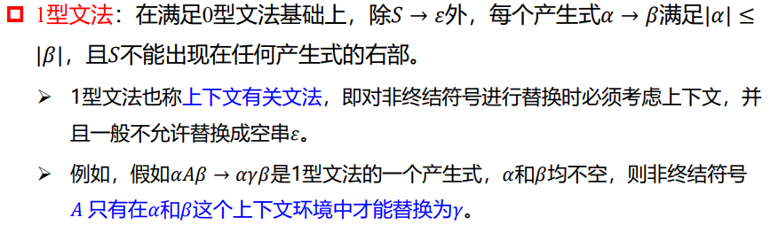
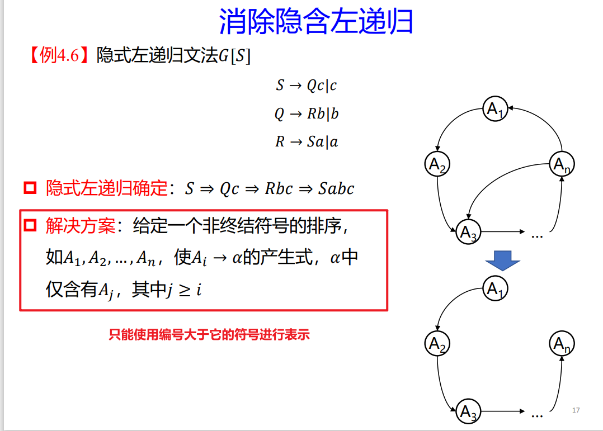
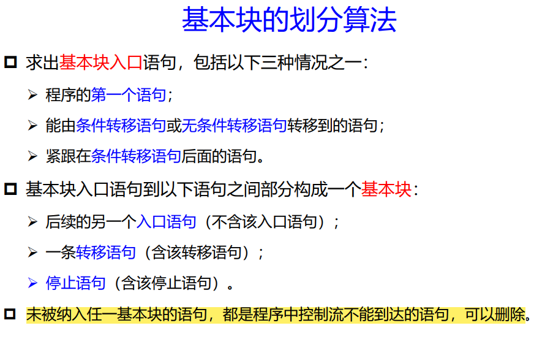

## 问题备忘

### if else问题

### 右线性文法、左线性文法和正规式之间的转换

### 如何根据DFA快速的求出对应的正规表达式

# 简答与计算

## 简答题

### 描述LR文法

对于一个文法，如果可以构造出一张分析表，使得他的每一个入口均是唯一确定的，则称这个文法是LR文法。

L表示从左到右扫描输入串，R表示构造出一个最右推导的逆过程。

对于一个LR文法来说，当分析器对输入串从左至右扫描时，需要维护符号栈和状态栈，并且由栈顶元素决定下一步执行的动作。LR分析时，一旦句柄出现于栈顶，就可以及时对他进行规约。

### 有哪些存储分配策略

1. 静态存储
2. 动态存储

静态存储策略在编译时对所有的数据对象分配固定的存储单元，并且在运行时保持不变。

栈式动态分配策略在运行时把存储器当做一个栈进行管理，运行时每当执行一次过程，他所需要的存储空间就可以动态的分配于栈顶，一旦退出，他所占用的空间也就被释放。

堆式动态分配策略在运行时把存储器组织成堆结构，以便用户关于存储空间的申请和归还，申请者需要从堆中分给一块，释放着需要退回给堆。

### 运行时存储器的划分

1. 目标代码区：目标代码的大小在编译时可以确定，所以编译程序可以把他放在一个静态确定的区域。
2. 静态数据区：编译时完全确定的数据可以放在静态数据区，并且应该尽可能多的静态分配数据对象。
3. 栈区：使用扩充的栈来管理过程的活动。当发生过程调用时，中断当前的执行，激活被调用过程的活动，并把包含在这个活动生存期中的数据对象以及和该活动有关的信息存储到栈中。当控制从调用返回时，将所占的存储空间弹出栈顶，同时被中断的活动恢复运行。
4. 堆区：数据对象在运行时分配空间，以便建立动态数据结构。这样的数据存储空间分配在堆区。

### 生存周期

一个过程的活动是指该过程的一次执行

关于过程P的一个活动的生存期是指从执行该过程体第一步操作到最后一步操作之间的操作序列。

一个过程是递归的，是指该过程在没有退出当前活动时，又开始新的活动。

一个说明在程序中起作用的范围成为该说明的作用域

### 编译前端和后端

#### 前端

前端主要由与源程序有关，但是与目标机器无关的部分组成。这些部分通常包括词法分析器，语法分析器，语义分析器与中间代码生成，有些代码优化的部分也在前端。

#### 后端

后端通常包括编译程序中与目标机器有关的部分，如目标机有关的代码优化和目标代码生成等。通常后端不依赖于源语言而仅仅依赖于中间语言。

### 符号表

用于登记原程序中出现的每一个名字以及名字的各个属性的表格

符号表的作用

1. 收集符号属性
2. 上下文语句的合法性检查的依据，例如变量重复定义，标号检查等
3. 作为目标代码生成阶段地址分配的依据。

对符号表的操作

1. 对给定的名字，查询此名是否已经在表中
2. 向表中填入一个新的名字
3. 对于给定的名字，访问他的某些信息
4. 对给定的名字，向表中填写或者更新他的某些信息
5. 删除一个或者一组无用的项

符号表的总体组织

1. 构造多个符号表，具有相同属性种类的符号组织在一起

   优点：每一个符号表中存放的符号的属性个数和结构完全相同

   缺点：编译程序需要一遍同时管理若干个符号表

2. 所有符号都组织在一张符号表中

   优点：管理集中单一

   缺点：增加了空间开销

3. 根据符号属性的相似程度分类组织成若干张表

   优点：减少了空间开销

   增加了表格管理的复杂性

符号表项的排列

1. 线性组织

   优点：插入块，空间效率高

   缺点：查询速度慢，时间效率差

2. 排序组织以及二分法

   优点：查询效率高，空间效率高

   缺点：插入效率低，算法比较复杂

3. Hash表

   优点：插入和查询的效率高

   缺点：空间效率降低

符号表的主要属性以及作用

1. 符号名

2. 符号的基本类型

3. 符号的存储属性

4. 符号属性的作用域以及可见性

5. 符号的存储分配信息

   静态存储区和动态存储区域（根据变量的局部定义和分程序定义，设置动态存储区来适应这些局部变量的生存和消亡）

### 遍

对源程序或源程序的中间结果从头到尾扫描一遍，并做有关的加工，生成新的中间结果或目标程序。

### 中间代码

中间代码是一种含义明确、便于处理的记号系统，常常独立于具体的硬件。

### 翻译程序与编译程序

翻译程序将某一种语言（源程序）转化为另一种语言（目标程序），而前者和后者在逻辑上是等价的。特别的，如果源程序是高级语言，而目标程序是低级语言，则这样的翻译程序称为编译程序。

### 解释程序

以源语言的程序作为输入，但是不产生目标程序，而是边解释边执行源程序本身。

### 目标机和宿主机

运行编译程序的计算机成为宿主机，运行编译程序产生的目标代码的计算机成为目标机。

一个编译程序产生不同于宿主机的机器代码，则称他为交叉编译程序。

### 编译程序能够发现几种类型的错误

语法错误（包括语法错误和词法错误）和语义错误（只能发现部分的）

### 形参和实参的四种方式

### 两种**==语法==**分析方法的问题

#### 自上而下分析法

1. 不能处理回溯问题
2. 不能处理虚假匹配问题
3. 不能左递归
4. 错误匹配不准确

#### 自下而上分析法

重点在于确定那一个串是可规约的

### 编译总框图

### 语法制导翻译

>对单词符号进行语法分析，构造语法树，然后根据遍历语法树并在语法树的各个节点处按照语义规则进行计算，这种由源程序的语法驱动的处理办法就是语法制导翻译。

**语法制导翻译简称SDT,基于属性文法的处理过程，对单词符号串进行语法分析，构造语法分析树，然后根据需要构造属性依赖图，遍历语法树并在语法树的各结点处按语义规则进行计算。**

基本思想是，根据翻译的需要设置文法符号的属性，以描述语法结构的语义

### 属性文法的定义

1. 属性文法：在上下文无关文法的基础上，为每一个符号配备若干相关的值，称为属性。这些属性代表与文法符号相关的信息，例如类型或者取值。
2. 属性通常分为两类：
   1. 综合属性：用于自下而上传递信息
   2. 继承属性：用于自上而下传递信息

### LL(1)文法的改写

无论是提取左公共因子还是消除左递归，都需要引入新的非终结符，作为中间的变量进行过渡

#### 提取左公共因子

$$
A->abC|ab    \\
A->ab(C|空)\\
A->abC',C'->C|空
$$

#### 消除左递归

$$
A->Aa|b\\
$$

可以化为
$$
A->bA'\\
A'->aA'|空
$$
（**==把左递归转化为右递归==**）

### 如何判断是LL(1)文法

1. ==**不含左递归**==
2. 产生式右侧的每一个候选式的首符集不相交
3. 如果产生式左侧的非终结符的首符集有空字符，则该非终结符的首符集和尾符集不相交

​	

### 描述LR分析算法

在规约的过程中，一方面记录下已经移进和规约的整个字符串，即记住历史，另一方面根据所用产生式推测未来可能碰到的输入符号，即对未来进行展望。其实质是一个带有先进后出存储器（栈）的优先状态自动机，每一步工作都是由栈顶状态和线性输入符号所唯一决定。

### C语言的活动记录

C语言的活动记录有以下的四个项目

1. 连续数据，分别是前一活动记录的地址（旧SP值）以及返回地址
2. 参数个数
3. 形式单元，用于存放实在参数的值或者地址
4. 过程的局部变量、数组内情向量和临时工作单元

结构如下图所示：

### 什么是S-属性文法

仅仅使用综合属性的文法称为S-属性文法

### 什么是是L-属性文法

文法中的每一个非终结符要么只有综合属性，要么有继承属性，但是继承属性仅仅依赖于该符号右边非终结符的属性

### 什么是句柄

一个句型的最左直接短语称为该句型的句柄

### 素短语、短语、直接短语、句柄

 素短语：是至少包含一个终结符号的短语，并且除它自身外，不再含有任 何更小的素短语。 

➢ 处于句型最左边的那个素短语就是最左素短语。

短语：一个有两层或者两层以上的子树的所有叶子结点从左向右排起来就是一个短语。

直接短语：如果一个子树的所有孩子都是叶节点，则该子树的所有孩子从左向右排起来就是一个短语。

句柄：一个语法树的最左短语就是句柄。

### 基本块

基本块是指程序中一组顺序执行的语句序列，其中只有一个入口和一个出口。入口就是其中第一个语句，出口就是其中最后一个语句。

对于一个基本块来说，执行时只能从入口进入，从出口退出。

### 确定基本块的入口语句的条件是什么

1. 程序的第一条语句
2. 能够由条件跳转语句或者无条件跳转语句转移到的语句
3. 紧跟在条件跳转语句后面的语句

### DISPLAY表

运行时的 DISPLAY 表的内容是什么？它的作用是什么？

DISPLAY 表是嵌套层次显示表。每当进入一个过程后，在建立它的活动记录 区的同时建立一张嵌套层次显示表 diaplay.假定现在进入的过程层次为 i，则它 的 diaplay 表含有 i+1 个单元，自顶向下每个单元依次存放着现行层、直接外层、 …、直至最外层(主程序，0 层)等每层过程的最新活动记录的起始地址。通过 DISPLAY 表可以访问其外层过程的变量

### 代码优化

#### 前端优化

在目标代码生成之前，对语法分析后的目标代码进行优化

#### 后端优化

在生成目标代码时进行优化，依赖于具体的计算机指令系统

#### 局部优化

局限于基本块范围内的优化成为基本块内的优化，或称为局部优化

#### 优化的定义

对程序进行各种等价变换，使得从变换后的程序出发，可以生成更加有效的目标代码，通常称这种变换为优化

#### 主要目的

优化的目的是为了产生更高效的代码

#### 基本原则

1. 等价原则：不改变程序的运行结果
2. 有效原则：优化之后要么时间缩短，要么空间更有效
3. 合算原则：以较低的代价产生较好的效果

#### 主要手段

1. 删除公共子表达式
2. 复写传播
3. 强度削弱
4. 删除无用代码
5. 删除归纳变量
6. 代码外提

## 画图表示编译过程的各阶段

表格管理：用来等级源程序中出现的每一个名字以及名字出现的各种属性，编译原理各个阶段都涉及到构造、查找或更新有关的表格

## 如何转化为后缀表达式

按照实际计算的优先级从左向右进行转化。

特别是逻辑运算，注意**==非运算>与运算>或运算==**

## 二义文法

如果一个文法的某个句子对应两棵不同的语法树，即其最左（ 最右）推导不唯一，称该文法为二义文法

原因：文法中缺少对文法符号优先级和结合性的规定，在 产生句子的过程中某些推导有多于一种选择

改写二义文法的关键步骤：

1. 引入一个新的非终结符，增加一 个子结构并提高一级优先级； 
2. 递归非终结符在终结符左边，使 该终结符具有左结合性，否则具有右结合性。

### 例子

### 如何修改成无二义文法

1. 新引入的非终结符，限制了每一步直接推导均有唯一选择
2. 最终语法树的形状，仅与文法有关，而与推导方法无关
3. 非终结符的引入，增加了推导步骤（语法树增高）
4. 越接近S的文法符号的优先级越低
5. 对于A→αAβ，其右部中，若A在终结符a左边出现（即β中 包含a），则终结符a具有左结合性质。

#### 改写二义文法的关键步骤

1. 引入一个新的非终结符，增加一 个子结构并提高一级优先级
2. 递归非终结符在终结符左边，使 该终结符具有左结合性，否则具有右结合性。

### 形式语言鸟瞰

## 正规式和正规集

正规式是一个表达式，类似于一个函数表达式

正规集是一个集合，类似于函数的值域，对应正规式可以生成的字符串的取值空间，是正规式所能生成的所有字符串的集合。

正规文法是一个五元组，有终结符，非终结符，产生式，初态和终态构成。正规文法描述了正规式的产生过程。

### 正规文法

正规文法包括左线性文法和右线性文法

左线性文法指的是非终结符在产生式右侧的最左边

右线性文法指的是非终结符在产生式右侧的最右边

### DFA确定有限自动机定义

### 非确定有限自动机定义

### NFA如何确定化

### FA->正规式

## 如何将NFA确定化并最小化

分成两步，首先是确定化，之后是最小化

1. 首先根据正规表达式构造一个NFA，并画出NFA状态转化图
2. 根据图中边的关系，依次求$close$闭包，直到收敛，最终构造出一张状态转化表
3. 首先将集合的状态划分为含有终态和不含有终态的两个集合，之后递归对集合进行划分，直到将集合划分完毕。

# 词法分析——自上而下分析

## 消除左递归

## First和Follow集合的求法

### First集合

首先初始化每一个终结符的首符集就是自己。对于非终结符，需要不断扫描每一个产生式，分析非终结符第一个推出来的终结符是哪个。

尤其注意非终结符的首符集可以按照产生式之间的递推关系进行传递，并且首符集中可以出现空字符。

### Follow集合

1. 首先注意，只有非终结符才有Follow集，并且初始时，每一个非终结符的Follow集都是空，只有开始字符的Follow集合有一个#(句末结束符)
2. 之后不断扫描产生式，分析每一个非终结符·都会跟着哪些终结符，例如可以是紧跟在后面的非终结符的首符集（出去空字符）、可以是紧跟在后面的非终结符。如果非终结符后面啥都没有，也可以是产生式左边非终结符的Follow集合。
3. 尤其要注意，Follow集合中没有空字符。

**==当产生式中可以推出空字符时，需要格外注意First和Follow集合在求解时的传递性==**

## LL(1)分析

### LL1文法的定义

满足一下条件的文法称为LL1文法

1. 文法不含递归
2. 对于文法中的每一个非终结符A的各个产生式的候选首符集两两不想相交。也就是如果

$$
A->\alpha_1|\alpha_2|\alpha_3...\alpha_n
$$

则$FIRST(\alpha_i)\and FIRST(\alpha_j)=φ$

3. 对于文法中的每一个非终结符A，如果它存在某个候选首字符集包含空子符，则$FIRST(A)\and FOLLOW(A)=φ$

### 如何判断一个文法是不是LL1文法

1. 首先判断同一个产生式中出现的非终结符的$first$集合两两不相交
2. 对于任意一个非终结符，其$first$和$follow$集合不相交

### LL1分析步骤

对于LL1文法，可以按照以下步骤来匹配关键词

1. 如果$a \in FIRST(\alpha_i)$，则指派$\alpha_i$去执行匹配任务
2. 如果a不属于任何一个候选首字符集，则
   1. 如果空字符属于某个首字符集$FIRST(\alpha_i)$并且$a\in FOLLOW(A)$，则让A与空字符进行匹配
   2. 否则，报错（a出现是无法匹配的）

## LL1预测分析表的构造

例子：

按部就班的写

1. 扫描每一个产生式，把每一个产生式中左右两边的符号的首符集都求出来。
2. 把每一个产生式左边符号的Follow集合求出来。

快速的方法

1. 扫描LL(1)分析表中每一行，且每一行代表一个非终结符A。查看所有产生式中，以该非终结符在左侧的产生式

1. 一个非终结符只对应LL（1）分析表中的一行，并且一般来说一个非终结符也只会给出一个产生式。

2. 对于步骤1中找出来的每一个产生式，分析其右侧表达式对应的first集合。如果没有空字符，则将该产生式放入first集中每一个元素对应的列中。

   如果有空字符，则将A->空字符添入follow（A）中。

   特别注意：如果产生式的右侧是多个非终结符连续排列，且非终结符的first集合中有空字符，则注意follow集合的传递

   

   

   

# 自下而上分析

[编译原理 —— 短语、直接短语、素短语和句柄 - 哔哩哔哩 (bilibili.com)](https://www.bilibili.com/read/cv8492761)

## 短语、直接短语、句柄

短语：一个有两层或者两层以上的子树的所有叶子结点从左向右排起来就是一个短语。

直接短语：如果一个子树的所有孩子都是叶节点，则该子树的所有孩子从左向右排起来就是一个短语。

句柄：一个语法树的最左短语就是句柄。

## 如何构造SLR分析表

1. 首先画一个表：SLR表的每一行表示一个项目集，每一列表示一个非终结符（ACTION）或者终结符（GOTO）

2. 如果需要规约：依次扫描每一个项目集$I_k$中的产生式，如果是一个需要规约的产生式$A->\alpha ·$,则对于任意的终结符$a \in FOLLOW(A)，在表ACTION[k,a]处填入r_j,假定A->\alpha是文法的第j个产生式$

3. 如果是acc：如果项目$S'->S·属于I_k$，则置$ACTION[k,\#]=acc$

4. 如果是需要移进：如果$A->\alpha·a\beta \in I_k,且GO[I_k,a]=I_j，且a为终结符，则置ACTION[k,a]=s_j$

注记：

1. 如果是规约则只更新FOLLOW集合对应的元素

2. 如果是移进则识别了非终结符则更新GOTO表，识别了非终结符则更新ACTION表

## LR和SLR的对比	

## 辨析

1. 每一个SLR（1）文法都是无二义的，但是无二义的文法不一定是SLR（1）的

## 各种文法的判断方法

#### LR(0)

对于每一个项目集，分析其中是否既有规约项目，又有移进项目

#### SLR(1)

对于每一个项目集，如果没有移进-规约冲突，则一定满足SLR(1)

如果有移进-规约冲突，则分析是否是可消解的（当前的字符只能满足规约或者移进某一条条件）

如果有规约规约冲突，则分析是否是可消解的（当前的字符只能跟在某一个非终结符的Follow集合中，而不能是多个）

#### LALR(1)

在SLR(1)的基础上，将具有**==相同的心==**的项目集进行合并。合并之后如果没有新的规约规约冲突，则是LALR(1)文法

#### LR(1)

使用LR(1)分析法构造分析表，如果每一个空上最多有一个动作，则说明不存爱动作冲突，则说明是满足LR(1)文法

==**对于LL(1)文法，只需要判断每一个产生式是否满足First之间不相交，且各自的Follow和First也不相交即可。**==

并且LL(1)**==文法一定是不含左递归的文法==**

# 属性文法翻译和语法制导

## 将高级语言翻译成目标代码

首先分析高级语言程序对应的计算顺序

按照实际计算过程中的计算顺序调用相应的产生式，并执行产生式后对应的动作。

最终生成目标代码（三地址代码或者四元式）

## 各种优先级

## 易错

1. 分支指令执行完毕之后一定要附加上无条件跳转指令$(j,-,-,出口)$，例如else if或者if后面一定要加上无条件跳转指令，否则随着指令的执行会自动向下执行else程序段的指令。

例如

2. while内部执行完毕之后需要加上依据跳转回while最开始的入口

## 采用中间语言的好处

1. 便于进行与机器无关的代码优化工作
2. 使编译程序改变目标机器更容易
3. 使编译程序在结构上更加简单明确

# 代码优化

## 基本块的划分

## 循环优化

### 代码外提

1. 定值：定值就是赋值，在某点对A定值，就是指在该处对变量A进行赋值。

1. 语句是所有出口的必经节点或者代码中的左值出代码块之外是不活跃的
2. 代码块中没有其他地方对左值进行赋值
3. 代码块中只能引用该语句对左值的赋值

### 强度削弱

1. 乘法替换为递推的加法
2. 变量替换为常量

###  删除归纳变量

经常与强度削弱一起使用，将循环变量的加减用其他必须要计算的符号间接代替。需要在进入循环之前计算出来新的循环终止条件。

## DAG优化

1. 首先建立有向无环图

   1. 如果是常量节点，则直接建立，并将变量附加在节点上就行
   2. 如果可以计算出是常量节点，则直接建立该常量节点并附加变量信息即可
   3. 如果是变量参与的运算，则为每一个操作数建立节点，并附加信息
   4. 注意第一操作数和第二操作数的位置关系（第一操作数在左边，第二操作数在右边）

2. 如果需要写优化后的目标代码，且知道出了基本块后的活跃变量，则只用计算DAG中以活跃变量为根的子树

3. 如果需要写优化后的四元式，则翻译成四元式

4. 如果涉及到寄存器的分配，则需要将计算每一个变量的待用信息和活跃信息，并从后向前为每一条目标代码的左值，第一操作数、第二操作数维护待用信息和活跃信息。

   在分配寄存器时，最后需要将活跃变量从寄存器存储到主存中（ST R M，其中R是寄存器，M是变量符号）

### 活跃的定义

基本块中的一个名字在程序中某个给定点是活跃的，指如果在程序中（包 括本基本块或其它基本块），它的值在该点以后被引用

### 寄存器分配算法

1. 如果𝐵存放在某个寄存器𝑅𝑖，𝑅𝑣𝑎𝑙𝑢𝑒[𝑅𝑖 ]只包含𝐵，同时，或者𝐵与𝐴是同一标识 符，或者中间代码𝑖中𝐵的信息为(−, −)（即后面不再引用），则选取𝑅𝑖为所需寄存 器，转(4)。 
2. 如果(1)失败，若有空闲寄存器𝑅𝑖，选择其作为所需寄存器，转(4)。 
3. 若2.也失败，需要从已分配寄存器中选择𝑅𝑖：占用该𝑅𝑖的变量也保存在主存中 ，或者在最远的地方被引用（即待用信息值最大）。

4. 对𝑅𝑣𝑎𝑙𝑢𝑒[𝑅𝑖 ]中的每个变量𝑀，如果𝑀 ≠ 𝐴，或者𝑀 = 𝐴 = 𝐶 ≠ 𝐵 ∧ 𝐵 ∉ 𝑅𝑣𝑎𝑙𝑢𝑒[𝑅𝑖]，则： 

   ① 如果𝑀 ∉ 𝐴𝑣𝑎𝑙𝑢𝑒[𝑀]，生成目标代码𝑆𝑇 𝑅𝑖 , 𝑀； 

   ② 如果𝑀 = 𝐵，或者𝑀 = 𝐶 ∧ 𝐵 ∈ 𝑅𝑣𝑎𝑙𝑢𝑒[𝑅𝑖]，则令𝐴𝑣𝑎𝑙𝑢𝑒 𝑀 = {𝑀, 𝑅}，否则 令𝐴𝑣𝑎𝑙𝑢𝑒 𝑀 = {𝑀}

   ③ 删除𝑅𝑣𝑎𝑙𝑢𝑒[𝑅𝑖]中的𝑀

   ④ 给出𝑅，返回

1. 优先复用第一操作数所在的寄存器

   复用的条件：

   1. 第一操作数所在的寄存器中没有其他变量
      1. 第一操作数也是左值或者第一操作数后续不再使用

2. 不能服用则在考虑分配空闲寄存器

3. 不能复用且没有空闲寄存器，则只能抢占一个寄存器，找一个最远被访问的寄存器进行替换

找到寄存器之后需要更新变量存储的状态

1. 对于指令LD R x：

   1. 首先修改寄存器描述符，使之只包含x
   2. 修改x的地址描述符，把R作为新增位置加入到x的位置集合，并从任何不同于x的地址描述符中删除R

   也就是：更新寄存器数组和主存单元，建立寄存器x和变量R之间的一一映射（两边都是唯一确定的）

2. 对于指令OP Rx, Ry, Rz：

   1. 更新寄存器数组，使得只有Rx中包含x
   2. 更新主存单元，使得只有x处有寄存器Rx

3. 对于指令ST x, R:

   1. 修改x的地址描述符，使之包含自己的内存单元

4. 对于赋值语句x=y，如果需要生成加载指令LD Ry, y，

   1. 修改Ry的寄存器描述符，使之包含x和y
   2. 向主存单元y中加入寄存器Ry
   3. 修改主存单元x，使其只包含Ry

