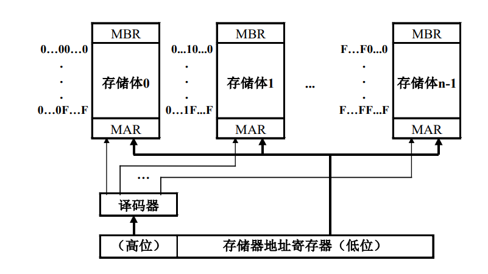

[toc]

# 题型

1. 概念简答题
   1. 仿真和模拟的区别
   
   2. 互联网络
   
   3. 计算机系统的分类，弗莱明分类
   
   4. CICS和RISC方向
   
   5. 存储系统的评价指标
   
   6. 堆栈型替换算法
   
   7. 标志符数据表示：为了缩短高级语言和机器语言之间的差距，可以让机器中的每一个数据都加上类型标志符。
   
   8. 数据描述符：为了进一步减少标志符所占用的存储空间，对向量、数据、记录等数据由于元素属性相同，采用数据描述符，作用于一组数据。
   
   9. RISC的基本思想：通过减少指令的种类和简化指令功能来降低硬件设计的复杂度，提高指令执行速度，减少CPI。
   
      关键技术：延迟转移技术，指令取消技术，重叠窗口寄存器技术，指令流调整技术，高速缓冲寄存器技术，优化设计编译系统。
   
   10. 存储系统层次结构：
   
       寄存器堆-线性缓冲栈-高速缓冲寄存器-主存储器-脱机存储器-联机存储器
   
   11. Cache一致性问题：
   
       - CPU写Cache但是没有写主存
       - 由于I/O处理机或者设备写主存
   
   12. 基本输入输出方式
   
       - 程序控制方式：一个处理机为多台设备服务，采用轮询的方式进行测试，分时为多个设备服务。
       - 中断输入输出方式：当出现中断时，CPU暂停当前程序转去处理其他事件，处理完成之后再返回继续执行原程序
       - DMA直接存储器访问：外围设备的访问请求直接发往主存储器，CPU与外围设备并行工作。数据的传送过程不需要CPU的干预，不需要做保存现场和恢复现场等工作。
   
   13. 中断分类：
   
       目的：在响应中断后，快速的找到中断的入口。
   
       一般可以分为可屏蔽中断和不可屏蔽中断。
   
   14. 向量链接技术：当前一条指令的结果寄存器是后一条指令的目的寄存器时，多条有数据相关的指令可以同时并行，这种技术称为向量链接技术。
   
       第一个结果产生送入结果寄存器时，立即送入下一个功能部件的入口，开始执行后续的向量操作。此后得到的中间结果都按此处理。这样前面功能部件的结果一旦产生，就立即送入后面的功能部件使用，不用等到结果向量全部产生再使用。
   
   14. 通道的作用
   
       1. 选择设备：接收CPU发出的指令，选择一个指定的外围设备与通道相连接
   
       2. 执行程序：执行CPU为通道组织的通道程序
   
       3. 地址管理：
   
          - 管理==**外围设备**==的有关地址
   
          - 管理**==主存缓冲区==**的地址。
   
       4. 控制次数：控制外围设备与主存缓冲区之间交换的个数
   
       5. 收尾工作：指定传送工作结束时需要执行的操作
   
       6. 检查状态：检查外围设备的工作状态是正常还是故障
   
       7. 格式变换：在数据传送过程中完成必要的格式变换
   
   15. 通道的工作过程
   
       - 在用户程序中使用**==访管指令==**进入管理程序，由CPU通过管理程序组织一个**==通道程序==**，并启动通道。
       - 通道处理机执行通道程序，完成指定的数据输入输出工作。
       - 通道程序结束后再次调用管理程序进行处理。
   
   16. 互联网络：
   
       - 定义：互联网络是一种由开关元件按照一定的拓扑结构和控制方式构成的网络，用来实现计算机系统中节点之间的相互连接。
       - 作用：
         - 处理机与本地存储器和私有高速缓存相连
         - 处理机之间的通信
         - 通过互联网络共享存储器模块和I/O设备。
         - 
       
   18. 静态互联函数
   
       
   
       
   
   
   
   
   
2. 大题
   1. Amdahl定律
   2. 进制转换
   3. 扩展编码，Huffman
   4. 中断向量，向量屏蔽技术
   5. 禁止向量的计算，找最小的启动循环
   6. 流水线，向量链接技术
   7. 内存分配，虚拟存储系统
   8. 通道，流量的计算
   9. 互联网络
   10. CPU的效率计算

# 第一章

## 解释和翻译

## 层次结构

## 计算机系统结构的定义

1. 程序设计者所看到的计算机系统的属性，即概念性结构和功能型结构。按照计算机系统的多层次结构，不同层级的程序员看到的计算机具有不同的属性，底层计算机的属性相对于高层计算机的程序员是透明的。
2. 计算机系统结构也成为计算机系统的体系结构。

结论：计算机系统结构研究的是软硬件之间的功能分配，以及对传统机器级界面的确定，为不同层次的设计者提供相应的计算机属性

## 逻辑实现和物理实现

### 逻辑实现

计算机组成（Computer Organization）

1. 计算机系统结构的逻辑实现，包含物理机器级中的数据流和控制流的组成 以及逻辑设计等，着眼于物理机器级内各事件的排序方式与控制方式、各 部件的功能以及各部件之间的联系 

### 物理实现

计算机组成的物理实现, 主要包括

1. 处理机、主存储器等部件的物理结构；
2. 器件的集成度和速度； 
3. 专用器件的设计；
4. 器件、模块、插件、底版的划分与连接； 
5. 信号传输技术；
6. 电源、冷却及装配技术，制造工艺及技术等。

## 处理机的分类

1. 按性能和价格的综合指标划分：巨型、大型、中型、小型、微型机

2. Flynn分类法：按照指令流和数据流的多倍性特征进行分类。

   - 指令流：机器执行的指令序列
   - 数据流：由指令流调用的数据序列
   - 多倍性：在系统性能瓶颈部件上同时处于同一执行阶段的指令或者数据的最大可能个数

   四种类型

   - 单指令流单数据流SISD：例如典型的顺序处理机
   - 单指令流多数据流SIMD：例如并行处理机，阵列处理机，向量处理机
   - 多指令流单数据流：几条指令对于同一个数据进行不同的处理
   - 多指令流多数据流：例如多处理机系统

3. 库克分类法

## **Amdahl定律**

## CPU性能公式

## 计算机系统层次结构

### 由上而下

设计过程：由上向下

面向应用的数学模型→面向应用的高级语言→面向这种应用的操作系统→面向 操作系统和高级语言的机器语言→面向机器语言的微指令系统和硬件实现 •

应用场合：专用计算机的设计 

特点：对于所面向的应用领域，性能和性能价格比很高。随着通用计算机价格降低，目前已经很少采用。

### 由下而上

设计过程：根据当时的器件水平，设计 微程序机器级和传统机器级→根据不同 的应用领域设计多种操作系统、汇编语 言、高级语言编译器等→最后设计面向 应用的用户级

应用场合：通用计算机的一种设计方法， 在计算机早期设计中（60～70年代）广 为采用

特点：容易使软件和硬件脱节，整个计 算机系统的效率降低。

### 由中间开始

设计过程：

1. 首先定义软硬件的分界面(指令系统、存储系统、输入输出系统、中断系 统、硬件对操作系统和编译系统的支持等)
2. 然后各个层次分别进行设计(软件设计人员设计操作系统、高级语言、汇 编语言、应用程序等，硬件设计人员设计传统机器、微程序、硬联逻辑等)

应用场合：用于系列机的设计 

特点：软硬件人员结合、同时设计，软硬件功能分配合理

### 冯·诺依曼结构

存储程序原理的基本点：指令驱动

1. 程序预先存放在计算机存储器中，计算机一旦启动，就能按照程序指定的 逻辑顺序执行这些程序，自动完成由程序所描述的处理工作
2. 以运算器为中心,集中控制。 
3. 在存储器中，指令和数据同等对待。指令和数据一样可以进行运算，即由指令 组成的程序是可以修改的。 
4. 存储器是按地址访问、按顺序线性编址的一维结构，每个单元的位数是固定的。 ❑指令的执行是顺序的。 
   1. 一般是按照指令在存储器中存放的顺序执行。
   2.  程序的分支由转移指令实现。 
   3. 由指令计数器PC指明当前正在执行的指令在存储器中的地址。 ❑指令由操作码和操作数组成。 
5. 指令和数据均以二进制编码表示，采用二进制运算

## 模拟和仿真的定义

### 仿真与模拟的区别 

1. 解释用的语言不同 
2. 解释程序所存的位置不同：仿真存在控制寄存器，模拟存在主存中 
3. 说明：
   1. 模拟适用于运行时间不长、使用次数不多的程序
   2. 仿真提高速度，但难以仿真存储系统、I/O系统，只能适用于系 统结构差异不大的机器间； 
   3. 在开发系统中，两种方法共用

### CPU性能公式

$IC程序执行的总指令条数：取决于指令集结构和编译技术$

$平均每条指令的时钟周期数CPI：取决于计算机组成的指令集结构$

$时钟主频f_c:取决于硬件实现技术和计算机组成$

$CPU程序执行的时间=IC\times CPI \times  f_c$

$MIPS=\frac{指令条数}{执行时间\times 10^6}$

优点：

1. 直观方便

缺点：

1. 依赖于指令集，不同指令集之间比较不准确。
2. 在同一台机器上，由于指令使用频度差别很大，因此MIPS会因为程序的不同而变换。也可能出现与性能相反。

### 程序访问的局部性原理

时间局部性：程序中期被访问的信息项很可能马上再次被访问

空间局部性：在访问地址上邻近的信息项很可能被在一起访问

### 并行的概念

#### 三个概念

并行性（Parallelism）：计算机系统在同一时刻或者同一时间间隔内 进行多种运算或操作 

同时性（Simultaneity）：两个或两个以上的事件在同一时刻发生 

并发性（Concurrency）：两个或两个以上的事件在同一时间间隔 内发生

#### 并行的粒度

从执行程序的角度来看，并行性等级从低到高可分为 

1. 指令内部并行：单条指令中各微操作之间的并行
2. 指令级并行：并行执行两条或两条以上的指令
3. 线程级并行：并行执行两个或两个以上的线程 • 通常是以一个进程内派生的多个线程为调度单位 

任务级或过程级并行：并行执行两个或两个以上的过程或任务 （程序段） • 以子程序或进程为调度单元 

作业或程序级并行：并行执行两个或两个以上的作业或程序

# 第二章

## 数据表示定义

数据表示是指计算机硬件能够直接识别，可以被指令系统直接调用的 那些数据类型

## 不同数据表示的优缺点

### 自定义数据表示——标志符数据表示

#### 优点

1. 简化了指令系统
2. 由硬件实现一致性检查和数据类型转换。
3. 简化编译器，使高级语言与机器语言之间的语义差距大大缩短。
4. 支持数据库系统，一个软件不加修改就可适用于多种数据类型。 
5. 方便软件调试，在每个数据中都有陷井位

#### 缺点

1. 数据和指令的长度可能不一致

   可以通过精心设计指令系统来解决

2. 指令执行速度降低

   但是，程序的运行时间是由设计时间、编译时间和调试时间共 同组成的。 

   采用标志符数据表示方法，程序的设计时间、编译时间和调试 时间可以缩短

3. 硬件复杂度增加

   由硬件实现一致性检查和数据类型的转换

### 自定义数据表示——数据符表示

为进一步减少标志符所占用的存储空间，对向量、数据、记录等数 据，由于元素属性相同，采用数据描述符。 

数据描述符与标志符的区别：标志符只作用于一个数据，而数据描 述符要作用于一组数据。

### 向量、数组数据表示

定义：为向量、数组数据结构的实现和快速运算提供个更好的硬件支持的方 法是增设数组数据表示，组成向量机

### 堆栈数据表示

定义：堆栈数据结构在编译和子程序调用中很有用，为高效实现，很多机器 都设置有堆栈数据表示

一般通用寄存器型机器对堆栈数据结构实现的支持较差：堆栈操作用 的机器指令少、功能单一；堆栈置于存储器内，访问速度较低，通常 只用于保存子程序调用时的返回地址，较少用于实现程序之间的参数 传递

堆栈机器的特点：

1. 有高速寄存器组成的硬件堆栈
2. 丰富的堆栈 操作指令，功能强大
3. 支持高级语言编译
4. 支持子程序的嵌套 和递归调用

## 浮点数的表示方法

### 通用表示方法

### 浮点数的规格化

### 浮点数表示的一些性质

### 浮点数表示的例题

### 不同进制表示的性质

1. 基数$r_m$越大，数在数轴上的分布越稀疏，数的表示精度下降
2. 当基数变大后，对阶移位的机会减少，数的表示范围扩大，使尾数溢出后需要右规的次数减少，精度损失减少。
3. 基数$r_m$变大之后，由于对阶或尾数溢出需要右移以及规格化需要左移的次数减少，运算速度增加

因此，随着基数的增大，浮点数的表示范围扩大，可以表示的数据的个数增加，减少了移位次数以及右移造成的精度损失，提高运算速度。但是会降低数据的表示精度，数值的分布变的稀疏。

## 浮点数下溢处理

### 截断法

将尾数超出机器字长的部分截去。优点是实现简单，不增加 硬件，不需要处理时间；缺点是平均误差较大且无法调节

### 舍入法

在机器运算的规定字长之外增设一位附加位，存放溢出部分 的最高位，每当进行尾数下溢处理时，将附加位加1。优点是实现简单，增 加硬件很少，最大误差小，平均误差接近于零；缺点是处理速度慢，需要 花费在附加位上加1以及因此产生的进位时间

### 恒置“1”法

把有效字长的最低一位置成1。优点是实现简单，不需 要增加硬件和处理时间，平均误差接近0；缺点是最大误差较大

### 查表舍入法

用ROM或者PLA存放下溢处理表。优点是速度快，平均误 差可以调节到0；缺点是硬件量大

### 各种方法的对比

恒置法虽有少量的积累误差，且损失一位精度，但由于实现很容易， 普遍在小型微型机中使用。 

舍入法只有少量积累误差，且精度比较高，但实现很复杂，用于软 件实现的算法中。 

查表法实现比较容易，积累误差很小，且可以通过改变ROM或PLA中 的内容来修正积累误差，是一种很有前途的舍入方法。

## 数据对齐

数据按照字对其存储，会增加地址信息的浪费，以及存储空间的浪费。

但是读写速度快，读写控制逻辑简单

### 大端小端问题

## 交叉编址

并行存储器的编址技术包括：

1. 高位交叉编址：主要用来扩大存储器容量。
2.  低位交叉编址：主要是提高存储器速度

### 高位交叉编址

### 低位交叉编址

## 寻址方法

### 立即数寻址方式

直接在指令中给出操作数， 用于数据比较短，且为源操作数的场合 

### 面向寄存器的寻址方式

指令在执行过程中所需要的操作数来自于寄 存器，运算结果也写回到寄存器中

### 直接寻址

在指令中直接给出参加运算的操作数及运算结果所存 放的主存地址。 

### 间接寻址

指令中给出的是操作数地址的地址，必须经过两次 （或两次以上）的访主存操作才能得到操作数。 

### 变址寻址（相对寻址、基址寻址）

指令执行时，用一个硬件加 法器，把变址寄存器中给出的基地址加上指令中给出的偏移量， 才能得到有效地址

### 面向堆栈的寻址方式

堆栈寻址方式的地址是隐含的，在指令中不需要 给出操作数的地址

### 定位方式

概念：程序所分配到的主存物理空间和程序本身的逻辑空间是不相同的，需要把指令的数据中的逻辑地址转化为主存储器的物理地址（绝对地址）

程序需要定位的原因：

1. 程序的独立性
2. 程序的模块化设计
3. 数据结构在程序运行过程中，大小是变化的
4. 有些程序很大，大于分配给他的主存物理空间。

#### 直接定位

在程序装入主存储器之前，程序中的指令和数据的主存物理地址已经确定

静态定位

在程序装入主存储器的过程中随机进行地址变换，确定指令和数据的主存物理地址

动态定位

在程序执行的过程中，当访问到相应指令或者数据才进行地址变换，确定指令和数据的主存物理地址

## 指令系统的设计

### 最理想情况的编码长度计算

### Huffman编码法

### RISC/CISC

两种途径和方向

1. 按CISC方向：增强原有指令的功能以及设置更为复杂的新指令，取代原先由软件子程序完成的功能，实现软件功能的硬化
2. 按RISC方向：通过减少指令种类和简化指令功能来降低硬件设计的复 杂度，提高指令执行速度，核心思想是减少指令的CPI

### CISC特点

1. 通过增强指令系统的功能，简化了软件，增加了硬件复杂度

2. 由于指令的复杂性，指令的执行时间必然加长，从而使整个程序的执行时间反而增加
3. CISC为了实现大量复杂指令，控制逻辑极不规整
4. 通过减少指令种类和简化指令功能来降低硬件设计的复 杂度，提高指令执行速度
5. 按CISC方向发展和改进指令系统可以包括
   1. 面向目标程序的优化实现改进
   2. 面向高级语言的优化实现改进
   3. 面向操作系统的优化实现改进

### RISC

#### RISC的特点

#### RISC的关键技术

基本思想：减少指令的时钟周期数（CPI）

1. 延迟转移技术：为了使指令流水线不断流，在转移指令之后插入一条没有数据相关和控制相关的有效指令，而转移指令被延迟执行。整个过程由硬件完成，用户无需参与。

   特点：

   - 被移动的指令在移动过程中所经过的指令之间没有数据相关
   - 被移动指令不破坏条件码，至少不影响后续指令使用的条件码。

2. 指令取消技术：

   向后技术（适用于循环程序）：循环体的第一条指令放在两个位置，分别是循环体之前和之后。如果转移成功，则循环体后面的质量，然后返回循环的开始。否则取消循环体后的面对指令。

   向前技术（IF THEN）：如果转移不成功，则执行转移指令之后的下一条指令，否则取消转移。

3. 重叠寄存器窗口：

   在RISC中子程序比CISC多，因此传送参数而访问寄存器的信息量大，可以设置一个数量比较大的寄存器堆，并划分为多个窗口。在每一个过程使用的几个窗口中，有一个窗口是与之前一个过程共用，有窗口与下一个过程共用。

4. 指令流调整技术：通过变量重新命名消除数据相关，提高流水线效率

5. 采用高速缓冲存储器Cache：分别设置指令Cache和数据Cache，用于存放指令和数据。保证向指令流水线不间断的输送指令的存取数据，提高流水线的效率。

6. 优化器编译系统：编译程序尽可能优化寄存器的分配，提高使用效率，减少访问次数。

# 第三章——存储系统

## 基本概念

### 存储系统的评价指标

存储器的主要性能：速度、容量、价格 

1. 速度用存储器的访问周期、读出时间、频带宽度等表示。
2. 容量用字节B、千字节KB、兆字节MB和千兆字节GB等单位表示。 
3. 价格用单位容量的价格表示

 组成存储系统的关键：把速度、容量和价格不同的多个物理存储器组 织成一个存储器，这个存储器的速度最快，存储容量最大，单位容量 的价格最便宜

### 存储系统的定义

两个或者两个以上速度、容量个叫各不相同的存储器用硬件，软件或者软硬结合的方法连接起来成为一个存储系统。这个存储系统对程序员透明，且速度接近最快的存储器，价格接近最便宜的存储器。

一般有两种存储系统

1. Cache存储系统
   1. 由Cache和主存储器构成
   2. 主要目的是提高存储器速度
2. 虚拟存储系统
   1. 由主存储器和硬盘构成
   2. 主要目的是扩大存储器容量

提高存储器系统速度的两种途径

1. **==提高命中率==**
2. 减少存储器之间的速度差

## 存储系统的层次结构

## **==频带平衡==**

## 并行访问存储器的主要缺点

1. 取指令冲突：当遇到程序转移指令且转移成功时，一个存储周期读出的n条指令中，后面的几条指令将无用。
2. 读操作冲突：一次读出n个操作数，但是不一定都有用
3. ==**写数据冲突：需要凑齐n个数据后才能写入内存**==
4. 读写冲突：当需要读出的字和写入的字同处于一个存储器时，无法在一个存储周期完成。

## **==交叉访问存储器==**

### 高位交叉访问存储器

主要目的：扩大存储器容量

实现方法：用地址码的高位部分区分存储体号

其实也就是地址优先按照一个存储体内部顺序编排，下一个存储体接着上一个存储器的地址继续遍址。

### 低位交叉遍址

主要目的：提高存储器的访问速度

实现方法：用地址码的地位部分区分存储体号

地址优先按照不同的存储器向后编排，同一个存储体内部的地址都是跳跃的。需要同时读取若干个存储体才可以得到一个完成的字

### ==访问冲突==

## 虚拟存储器

### 工作原理

把主存储器、磁盘存储器和虚拟存储器都划分为固定大小的页，其中主存储器的页成为实页，虚拟存储器中的页面成为虚页。实际的内存管理以页为单位进行分配和回收。

### 段式虚拟存储器

#### 优点

1. 程序的模块化性能好
2. 便于程序和数据的共享
3. 程序的动态连接和调度比较容易
4. 便于实现和信息保护

#### 缺点

1. 地址变换所花费的时间较长，两次加法（段号+段表基址，段地址+段内偏移）
2. 主存储器的利用率往往较低

### 页式虚拟存储器

页式虚拟存储器把虚拟地址空间划分成一个个固定大小 的块，每一块称为一页（page），把主存储器的地址空间也按虚拟 地址空间同样的大小划分为页

#### 优点

1. 主存储器的利用率较高
2. 页表相对比较简单
3. 地址变换速度较快
4. 对磁盘的管理相对容易

#### 缺点

1. 程序的模块化性能不好
2. 页表很长，需要占用很大的存储空间。

### 段页式

#### 直接映像以及地址变换

#### 全连接地址映像

用户的 每一页都可以映像到主存 储器的任意一页的位置

#### 组相连映像

### 段页式虚拟存储器

## 地址映像过程——Cache+组相联

### Cache三种映射

关于地址的划分，

1. 主存地址的划分：假设主存地址长度为$l$	
   - 首先根据Cache块的大小，计算块内地址长度$address$
   - 如果是全相连，则$l-address$全部作为标记字段
   - 如果是直接相连，则在计算Cache中有多少行（Cache的总容量除以Cache块的大小，再取对数），即为$c$。主存剩余字段全部作为标记字段，长度为$l-address-c$
   - 如果是组相联，则首先计算主存中可以容纳多少个Cache，即有多少区$z$，之后计算Cache有多少行$c$，在计算Cache有多少组$g$，则主存地址被划分为四个字段，分别是$区号z+Cache组号g+组内块号b+块内地址address，其中区号+组内块号是标志位，存储在每一个Cache组的Cache块中。$
2. Cache地址的划分
   - 如果是直接相连：$Cache地址=块号+块内地址$
   - 如果是全相连：$Cache地址=块号+块内地址$
   - 如果是组相连：$Cache地址=组号+组内块号+块内地址$

### 多级页表

由页表机制寄存器指出第一级页表的基地址，再用第一级页表各单元中的地址字段指出第二级页表的基地址，如此下去，构成一个树形结构的多级页表。在最后一级页表中给出主存实页号信息。

#### 页表级数的计算公式

### 加快内部地址变换

#### 目录表法

压缩页表的存储容量，用容量比较小的高速存储器存放页表，加快页表的查表速度（当页表较大则不适合）

#### 快慢表

目录表为块表（相联方式访问，硬件实现），完整页表为慢表（存于主存，软件实现并按照地址访问）

块表和慢表构成了一个两级存储系统

慢表是线性存储，存储的下标就对应查询的用户号+虚页号，因此慢表的每一个表项只需要存储装入位（1位）和实页号（$log(主存空间/页面大小)$)

块表是非线性存储，相连并行访问。需要存储key和value（key就是用户号+虚页号），value就是实页号

### 堆栈型替换算法

（FIFO是队列型算法）

### 命中率

#### 影响命中率的因素

1. 程序在执行过程中的页地址流分布情况。
2. 所采用的页面替换算法。
3. 页面大小。 
4. 主存储器的容量
5.  所采用的页面调度算法

#### 命中率和页面大小的关系

#### 所分配的主存容量和命中率的关系

1. 主存命中率H随着分配给程序的主存容量S的增大而单调上升（增加的速度逐渐收敛于0）

##  页面替换算法

## Cache替换算法实现方式

### LRU算法的实现

#### 主要优点

1. 命中率高
2. 能够较好利用程序的局部性原理
3. 充分的利用历史上块地址流的分布情况
4. 是一种堆栈型算法，随着组内块数的增加，命中率单调上升

#### 缺点

控制逻辑复杂，增加了判断和处理是否命中的情况。

## Cache性能分析

### 加速比与命中率的关系

### Cache容量和命中率的关系

### Cache大小和命中率的关系

### Cache组数和命中率的关系

以组相连为例

1. 组数增加，相当于容量减少，Cache命中率下降

### Cache的一致性

造成不一致的原因

1. CPU写Cache，但是没有立即写入主存
2. 由于IO处理机或者IO设备写主存

#### Cache更新算法

1. 写直达法：CPU的数据写入Cache，同时写入主存储器
2. 写回法：CPU的数据只写入Cache，不写入主存，仅当替换时，才把修改过后的Cache写回主存。

#### 通信量对比

## 两级存储系统

## 三级存储系统

**==特别注意：Cache接收的是物理地址，不是虚拟地址==**

## 预取算法

1. 按需预取：当出现Cache不命中时，才把需要的一个块取到Cache中。
2. 恒预取：无论Cache是否命中，都把下一个快取到Cache中。
3. 不命中预取：当出现Cache不命中时，把本块和下一块都取到Cache中。

# 第四章

## I/O系统的概念

### 输入输出基本原理

通常把处理机与主存储器之外的部分统称为输入输出系统，包括输入 输出设备、输入输出接口和输入输出软件等

### 输出输出基本特点

 输入输出系统的特点集中反映在异步性、实时性和与设备无关性三 个基本要求上，并对输入输出系统的组织产生决定性影响

1. 实时性：采用层次结构的方法

2. 与设备无关性：处理机采用统一的硬件和软件对品种繁多的设备进行管理

   可以采用分类处理的方法，根据工作方式，工作速度和使用场合进行分类。

3. 异步性：输入输出设备通常不采用统一的中央始终，各个设备按照自己的时钟工作，但是在某些时刻又收到处理机的控制。（处理机与外围设备之间，外围设备与外围设备之间可以并行工作）

 

## I/O系统的特点

输入输出系统是处理机与外界进行数据交换的通道。

1. 输入输出系统是计算机系统中最具多样性和复杂性的部分。 
2. 输入输出系统涉及到机、光、电、磁、声、自动控制等多种学科。 
3. 输入输出系统最典型地反映着硬件与软件的相互结合。 
4. 输入输出系统的复杂性隐藏在系统软件中，用户无需了解输入输出设备 的具体细节。

## 三种基本输入输出方式

### 程序控制输入输出方式

一个处理机管理多台外围设备。处 理机采用轮流循环测试方法，分时 为各台外围设备服务

### 4个特点：

1.  何时对何设备进行输入输出操作受CPU控制  
2. CPU要通过指令对设备进行测试才能知道设备的工 作状态。空闲、准备就绪、忙碌等
3. 数据的输入和输出都要经过CPU 
4. 用于连接低速外围设备，如终端、打印机等

### 优缺点

#### 优点

灵活性很好。可以很容易地 改变各台外围设备的优先级

#### 缺点

不能实现处理机与外围设备 之间并行工作

## 中断输入输出方式

### 定义

当出现来自系统外部，机器内部，甚至处理机本身的任何例外 的，或者虽然是事先安排的，但出现在现行程序的什么地方是事先不 知道的事件时，CPU暂停执行现行程序，转去处理这些事件，等处理 完成后再返回来继续执行原先的程序。

### 特点

1.  CPU与外围设备能够并行工作
2. 能够处理例外事件
3. 数据的输入和输出都要经过CPU
4.  用于连接低速外围设备

## 直接存储器访问方式

直接存储器访问方式（DMA：Direct Memory Access），主要用来连接 高速外围设备。如磁盘存储器，磁带存储器、光盘辅助存储器，行式 打印机等

### 特点

1. 主存储器既可以被CPU访问，也可以被外围设备访问
2. 外围设备的访问请求直接发往主存储器，数据的传送过程不需要CPU 的干预，不需要做保存现场和恢复现场等工作
3. DMA控制器复杂，需要设置数据寄存器、设备状态控制寄存器、主存 地址寄存器、设备地址寄存器和数据交换个数计数器及控制逻辑等， 其数据交换过程全部在硬件控制下完成
4. 在DMA方式开始和结束时，需要处理机进行管理
5. CPU与外围设备并行工作，整个数据传送过程不需要CPU的干预

### DMA输入设备的工作流程

1. 从设备读一个字节到DMA控制器中的数据缓冲寄存器BD（DMA控制器中）
2. 若一个字没有装配满，则返回到上面；若校验出错，则发中断申请；
3. 若一个字已装配满，则将BD中的数据送主存数据寄存器
4. 把主存地址寄存器BA（ DMA控制器中）中的地址送主存地址寄存器， 并将BA中的主存地址增值 
5. 把DMA控制器内的数据交换个数计数器减１ 
6. 若交换个数为0，则DMA数据传送过程结束，否则回到上面

### DMA输出设备的工作流程

1. 把主存地址寄存器BA（DMA控制器中）中的地址送入主存地址寄存器， 并启动主存储器，同时将BA中的主存地址增值
2. 将主存储器数据寄存器中的数据送DMA控制器的数据缓冲寄存器BD
3. 把BD中的数据写到输出介质上（可能要逐个字符输出）
4. 把DMA控制器内的数据交换个数计数器中的内容减１
5. 若交换个数为0，则DMA数据传送过程结束，否则回到上面

### 周期窃取方式

1. 在每一条指令执行结束时，CPU测试有没有DMA服务申请
2. 借用CPU完成DMA工作流程。包括数据和主存地址的传送，交换个数计数 器减1，主存地址的增值及一些测试判断等

#### 优点

1. 硬件结构简单，比较容易实现。

#### 缺点

1. 缺点是在数据输入或输出过程种实际上占用了CPU的时间

### 直接存取方式

DMA控制器的数据传送申请直接发往主存储器 ，整个工作流程全部用硬件完成。

优点与缺点正好与周期窃取方式相反

### 数据块传送方式

在设备控制器中设置一个比较大的数据缓冲存储器。设备控制器与主存 储器之间的数据交换以数据块为单位，并采用程序中断方式进行。

采用数据块传送方式的外围设备有软盘驱动器、行式打印机、激光打印 机、卡片阅读机、绘图仪等。

## 中断过程

1. 现行指令结束，且没有更紧急的服务请求
2. 关CPU中断
3.  保存断点，主要保存PC中的内容
4. 撤消中断源的中断请求
5. 保存硬件现场，主要是PSW及SP等 
6. 识别中断源
7. 改变设备的屏蔽状态
8. 进入中断服务程序入口
9. 保存软件现场，在中断服务程序中使用的通用寄存器等 
10. 开CPU中断，可以响应更高级别的中断请求
11. 中断服务，执行中断服务程序
12. 关CPU中断
13. 恢复软件现场 
14. 恢复屏蔽状态 
15. 恢复硬件现场
16. 开CPU中断
17. 返回到中断点

1. ==**保存断点**==
2. ==**关中断**==
3. ==**进入中断服务程序入口**==
4. 保存软件现场，例如在中断服务程序中使用的通用寄存器
5. 开中断，可以响应更高级别的中断请求
6. 中断服务，执行中断服务程序
7. ==**关cpu中断**==
8. ==**恢复软件现场，恢复屏蔽状态，恢复硬件现场。**==
9. ==**开中断，回到中断点**==

软硬件分配：

1. 必须用硬件实现的：
   - 保存中断点
   - 进入中断服务程序入口
2. 必须用软件实现的
   - 中断服务
   - 返回到断点处

## 识别中断源的方法

### 查询法

1. 所有中断源共用一条中断请求线
2. 处理机响应中断后都进入同一个程序入口 
3. 用软件找出申请中断的中断源 

#### 优点

灵活性好

#### 缺点

速度慢

### 软件排队链法

1. 设置一个中断请求寄存器，每个中断源在其中占据一位，并且按照中断的优先级 从高位到低的顺序排列。
2. 所有中断源使用同一条公共的中断请求线，进入公共中断源服务程序入口，其过 程与查询法相同。
3. 在公共中断服务程序入口，用一条特殊指令将中断请求寄存器中的内容读到通用 寄存器，然后用一条按位扫描指令找到第一位为“1”的位号（该位号实际上是 所有请求中断服务的中断源中，具有最好优先级的中断源的相对编号）。
4. 通过变址转移指令，直接转移到这个中断源的中断服务程序入口 
5. 节省了用软件逐个寻找中断源的时间。

### 串行排队链法

1. 用硬件排队器和编码器，在所有请求中断服务的中断源中，找出具有最高 优先级的中断源。
2. 设置一个中断请求寄存器，每个中断源在其中中占据一位。
3. 所有中断源使用同一条公共的中断请求线，进入公共中断源服务程序入口。
4. 转入公共的中断服务程序后，用一条特殊指令直接读到所有请求中断服务 的中断源中，具有最高优先级的中断源编号 
5. 特点：识别中断源的速度更快

### 中断向量法

将以上两种方法全部用硬件实现 

1. 在主存储器的固定区域中开辟出一个专用的中断向量区
2. 用硬件排队器和编码器在所有请求中断服务的中断源中，产生具有最高优先 级的中断源编号。
3. 隐含执行上面方法中的两条识别中断源的指令，直接通过硬件转向这个中断 源的中断服务程序入口。 

不需要进入公共的中断服务程序，从而能够实现向中断服务程序入口地址的快速转移

### 独立请求法（Independent Request Method）

1. 各个中断源使用自己独立的中断请求线。
2. 如果同时有多个中断源请求中断服务，通过仲裁线路立即选择具有最高优先级的 中断源，并向它发出中断响应信号INIT，处理机就可以立即转入这个中断源的中 断服务程序。
3. 独立请求法实际上是把分布在各个中断源内的串行排队器都集中到处理机中，从而克服了串行排队链法可靠性差的缺点，但灵活性差的缺点仍然存在。

## 中断响应与中断服务

### 中断屏蔽技术

步骤：先响应 然后把响应的中断对应的中断屏蔽字设置好，然后看看有没有没被屏蔽的中断请求，如果有的话，取他们之中中断响应优先级高的再响应

例如

### 中断优先级

### 二者的对比

1. 概念上的不同

   - 中断屏蔽技术使用中断欧宁比，任意屏蔽掉一个或者几个中断源
   - 中断优先级技术屏蔽掉比某一个优先级低的中断源

2. 需要的屏蔽码的位数不同

   中断屏蔽技术需要的屏蔽位数较多（n），后者仅需要（logn)

## ==通道==

### 三种基本输入输出方式的问题

1. CPU的输入输出负担很重，不能专用于执行用户程序的计算任务
2. 低速的外围设备，传送每一个字符都有CPU执行一段程序来完成
3. 高速外围设备的初始化，前处理和后处理等工作都由CPU完成。
4. 大型机中的外围设备数量多，一般不并行工作。让DMA控制器被多台设备共享，提高硬件的利用率

### 通道的主要功能

1. 选择设备：接收CPU发出的指令，选择一个指定的外围设备与通道相连接

2. 执行程序：执行CPU为通道组织的通道程序

3. 地址管理：

   - 管理==**外围设备**==的有关地址

   - 管理**==主存缓冲区==**的地址。

4. 控制次数：控制外围设备与主存缓冲区之间交换的个数

5. 收尾工作：指定传送工作**==结束时==**需要执行的操作

6. 检查状态：检查**==外围设备==**的工作状态是正常还是故障

8. 格式变换：在数据传送过程中完成必要的格式变换

### 管道的工作过程

1. 在用户程序中使用访管指令进行管理程序，由CPU通过管理程序组织一个通道程序，并启动通道
2. 通道处理机执行通道程序，完成指定的数据输入输出工作
3. 通道程序结束后再次调用管理程序进行处理

每完成一次输入输出工作，CPU只需要两次调用管理程序

### 通道的种类

#### 字节多路通道

采用分时技术，一次传输一个字节，同时为多态低速的外围设备服务。

#### 选择通道

为高速外围设备服务

一旦选中某一个设备，通道就进入忙碌状态，直到设备的数据传送工作全部完成

内部只有一个成组方式工作的子通道

#### 数组多路通道

字节夺路通道和选择夺路通道的结合。

每一次为一台**==高速设备==**传送一个数据块，并轮流为多台外围设备服务。

特点：

1. 与选择多路通道相比，数组多路通道和数据传输率和通道的硬件利用率都很高
2. 一次输入输出过程要多次与同一台高速设备连接和断开，控制硬件的复杂度高

### 不同类型通道的传送过程对比

假设有P台设备，每一台设备需要传送n个字节

每一次连接一台设备都需要花费$T_s$的时间

每一次传送一个字节都需要花费$T_D$的时间

所需要的总时间为：$T_{byte}$

#### 字节多路通道

$总时间=设备选择时间+数据传送时间=T_s\times P\times n+T_D\times P\times n=(T_s+T_D)\times P \times n$

#### 选择通道

$总时间=设备选择时间+数据传送时间=T_s\times P + T_D\times P \times n$

相当于每一台设备只选择一次，数据一次性传输完毕

#### 数组多路通道

$总时间=设备选择时间+数据传送时间=T_s\times \frac{n}{k}\times P + T_D\times P \times n$

相当于将一台设备需要传送的数据分为大小为k的块进行传送，一共传送$\frac{n}{k}次$

无论选择哪一种类型的通道，数据传送的时间都不变，变化的只是设备选择的时间

### 通道流量分析

1. 通道实际流量（吞吐率，通道数据传输率）：单位时间内传送的数据量
2. 通道最大流量：通道在满负荷工作状态下的流量

通道流量与连接在通道上的设备的数据传送率关系：

假设$f_i为第i个设备的数据传输速率$，则

- 字节多路通道：$f_{BYTE}=\sum_{i=1}^{p}f_i$
- 选择通道：$f_{SELECT}=max_i\{f_i|i=1,2,3...p\}$
- 数组多路通道：$f_{BLOCK}=max_i\{f_i|i=1,2,...p\}$

最大流量计算公式：$f_{max}=\frac{1}{f_{通道数据传输速率}},f_{通道数据传输速率}=f_{BYTE},f_{SELECT},f_{BLOCK}$

为了保证数据不丢失,通道的实际流量应该不大于通道最大流量

基本公式：

1. $实际流量f=\frac{1}{数据请求发送的间隔}，单位是B/s或者b/s$
2. $实际工作周期t=\frac{1}{实际流量f} ，单位是时间/字节，s/B$（也就是传送一个字节所需要的时间）

例如

### 流量过载

#### 流量过载原因分析

在字节多路通道中采用分时技术，按照优先级为不同的设备提供数据传输服务。

即使实际流量小于最大流量，也可能出现设备传输的数据没有得到服务，而被覆盖的情况。

原因：

在字节多路通道中对所有设备的请求时间间隔取最小公倍数，在这一段时间内的通道的流量是平衡的。但是在任意一台设备的任意两次时间传送请求之间并不能保证都可以得到通道的相应。

#### 解决流量过载的方法

1. 增加通道的最大工作流量
2. 动态改变设备的优先级
3. 增加缓冲存储器

### 通道处理机存在的问题

1. 完成一次输入输出操作需要两次中断CPU的现行程序
2. 通道处理机不能处理自身以及输入输出设备的故障
3. 数据格式转换，码制转换，数据块检验等工作都要由CPU完成
4. 文件管理，设备管理等工作，通道处理机无能为力

## 输入输出处理机

定义：能够独立承担输入输出工作的专用处理机

### 输入输出处理机的作用

1. 可以完成通道处理机的全部功能
2. 码值转换
3. 数据校验和校正
4. 故障处理
5. 文件管理
6. 诊断和显示系统状态
7. 处理人机对话
8. 数据库管理
9. 运算功能或者程序控制功能
10. 连接网络或远程终端

输入输出处理机不仅可以执行输入输出指令，还可以执行算术逻辑指令和程序控制指令，类似于一般的处理机。

### 输入输出处理机的分类

1. 按照是否共享主存储器：
   - 共享主存储器的输入输出处理机
   - 不共享主存储器的输入输出处理机
2. 按照运算部件和指令控制部件是否共享
   - 合用同一个运算部件和指令控制部件（造价低但是控制复杂）
   - 独立运算部件和指令控制部件（主流）

## ==总线==

### 总线的分类

1. 按照系统的位置
   - 芯片级
   - 板级
   - 系统级
2. 按照信息的传送方向
   - 单向传输
   - 双向传输
   - 双传输
3. 按照使用方法
   - 专用总线
   - 非专用总线
4. 按照使用方法
   - 专用总线：只连接一对物理部件的总线（$C_n^2$）
   - 非专用总线：可以被多种功能或者多个部件分时共享，但是同一时间只有一对部件可以使用总线进行通信。

### 总线的控制方式

1. 集中式控制：总线的控制机构集中在一起
2. 分布式控制：总线控制逻辑分散在总线的各个部件

# 标量处理机

## 指令的重叠执行

指令的三个阶段

1. 取指令：按照地址访问主存储器，取出一条指令送到指令寄存器
2. 指令分析：对操作码进行译码，按照给定的寻址方式和地址字段中的内容形成操作数地址，并利用地址读取操作数
3. 指令执行：根据操作码的要求，完成规定的功能，将运算结果写入到寄存器或者主存储器。

### 时间计算

1. 顺序执行：$总时间=\sum_{i=1}^{n}(取出第i条指令的时间+分析第i条指令的时间+执行第i条指令的时间)$

2. 一次重叠：

   

   $T=2\times n\times t+3t-2t$

相当于是每两个阶段是一个整体，最后一个指令还需要把第三个阶段执行完。由于采用流水线技术，当最后一条指令的最后一个阶段指令完毕之后，所有指令的三个阶段肯定都执行完毕。

3. 二次重叠

相当于n条指令每一条指令都花费一个时间片（对角线），最后一条指令额外花费两个时间片将第二阶段和第三阶段都执行完。

## 先行控制技术

### 关键部件

1. 先行指令缓冲栈：只要指令缓冲栈没有充满，就自动发出取指令的请求，在主存储器和指令分析器之间，用于平滑主存储器取指令和指令分析器之间的速度差异。
2. 先行指令操作栈：指令分析器对已经放在先行指令缓冲栈中的指令进行预处理，将处理后的指令送入先行操作栈。处于指令分析器和运算控制器之间，使指令分析器和运算控制器可以独自的工作。
3. 先行读数栈：处于主存储器和运算器之间，平滑运算器和主存储器之间的工作。将预先读出的操作数存放在操作数寄存器中，或者覆盖掉地址寄存器中的地址，并且设置标志位有效。
4. 后行写数栈：指令分析器遇到向主存写入结果的指令，则将有效地址送入后行写数栈的地址寄存器，形成RR指令送入先行操作栈。

### 基本结构

### 缓冲栈深度

#### 先行指令缓冲栈的深度

1. 指令流入速度快
2. 指令流出速度快

#### 一般设计原则

先行指令缓冲栈>先行操作站>先行读数栈>后行写数栈

## 数据相关

数据相关：在执行本条指令的过程中，如果用到的指令、操作数、变址量是前面指令的执行结果，这种相关叫做数据相关

控制相关：由条件分支指令、跳转子程序指令、中断指令等引起的相关。

## 流水线技术

定义：流水线方式将一个重复的过程分解为若干个子过程，每一个子过程都可以与其他子过程同时进行。

### 流水线时空图

### 流水线特点

1. 只有连续提供连续的任务才能发挥流水线的效率
2. 每一个流水线都需要设置一个流水线寄存器
3. 每一个流水段的时间应该尽量相等
4. 流水线有装入时间和排空时间。

### 流水线分类

1. 是否有反馈信号
   - 线性流水线：每一个流水段仅流过一次
   - 非线性流水线：某一些流水段之间有反馈回路或者前馈回路。
2. 按照流水线的级别
   - 处理机级流水线，又称为指令流水线。
   - 部件级流水线(操作流水线) 
   - 宏流水线(Macro Pipelining
3. 单功能和多功能流水线
4. 静态流水线和动态流水线
5. 标量流水线和向量流水线
6. 顺序流水线和乱序流水线

### 性能分析

假设$TP为吞吐率，S为加速比，E为流水线的时空效率$

对于任意类型的流水线，计算公式为

$TP=\frac{n}{T_k}$

$S=\frac{T_0}{T_k}$

$E=\frac{T_0}{k\times T_k}$

$T_0为顺序执行所用的时间，k为流水线的段数，T_k为流水线执行时间$

1. 吞吐率

   $TP=\frac{n}{T_k}=\frac{任务数量}{完成n个任务所需要的时间}$

2. 等长k段流水线，完成n个任务的时间为

   $T_k=(k+n-1)△t,△t是时钟周期$

3. 加速比

   $S=\frac{顺序执行时间T_0}{流水线执行时间T_k}$

   

   

### 非线性流水线的调度

1. 启动距离：连续输入两个任务之间的时间间隔。启动距离最大为流水步数
2. 流水线冲突：几个任务争用一个流水段

## 全局相关

定义：由条件转移或者程序中断引起的相关成为全局相关

为什么会出现全局相关

假设有n条指令，使用k段流水线

- 没有条件指令，吞吐率为

  $TP=\frac{n}{(n-k+1)△t}=lim_{n=无穷}\frac{1}{△t}$

- 假设有占比为p的条件跳转指令，且跳转成功的概率为q，则吞吐率为

  $TP=\frac{n}{(n-k+1)△t+npq(k-1)△t}=lim_{n=无穷大}\frac{1}{1+pq(k-1)△t}$

∴条件指令减少吞吐率的百分比为$D=\frac{\frac{1}{△t}-\frac{1}{1+pq(k-1)△t}}{\frac{1}{△t}}=\frac{pq(k-1)}{1+pq(k-1)}$

### 条件分支的处理方法

#### 延迟转移技术和指令取消技术

当没有合适的指令可调度时，编译器只能插入空操作。

#### 动态分支预测技术

1. 根据近期转移是否成功的记录来预测下一次转移的方向
2. 所有动态转移预测方法都能随程序的执行过程动态地概念转移的预测方向

实现方法

1. 在指令Cache中记录转移历史信息
2. 设置转移目标地址缓冲栈
3. 设置转移目标指令缓冲栈

#### 静态分支预测

1. 转移预测的方向是确定的，或者预测转移成功，或者不成功
2. 在程序实际执行过程中，转移预测的方向不变
3. 静态转移预测只能用软件实现，也可以用硬件实现。还可以在转移的两个方向都预取指令。

#### 提前形成条件码

# 向量处理机

## 两种基本结构

### 存储器-存储器结构

利用几个独立的存储器模块来支持相对独立的数据并发访问，从而达到所要求的的存储器带宽

- 多个多里的存储器模块并行工作
- 处理结果结构简单
- 对存储系统的访问速度要求很高

### 寄存器-寄存器结构

构造一个具有所要求的带宽的高速中间存储器，并实现该高速中间存储器与主存储器之间的快速数据交换。

- 运算通过向量寄存器进行
- 需要大量高速寄存器
- 对存储系统访问速度的要求降低

### 向量处理方式

#### 横向处理

水平处理方式，向量计算的方式按照从左向右横向的进行。

特点：

1. 在计算向量的每一个分量时，都会发生读写数据冲突，流水线效率低
2. 如果采用多功能流水线，则必须频繁的进行流水线的切换。

#### 纵向处理方式

垂直处理方式，向量计算的方式按照列的顺序自上而下纵向的计算。对整个向量按照相同的运算方式处理完之后，再去执行别的运算。

特点：

1. 每一条向量指令内都是单一相同的运算，两条向量指令之间仅有一次功能的切换，适合于向量处理机。
2. 向量指令的元向量和目的向量都在存储器中，运算的中间结果需要送回存储器保存，对存储器的信息流量要求较高。

#### 横纵处理方式

称为分组处理方式，横向处理和纵向处理方式的结合。

主要优点：

在每组运算中，用长度为n的向量寄存器作为运算寄存器并保存中间结果，从而大大减少了访问存储器的次数，提高了处理速度。

## 向量链接技术

### 定义

前一条指令的结果寄存器可以作为后继指令的操作数寄存器时，多条有数据相关的向量指令并行执行。这种技术成为两条流水线确定链接技术。

### 基本思想

当前一个向量功能部件产生第一个结果并送到结果向量寄存器入口时，将该结果立即送往下一个功能部件的入口，开始后续的向量操作。伺候一次得到的中间结果按此处理。这样，前面功能部件的结果元素一旦产生，就可以立即被后面的功能部件所使用，而不用等待整个结果向量全部产生再使用。

### 要求

1. 没有向量寄存器适用冲突或者功能部件的冲突。
2. 在进行链接的时候，只有在前一条向量指令的第一个结果元素送入结果向量寄存 器的那一个时钟周期才可以进行链接，若错过该时刻就不能进行链接，只有当前 一条向量指令全部执行完毕，释放相应的向量寄存器资源后才能执行后面的向量 指令
3. 当一条向量指令的两个源操作数分别是两条先行向量指令的结果寄存器时，要求 先行的两条向量指令产生运算结果的**==时间必须相等==**，即要求有关向量功能部件的 延迟时间相等
4. 只有所有可以链接执行的向量指令的**==向量长度相等==**时，它们之间才能链接执行， 否则它们之间也不能链接执行

## 向量循环开采技术

### 定义

当向量的长度大于向量寄存器的长度时，必须把长向量分成长度固定的段。采用循环结构处理这个长向量，这种技术称为向量循环开采技术，也称为向量分段开采技术。

## 向量处理机评价指标

执行一条长度为n的向量指令为$T_{vp}$

向量流水线建立的时间$T_s$，为了使处理部件流水线开始工作所需要的准备时间

向量流水线的流过时间$T_{vf}$,第一队向量元素通过流水线并产生第一个结果所需要的时间

流水线的时钟周期时间$T_c$

向量指令处理时间$T_{vp}=T_s+T_{vf}+(n-1)T_c$

将上式中的参数都折算成时钟周期个数，则有：$T_{vp}=[s+e+(n-1)]τ$

- s为向量流水线建立所需的时钟周期数， 
- e为向量流水线流过所需的时钟周期数， 
- n为向量长度
- τ为时钟周期长度

启动时间：从第一条向量指令开始执行，到还差一个时钟周期就产生第一个结果所需要的时钟周期数，叫做该向量指令的启动时间。**==经过启动时间之后，每一个时钟周期留出一个结果，经过n个时钟周期之后，有n个结果。==**

# 互联网络

## 基本概念

### 定义

互联网络是一种由开关元件按照一定的拓扑结构和控制方式构成的网络，用来实现计算机系统中节点之间的相互连接

### 互联网络的作用

1. 每台处理机$P_i$与自己本地存储器$LM$和私有高速缓存$C_i$相连。
2. 多台处理机-存储器互联网络$IPMN$与共享存储器模块$SM$相连。
3. 处理机通过与处理机-I/O网络IPON访问共享的I/O与外围设备。
4. 处理机之间通过处理机间通信网络IPCN进行通信。

### 互联函数

为了反应互联网络的连接特性，每一种互联网络可用一组互联函数来描述

如果将互联网络的N个输入端与N个输出端分别用证书0,1,...N-1来表示，则互联函数表示相互连接的输出端号与输入端号之间的一一对应关系。即在互联函数f的作用下，输入端x连接到输出端$f(x)$

> 当互联网络用来实现处理器与处理器之间的数据变换时，互联函数反映了网络输入数组与输出数组之间的对应的置换关系或排列关系。有时也称为置换函数或者排列函数

### 互联网络的种类

1. 静态网络：各个节点之间有固定的连接通路，且在运行中不能改变
2. 动态互联网络：由交换开关构成，可以按照运行程序的要求动态的改变连接状态。

### 等分宽度

在将某一网络切成相等两半的各种切法中，沿切口的最小通道边数。

### 静态互联网络

特点：

1. 各个节点之间有固定的连接通路，在运行中不能改变网络结构

2. 一般的景泰互联网络不能实现任意节点到节点之间的互联

3. 一维静态互联网络：线性阵列结构

   二维静态互联网络：树形、星形、网格型

   三维静态互联网络：立方体

   三维以上静态互联网络：超立方体

   

1. 线性阵列：一种一维的线性网络，其中N个节点用N-1个链路连成一行
   - 端节点的度：1
   - 其余节点的度：2
   - 直径：N-1
   - 等分宽度b=1

2. 环：用一条附加的链路将线性阵列的两个端点连接起来而构成，可以单项工作，也可以双向工作。

   - 节点的度：2
   - 双向环的直径：N/2
   - 单向环的直径：N
   - 环的等分宽度b=2

3. 带弦环：分别增加一条或者两条附加链路，可以得到如下的带弦环，增加的链路越多，节点度越高，网络直径越小

4. 循环移数网络：在环上每一个节点到所有与其距离为2的整数幂节点之间都增加一条附加链而构成。

   - 节点度：2n-1
   - 直径：n/2
   - 网络规模$N=2^n$

5. 树形：一颗k层完全平衡的二叉树有$N=2^k-1个节点$

   - 最大节点度数为3
   - 直径是$2(k-1)$
   - 等分宽度b=1

   

6. 星形：一种层数为2的树，

   - 节点度较高（N-1）
   - 直径较小吗，为常数2
   - 等分宽度$b=[\frac{N}{2}]$
   - 可靠性较低，只要中心节点出故障，整个系统就会瘫痪

7. 胖形树

   

8. 网格型：

   

9. 环网形：

10. 超立方体

    

11. 带环立方体

    

### 动态互联网络

1. 总线型网络

   特点

   - 结构简单，实现成本低，宽度较窄
   - 系统总线在处理机、I/O子系统、主存储器以及辅助存储器设备之间提供好了一条公用通路

   解决总线带宽较窄的问题：采用多总线或者多层次的总线

   - 多总线是设置多条总总线
     1. 为不同功能设置专门的总线
     2. 重复设置相同功能的总线
   - 多层次总线
     1. 按照层次的架构设置速度不同的总线，使不同速度的模块有比较适合的总线连接。

2. 单级开关网络

   

3. 

