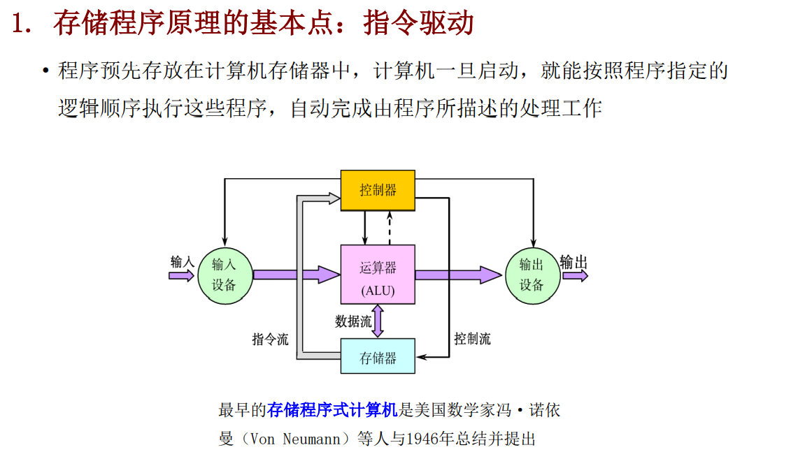
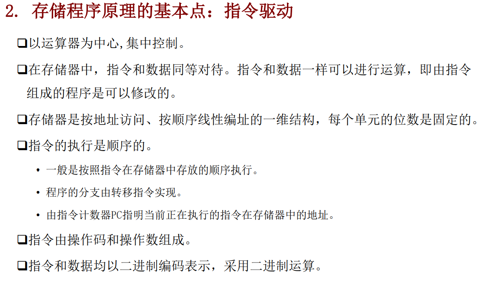
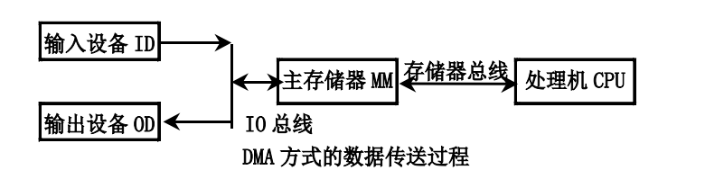
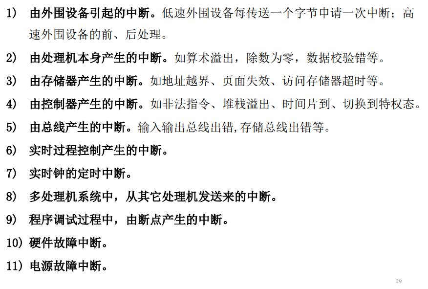

# 基本概念

## 冯诺依曼架构的特点

# 输入输出系统

## 基本原理

### 基本定义

处理机与存储系统之外的部分称为输入输出系统，包括输入输出==**设备**==，输入输出==接口==和输入输出**==软件==**等

### 特点

1. 是处理器与外界进行数据交换的通道
2. 最复杂和最多样性的部分
3. 硬件和软件的结合
4. 输入输出的复杂性隐藏在系统软件中，用户无需了解输入输出设备的细节

输入输出系统的特点集中反映在异步性，实时性和设备无关性

#### 实时性

1. 对于数据的及时处理，佛足额会造成丢失数据或者对外围设备工作造成影响
2. 实时控制系统中如果处理机提供的服务不及时，可能造成很大损失
3. 不同类型的设备，必须具有与设备相互配合的多种工作方式

#### 与设备无关性

1. 输入输出系统应该独立于设备的标准接口
2. 处理机采用统一的硬件和软件对品种繁多的设备进行管理
3. 尽可能做到即插即用

#### 异步性

1. 输入输出设备通常不采用统一的中央时钟，各个设备按照自己的时钟进行工作，但是在某些时刻会受到处理机的控制
2. 外围设备与处理机之间的交互是随机的
3. 处理机与外围设备之间，外围设备与外围设备之间都可以并行工作

### 输入输出系统的组织方式

1. 实时性->层次结构
2. 设备无关性->分类处理（例如面向字符的设备，面向数据块的设备）
3. 异步性->资质控制（输入输出系统是独立于CPU之外的自治系统）

### 基本输入输出方式

#### 程序控制输入输出方式

##### 特点

1. 何时对哪一种设备进行输入输出操作收到CPU的控制
2. CPU通过指令对设备进行测试才能知道设备的工作状态（例如空闲，准备，就绪，忙碌等）
3. 数据的输入输出都需要经过CPU
4. 用于连接低速的外围设备，例如打印机或终端

##### 优点

灵活性好，可以容易的改变各台外围设备的优先级

##### 缺点

不能实现处理机与外围设备的之间的并行工作

#### 终端输入输出方式

##### 定义

当出现来自系统外部，机器内部，甚至处理机本身的任何例外 的，或者虽然是事先安排的，但出现在现行程序的什么地方是事先不 知道的事件时，CPU暂停执行现行程序转去执行这些事件，等待处理之后在返回来继续执行原先的程序

##### 特点

1. CPU和外围设备之间可以并行工作
2. 能够处理例外事件
3. 数据的输入输出都需要经过CPU
4. 用于连接低速外围设备

##### 直接存储访问方式（DMA）

##### DMA

主要用于连接高速外围设备，例如磁盘存储器，磁带存储器、光盘辅助存储器，行式 打印机等

##### 特点

1. 主存储器既可以被CPU访问，也可以被外围设备访问
2. 外围设备的访问请求直接发往主存储器，数据的转送不需要经过CPU的干涉，不需要做保存现场和恢复现场等工作
3. DAM在开始和结束时需要处理机进行管理
4. CPU与外围设备并行工作，整个数据传送过程不需要CPU的干预
5. 数据交换过程全部在硬件控制下完成

##### DAM输入设备工作流程

1. 读数据：从设备读取一个字节到DMA控制器中的数据缓冲寄存器BD（DMA控制器中）。如果一个字没有装满，则返回上面，如果校验出错，则发出中断申请
2. 送数据：如果一个字已经填充满，则将BD中的数据送到主存数据寄存器
3. ==**送地址：把主存地址寄存器BA（DMA控制器中）的地址送到主存地址寄存器，并将主存地址寄存器BA增值**==
4. 计数器减一：将DMA控制器中的数据交换个数计数器减一
5. 判断是否停止：如果交换个数为0，则DMA数据传送过程结束，否则重复执行

##### DMA输出设备的工作流程

1. 把主存地址寄存器BA（DMA控制器中）中的地址送入主存地址寄存器， 并启动主存储器，同时将BA中的主存地址增值
2. 将主存储器数据寄存器中的数据送DMA控制器的数据缓冲寄存器BD
3. 把BD中的数据写到输出介质上（可能要逐个字符输出）
4. 把DMA控制器内的数据交换个数计数器中的内容减１ 
5. 若交换个数为0，则DMA数据传送过程结束，否则回到上

#### 三种DMA的实现方式

1. 周期窃取
2. 直接传送
3. 数据块传送

##### 周期窃取

1. 每一条执行执行结束时CPU测试是否有DMA服务的申请
2. 借用CPU完成DMA工作流程，包括数据和主存地址的传送
3. 优点：硬件结构简单，容易实现
4. 缺点：数据在输入或者输出过程中实际上占用了CPU的时间

##### 直接存取方式

1. DMA控制器的数据传送申请直接发往主存储器
2. 整个总做流程全部使用硬件完成
3. 优点不占用CPU的时间，缺点是硬件结构复杂

#### 数据块传送方式

1. 在设备控制器中设置一个比较大的数据缓冲存储器。设备控制器与主存 储器之间的数据交换以数据块为单位，并采用程序中断方式进行。
2. 采用数据块传送方式的外围设备有软盘驱动器、行式打印机、激光打印 机、卡片阅读机、绘图仪等。

## 中断系统

1. 中断系统需要硬件和软件共同实现
2. 硬气中断的各种事件成为中断源
3. 中断源可以来自系统外部也可以来自机器内部，设置处理器本身
4. 中断可以是硬件也可以是软件产生
5. 中断系统主要的考虑因素是中断响应时间和灵活性（硬件速度快但是灵活性差，软件正好相反）

### 中断源的分类组织 

1. 中断源分类组织的目的：在响应中断后能尽快找到中断入口
2. 一般分为可屏蔽中断和不可屏蔽中断
3. **==为每一类中断源分配一个硬件的中断入口，在进入这个入口之后，再通过软件找到具体的中断源。==**

### 中断源的种类

#### 中断优先级与中断服务顺序

1. 要求：响应速度快，灵活性好。
2. 做法：由硬件排队器决定中断优先级，通过软件设置**==中断屏蔽码改变 中断服务顺序==**

####  中断系统的软硬件分配

有些功能必须用硬件实现，有的功能必须用软件实现，而大部分功能既 可以用硬件实现，也可以用软件实现

# 存储系统

## 关于中断响应

1. 如果分析中断响应顺序和中断服务顺序

> 先响应 然后把响应的中断对应的中断屏蔽字设置好，然后看看有没有没被屏蔽的中断请求，如果有的话，取他们之中中断响应优先级高的再响应