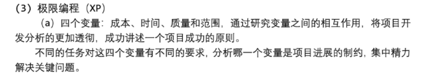
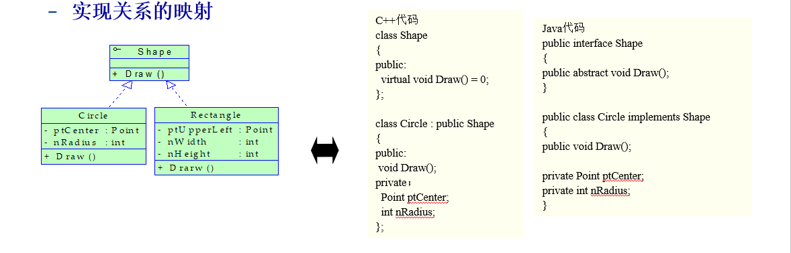

[toc]

# 分题型整理

## 理论

### 生命周期模型（软件过程模型）

软件过程模型是软件开发全过程中软件开发活动以及它们之间关系的结构框架

#### 瀑布模型

1. 开发阶段从一个阶段瀑布般地转到另一个阶段，并伴有文档

### 德米特法则

### 组织结构模型

# 提纲整理

## 第一章——软件工程概述

### 什么是软件开发过程？

按照项目的进度、成本和质量限制，开发和维护满足用户需求的软件所必需的一组有序的软件开发活动集合。

 

### 软件危机

软件危机是指落后的软件生产方式无法满足迅速增长的计算机软件需求，从而导致软件开发与维护过程中出现一系列严重问题的现象

### 错误、故障和失效

当人们在进行软件开发过程中出错，成为错误，出现的结果称为故障

例如设计人员可能误解了某一个需求，创建出与需求分人员和用户的十几亿图不想符合的设计，这种设计故障就是一种错误的编码，可能导致其他的故障。

单个错误可能导致多个故障，并且故障可能滞留在任何开发或者维护的产品中。

失效是指系统违背了他应用的行为，可能会在系统交付前或者交付后被发现，也可能在测试过程中或者在运行和维护过程中被发现。

关系：认为错误可能导致故障，故障可能导致失效

### 计算机学科和软件工程之间关系

### 高质量软件

#### 三个方面

1. 产品质量
2. 过程质量（生成该产品过程的质量）
3. 商业环境背景下的质量（产品将使用的商业环境背景的下的质量）

#### CMM

#### 泛型

### 系统要素、定义以及系统边界

#### 系统要素

软件系统要素：对象（实体）+活动+关系+系统边界

活动：活动是指发生在系统中的某些事情，通肠胃由某一个触发器引发的时间，活动通过改变某一个特性把一个事物转变为另一个事物。

对象（实体）：活动中设计的元素成为对象或实体（例如记录数据的对象）

关系：对实体和活动键数据项以及动作相互关系的描述

系统边界：用于描述系统包含什么，不包含什么

### 改变软件开发的关键因素（Wasserman）

1. 商用产品投入时长时间的紧迫性
2. 计算技术在经济上的转变：更低的硬件成本，更高的开发以及维护成本
3. 功能强大的桌面计算的可用性
4. 广泛的局域网和广域网
5. 面向对象技术的采用以及有效性
6. 使用窗口、图标、菜单和指示器的图形用户界面
7. 软件开发瀑布模型的不可预测性

### 增量开发

### Wasserman 规范

1. 抽象：基于某一种层次归纳水平的问题描述，是我们将注意力集中在问题的关键方面而不是细节方面

2. 分析、设计方法和符号描述系统：使用标准表示来对程序进行描述，利于交流，利于建模并检查其完善性和一致性，利于对需求和设计部分进行重用。

3. 用户界面原型化设计：建立系统的小型版，通常具有有限的关键功能，以利于用户评价和选择，证明设计或者方法的可行性。

4. 软件体系结构：定义一组体系结构单元以及相互关系集来描述系统。

5. 软件过程：软件开发活动中的各种组织以及规范方法

6. 复用或者重用：复用采用以前开发的软件系统中具有共性的部分，用到新的开发项目中去

7. 测度和集成环境：通用的评价方法和体系，有助于使过程和产品的戈丁产性更加课件，包括描述系统、量化审核系统。

8. 工具：通过框架比较软件工程环境提供的服务，以绝对其好坏。

   

## 第二章——软件过程模型

### 软件开发九个阶段

1. 需求分析和定义
2. 系统设计
3. 程序设计
4. 编写程序（程序实现）
5. 单元测试
6. 集成测试
7. 系统测试
8. 系统交付
9. 维护

每一个阶段本身就可以描述为一组活动的过程，并且每一个活动都包含约束，输出和资源。

### 瀑布模型

### 瀑布模型

定义：线性的安排每一个阶段 将开发阶段描述为从一个阶段瀑布般地转换到另一个阶段 。一个开发阶段必须在另一个开发阶段开始之前完成

特点：

1. 只有前一阶段工作完成以后，后一阶段的工作才能开始
2. 尽可能推迟软件的编码
3. 保证质量，在每个阶段都要完成规定的文档，每个阶段都要对已完成的文档进行复审

优点：

1. 它的简单性使得开发人员很容易向不熟悉软件开发的客户作出解释
   1.  每一个过程活动都有 其相关联的里程碑和可交付产品十 以便千项目经理评估项目进度。

2. 瀑布模型是最基础的模型，很多其他更复杂的模型实际上以瀑布模型为基础，如加入正反馈以及额外的活动。

缺点：

1. 缺乏灵活性，不能反映实际的代码开发方式
2. 文档转换有困难
3. 缺乏灵活性，不能反映实际的代码开发方式
4. 无法及时验证某一软件开发活动是否正确，最终产品直到最后一个步骤才出现，而软件客户无法在早期直到软件原型

适用场合

1. 技术和需求都到位：当有一个稳定的产品定义和很容易被理解的技术解决方案时，纯瀑布模型特别合适
2. 容易理解的顺序处理方法（体力活）：对于那些容易理解但很复杂的项目，采用纯瀑布模型比较合适，因为可以用顺序方法处理问题
3. 对质量要求较高：在质量需求高于成本需求和进度需求的时候，它尤为出色
4. 适合于小白：当开发队伍的技术力量比较弱或者缺乏经验时，瀑布模型更为适合

### 原型模型

#### 基本思想

软件开发人员在与用户进行需求分析时，以比较小的代价快速建立一个能够反映用户主要需求的原型系统，在实践过程中提出改进意见，开发人员根据用户的意见，对原型进行补充和完善，然后再由用户试用、评价、提出建议，重复这一过程，直到用户对开发的原型系统满意为止。

#### 优点

1. 从认知论的角度看，原型方**==法遵循了人们认识事物的规律==**，因而更容易为人们所普遍接受
2. 原型方法将模拟的手段引入分析的初期阶段，沟通了人们的思想，**==缩短了用户和开发人员之间的距离==**

#### 局限

1. 不适用于大型系统：对于一个**==大型系统==**，如果不经过系统分析得到系统的整体划分，而直接用原型来模拟是很困难的
2. 鲁棒性不好：对于原有应用的业务流程、信息流程混乱的情况，原型构造与使用有一定的困难
3. 不能批处理：对于一个批处理系统，由于大部分活动是内部处理的，因此应用原型方法会有一定的困难
4. 文档：文档容易被忽略
5. 难管理：项目难以规划和管理

#### 适用场景

1. 适合于那些不能预先确切定义需求的软件系统的开发
2. 适合于那些项目组成员（包括分析员、设计员、程序员和用户）不能很好交流或通信有困难的情况

### 阶段化开发

#### 基本思想

软件开发的不同阶段是按软件产品所具有的功能划分，先开发主要功能或用户最需要的功能，然后，随着时间推进，不断增加新的辅助功能或次要功能，最终开发出一个强大的、功能完善的、高质量的、稳定的产品。

因为有不断发布的开发系统和已经运行的产品系统 我们需要有一种组织两者的方式 增量开发和迭代开发是两种最常用的方式 

#### 增量开发

系统需求按照功能分成若干子系统，开始建造的版本是规模小的、部分功能的系统后续版本添加包含新功能的子系统 最后版本是包含全部功能的子系统集 

#### 迭代开发

系统开始就提供了整体功能框架，后续版本陆续增强各个子系统，最后版 本使各个子系统的功能达到最强。

1. 增量开发和迭代开发相结合：个新发布的版本可能包含新功能，并对已有功能做了改进 两种开发方式结合的原因包括
   1. 观察用户反馈
   2. 为新功能开拓市场
   3. 及时修复问 
   4. 针对不同版本设置不同专业领域技术的优先

#### 增量式模型的优点

1. 有利于增加客户对系统的信心
2. 降低系统失败风险
3. 提高系统可靠性，稳定性和可维护性

#### 增量式模型的优局限性

1. 增量粒度难以选择
2. 把每个新的增量构建集成到现有软件体系结构中时，必须不破坏原来已经开发出的产品
3. 容易退化为边做边改模型，从而是软件过程的控制失去整体性

#### 适用场景

1. 进行已有产品升级或新版本开发
2. 完成期限严格要求的产品
3. 对所开发的领域比较熟悉而且已有原型系统

### 螺旋模型

将开发活动与风险芒理结合起来，以降低和控制风险 有些类似于迭代开发模型 结合了迭代的思想 同时也结合了原型化的思想 该模型的适用范围于较大型软件工程项目

螺旋模型每次迭代有四个任务，依次是计划、目标／可选方案、风险评估、 开发与测试。螺旋模型一共有四次迭代、 依次是是操作概念、软件需求、软件设计、开发与测试。每一次迭代都根据需求和约束进行风险分析，以权衡不同选择 并且在确定选择之前 通过 原型化验证可行性和期望度。

### 敏捷方法

#### 四条原则

1. 介体和交互的价值胜过过程工具
2. 可以工作的软件胜过面面俱到的文档
3. 客户合作胜过合谈判
4. 响应变化胜过遵循计划

#### 敏捷开发常用方法（典型方法）

#### 极限编程

#### 四个准则 

1. 沟通：客户与开发者之间持续的交流意见 
2. 简单性：鼓励开发者选择最简单的设计或实现来应对客户的赛求 
3. 反馈：指在软件开发过程中的各个活动中，包含各种反馈循环 
4. 勇气：指尽早的和经常性的交付软件功能的承诺

#### 12个操作实践

1. 规划游戏
2. 小的发布
3. 隐喻
4. 简单设计
5. 首先编写测试
6. 重构
7. 对编程
8. 集体所有权
9. 持续集成
10. 可以忍受的步伐
11. 在现场的客户
12. 代码标准

#### 什么时候极限编程显得过于极端

1. 极限编程中的很多实践是相互依赖的，如果其中一个被修改，其他的都会受到影响。
2. 注重人员的沟通，忽略文档的重要性，若项目人员流动大太，给维护带来不少难度
3. 对编码人员的经验要求高，若项目存在新手比较多时，老员工比较累

#### 适用范围

1. 项目经常发生变更
2. 高风险的项目实施
3. 开发人员可以参与决策

#### 优点

1. 采用简单计划策略，不需要长期计划和复杂模型，开发周期短
2. 在全过程采用迭代增量开发、反馈修正和反复测试的方法，能够适应用户经常变化的需求
3. 注重市场快速反应能力，客户前期满意度高

### 静态建模和动态建模

#### 静态建模

描述—个过程如何由输入转换为输出

综合的过程符号描述系统 允许人们在任何详细的层次上对任何过程建模 该模型范 式中可由人员完成角色 由资源完成活动 最后导致软件 制品的产 模型可以 用角色、活动、 加工项 （工件） 来显示彼此之间的关系 用状态表显示每个加工项（工件）在 特定时间的完成情况。

#### 动态建模

推演一个过程，用户和开发人员可以看到中间产品和最终产品如何随着时间的推移进行转换。

## 第三章——计划和管理项目

### 名词解释

#### 项目进度（Project schedule）

通过列举项目的各个阶段，把每一个阶段分解成为离散的任务或者活动，来描述特定项目的软件开发周期。进度还绘制这些活动之间的交互，并估算每项任务或者活动将花费的时间。

因此，进度是一个时间线，说明活动在什么时候开始，在什么时候结束以及相关的开发产品在什么时候完成。

#### 活动（activity）和里程碑（milestone）

活动是项目的一部分，他在一段时间内发生。而里程碑是专门指定的活动的结束。

#### 前驱（precursor）

前驱是在活动开始之前必须发生的一个事件或者一组事件，他描述了活动开始的一组条件。

#### 活动图

活动图用于描述活动之间的依赖关系。图中的节点是项目里程碑，而连接节点的线段表示包含的活动。

#### 关键路径法

用于分析项目里程碑之间的路径的方法称为关键路径法。通过表明每一个活动工期的估算，路径可以告诉我们完成项目所需要的最短时间的量。

#### 甘特图（Gantt Chart）

甘特图用于对项目的描述，显示在什么地方活动是并行进行的，并用颜色或者图标来指明活动完成的程度。

### 人员工作风格

外向型、内向型

（理性的外向型、理性的内向型，感性的外向型，感性的内向型）

### 风险降低

降低风险的三种策略

1. 避免风险: 通过改变性能或功能需求
2. 转移风险: 把风险分配到其他系统中，或购买保险
3. 假设风险会发生: 接受并控制
4. 减少风险的成本

$$
风险杠杆 = (降低前的风险暴露 – 降低后的风险暴露) / (降低风险的成本)
$$

### 组织结构

### 负责制

1. 定义：由一个主程序员负责系统设计和开发 其他的成员向其汇报 ，主程序员对每一个决定有绝对决策权。
2. 优势：使交流最小化，可以迅速作出决定
3. 缺点：创造性低，对主程序员的要求较高，个人主观性强

### 忘我方法

1. 定义：每一个成员平等的承担责任，而且过程与个人是分开的；批评针对的是产品和结果，而不是针对个人。

### 从团队管理者和成员两个角度，探讨团队最好的管理、工作 方式

### COCOMOⅡ基本模型

COCOMO构造成本模型

### 项目管理

## 第四章——获取需求

### 风险承担者

风险承担者包括委托人、客户、用户、领域专家、市场研究人员、审计热源、软件工程师以及其他技术专家。

### 需求源

### 需求的类型

### 需求和规格说明

### 软件需求说明SRS

### 需求

定义：对来自用户的关于软件系统的期望行为的综合描述，涉及系统的对象、状态、约束以及功能。

任务：理解客户的问题和需求，针对的是客户和问题，不是问题和现实。

### 需求规格说明

需求规格说明将需求重新陈述为关于要构建和系统将如何运转的规格说明。该规格说明也是完全按照环境来编写的，唯一的区别是它仅仅提及通过其接口到系统是可 访问的环境实体。

### 确定需求的过程

1. 原始需求获取：客户给出的需求
2. 问题分析：理解需求并通过建模或者模型化方式进行描述
3. 规格说明草稿：利用符号描述系统将定义规范化表示
4. 需求核准：开发人员与客户进行核准
5. 软件规格说明：SRS

### 需求建模

#### E-R图

实体－联系图 entity-relationship diagram, ER diagram) (Chen 1976 种表示概念模型的流行 的图形表示法范型。

1. 实体 (entity) 表示为矩形 代农具有共同性质和 行为 的现实世界对象构成的集合（有时称为类）
2. 联系 relationship 表示为两个实体之间的边，边的中间有一个菱形， 说明联系的类型。
3. 属性 attribute) 是实体 的注释 描述实体相关 数据或性质

#### UML用例图

用例图着重于从系统外部执行者角度描述系统需要提供哪些功能，并且指明 这些功能虳执 行者是谁，用例图在 UML 中占 很重要的地位 ，甚至称为 UML 是一种用例驱动 开发方法

#### UML类图

描述了系统中的类及其相互之间的各种关系 其本质反映了系统中包含的各种对 象的类 及对象间的静态关系（关联、子类 等关系）

#### UML 包图

包图也存在类图里面的继承、 引用 等依赖关系，也包含接口 口与包之间用带 小圆圈的实线相连

#### UML序列图

序列图中的对象可以是并发执行的 每一个对象有自己运行的线程控制若 这时需要通过激活、异步消息、同步控制和活动对象来表示 序列图有两种，一种是描述特定对象 之间生存期中消息通信的所有情节，称作一般序列图 —种是描述消息通信的个别情节的实 例序列图 如果需要描述所有的情节 则需要多个实例序列图

### 

#### association

#### aggregation

### MSC

### State machine

### Petri网

### 数据流图DFD

数据流图建模功能以及从一个功能到另一个功能的数据流。其中一个泡泡表示一个交工或者功能，表示转换数据。箭头表示数据流，其中进入泡泡的箭头表示其功能的输入，从泡泡出去的箭头表示其功能的输出。

数据流图的优势之一是提供了两种直观模型，一种是关于被提议系统的高级功能的，一种是各种加工之间的数据依赖关系的。

数据流图的缺点是：对于领域的专家易于阅读，但是对于不太熟悉的人员来说，数据流图更加含糊不清。尤其是在解释一个具有多个输入流在DFD加工的方式有很多种。

特点：数据流图最好使用与熟悉建模的用户，并且最好作为问题的早期模型使用，因为此时问题的细节并不是很重要。

### UML用例图 

用例图着重于从系统外部执行者角度描述系统需要提供哪些功能，并且指明了这些功能的执行者是谁。

UML用例图类似于顶层的数据流图，他根据系统和系统的环境之间的角度，描述可观察到的、用户发起的功能。其中：

1. 大的方框表示系统的边界，方框外的小人描述的是参与者，包括人或系统，
2. 方框之内的椭圆是用例，表示必须的主要功能和变种。
3. 参与者和用例之间的线表明，参与者参与了用例。

### decision table（判定表）

判定表示函数规格说明的表格式表示，将事件和条件映射到适当的反应或者动作上。

### Parnas表

Parnas表示数学函数和关系的表格式表示，使用行和列将函数的定义分割为不同的情况。表的每一个条目要么指定部分第识别某些情况的一个输入条件，要么指定某些情况的输出值。并且Parnas表的输入输出是纯数学表达式。

### 时态逻辑

逻辑时态引入了额外的逻辑连接符，用以约束变量是如何随着时间的改变改变其值的。

### OCL

对象约束语言的目的是尝试创建一种即具有数学的精准性，又对非数学专业人员易读、易写、易理解的约束语言，是专门为表述对象模型（如ER图）上的约束而设计的一种语言，并且引入了这样一些语言成分：通过关键路径从一个对象导航到另一个对象，处理对象汇集，表达对象类型上的查询。

### SDL

三个主要图

1. SDL系统图
2. SDL方框图
3. SDL进程图

### 快速原型化的两种技术

1. 抛弃型原型：对了对问题或者提议的解决方法有更多的了解而开发的软件，永远不会作为交付软件的一部分。这种方法允许我们编写快速但是不考虑质量的软件。但是这种软件结构差，效率低，不进行错误检查。可以迅速的抓住我们面临的问题或者提议的解决方案的核心。
2. 演化型原型：演化型原型不仅帮助我们回答问题，而且要演变为最终的产品。该软件必须展现最终产品的质量需求（例如响应速度或者模块化），并且这些质量的要求不能改进。

### 建模还是原型化（**==建模与原型化在需求问题上的区别==**）

1. 探索关于需求的问题有两种方式，或者是建模，或者是原型化。
2. 一种方法是否比另一种方法更好，取决于我们的问题是什么，用模型表示更合适还是用软件表示更合适，以及构建模型或构建软件哪个更快。
3. 用原型更容易回答关于用户界面的问题。原型实现了一些提议的特征，将更有效地帮助用户对这些特征进行优先级划分，并可能识别出一些不必要的特征。
4. 另一方面，关于事件将要发生的顺序这样的约束问题，或者关于活动的同步这样的问题，使用模型能够更快速地得到答案。
5. 最后，我们必须给出最终的需求文档，供测试和维护小组、制定规章制度的机构以及最终要交付的软件使用。
6. 因此，模型好还是原型好，这取决于是模型以及从细化的模型开发软件更快、更容易，还是原型以及从细化的原型开发文档更快、更容易。

## 第五章——设计体系结构

### 六种分解

1. 功能性分解
2. 面性特征的分解
3. 面向数据的分解
4. 面向进程的分解
5. 面向事件的分解
6. 面向对象的设计

### 七种视图

1. 分解视图：将系统描述为若干个可编程的单元，这种视图可能是层次化的，且使用了多种模型。比如，一个模型中的单元可能在另一个模型中被扩展，以展示它本身的组成单元。
2. 依赖视图：这种视图展示了软件单元之间的依赖关系，例如一个单元调用另一个单元的过程。或者一个单元依赖于另一个或者几个单元产生的数据。这种视图在做项目计划时很有用，可以帮助我们确定哪些软件单元和其他单元没有依赖。因而可以被独立实现以及测试。
3. 泛化视图：用于展示一个软件单元是否是另一个单元的泛化或者特化。一个显著的例子就是面向对象的类之间的继承层次。这种视图在设计抽象或者可扩展的软件单元时非常有用。
4. 执行视图：这种视图是设计人员所绘制的传统的方框-箭头图。在考虑构建和连接器的情况下，展示了系统运行时的结构。每一个构建都是不同于其他构件的执行实体。可能拥有自己的程序站。连接器是一种构件之间的通信机制。
5. 实现视图：这种视图在代码单元和源文件之间建立映射。便于分析某个软件单元的实现
6. 部署视图：这种视图在运行时实体（构件和连接器）和计算机资源（处理器，数据存储器和通信网络）之间建立起映射，有利于设计人员分析一个设计的质量属性。
7. 工作分配视图：将系统分解成可以分配给各项目团队的工作任务。有利于项目管理人员跟踪各个团队的工作进度，并计划和分配工程资源。

### 7 个满足质量属性的策略

1. 可修改性：更该软件系统的难易程度
2. 可维护性：理解，改正、改动和改进软件的难易程度
3. 性能：描述了系统速度和容量的特点
4. 安全性：软件各种安全保密措施的有效性度量
5. 可靠性：软件产品在假设的环境下，按照规定的条件和规定的是啊金区间完成规定功能的能力。
6. 健壮性：系统在不正确的输入或者以外的环境条件下依然保持正确工作的能力。
7. 易用性：用户能够操作软件系统的容易程度。

### 故障树

### 割集树

P183

### KWIC不同设计方案对比

### Active design review

主动设计评审，是一个特别有效的评价SAD质量和确定他是否包含了正确的信息的方法

在主动评审中，评审人员通过在SAD中寻找信息来回答一些相关问题，而不是在阅读文档是发现问题，即被动设计评审。

### Passive design review

### ROI

### Payback period

### Product line

产品线

### core assert base

核心资产库

### 产品线的理念

(1）软件产品线:是指具有一组可管理的公共特性的软件密集性系统的合集，这些系统满足特定的市场需求或任务需求，并且按预定义的方式从一个公共的核心资产集开发得到

### 耦合

耦合是指两个软件之间的相互关联程度，耦合程度取决于模块之间依赖关系的多少，可以划分为紧密耦合，松散耦合以及非耦合。

面向对象的设计中模块之间的耦合度较低，现象对象设计的目标之一就是实现松散耦合。

### 内聚

内聚度是指模块内部各个组成部分的关联程度，内聚度越高，模块各个成分之间的相互关联越紧密。与总目标越相关。

总体来说，面向对象的设计是低耦合高内聚。

## 第六章——设计模块

### 面向对象设计的七个准则

常用的面向对象设计原则包括七个，这些原则并不是孤立存在的，它们相互依赖，相互补充

#### 单一职责原则

1. 定义：在软件系统中，一个类只负责一个功能领域中的相应职责。
2. 单一职责原则是实现高内聚、低耦合的指导方针，在很多代码重构手法中都能找到它的存在，它是最简单但又最难运用的原则，需要设计人员发现类的不同职责并将其分离，而发现类的多重职责需要设计人员具有较强的分析设计能力和相关重构经验。
3. 实例：

#### 开闭原则

1. 定义：一个软件实体应当对扩展开放，对修改关闭。也就是说在设计一个模块的时候，应当使这个模块可以在不被修改的前提下被扩展，即**==实现在不修改源代码的情况下改变这个模块的行为==**
2. 特点
   1. 抽象化是开闭原则的关键。 
   2. 绝大部分的设计模式都符合开闭原则，在对每一个模式进行优缺点评价时都会以开闭原则作为一个重要的评价依据，以判断基于该模式设计的系统是否具备良好的灵活性和可扩展性

#### 里氏代换原则定义 

1. 定义：所有引用基类（父类）的地方必须能透明地使用其子类的对象
2. 特点：
   1. 在软件中如果能够使用基类对象，那么一定能够使用其子类对象。把基类都替换成它的子类，程序将不会产生任何错误和异常，反过来则不成立，如果一个软件实体使用的是一个子类的话，那么它不一定能够使用基类。
   2. 里氏代换原则是实现开闭原则的重要方式之一，由于使用基类对象的地方都可以使用子类对象，因此**==在程序中尽量使用基类类型来对对象进行定义，而在运行时再确定其子类类型，用子类对象来替换父类对象==**。

#### **依赖倒转原则** 

1. 定义：要针对接口编程，不要针对实现编程
2. 特点：
   1. 代码要依赖于抽象的类，而不要依赖于具体的类；要针对接口或抽象类编程，而不是针对具体类编程。
   2. 实现开闭原则的关键是抽象化，并且从抽象化导出具体化实现，如果说开闭原则是面向对象设计的目标的话，那么依赖倒转原则就是面向对象设计的主要手段。 
3. 依赖倒转原则的常用实现方式之一是在代码中使用抽象类，而将具体类放在配置文件中。 依赖倒转原则要求客户端依赖于抽象耦合，以抽象方式耦合是依赖倒转原则的关键

#### 合成复用原则

1. 定义：尽量使用对象组合，而不是继承来达到复用的目的
2. 特点：
   1. 合成复用原则就是指在一个新的对象里通过关联关系（包括组合关系和聚合关系）来使用一些已有的对象，使之成为新对象的一部分。
   2. **==要尽量使用组合/聚合关系，少用继承。==**

#### 迪米特法则

迪米特法则就是指一个软件实体应当尽可能少的与其他实体发生相互作用。

迪米特法则主要用于控制信息的过载

在类的划分上，应该尽量创建松耦合的类，类之间的耦合度越低，就越有利于复用。一个处在松耦合中的类一旦被修改，也不会对关联的类造成太大的波及。

### 继承和组合

1. 在保持和复用代码的封装性方面，组合的方法要优于继承的方法，因为组合对象仅能通过他声明的接口来访问构件。
2. 组合的一个确定是对象组合引入了一层间接性，一个构件的方法的每一次访问都必须先访问这个构件对象，这种间接性可能会影响到程序运行时的性能。
3. 设计知道一般意见在组合和继承之间优先选择组合。

### Demeter德米特法则

通过把组合类中的作用在类构件上的每个方法都包含进来，可以降低他们的依赖程度。

一般情况下，德米特法则的设计具有更少的依赖关系，而类中的依赖关系越少，软件的故障也就越少，软件也就越容易修改。

另一方面，这种设计往往会使用包装类，以用来在不改变现有类的实现的前提下增加新的功能。

尽管使用包装类简化了向组合类中增加操作的任务，但是同时也会使得设计更加复杂从而降低运行时的性能。

#### ==基本思想==

迪米特法则主要用于控制信息的过载

在类的划分上，应该尽量创建松耦合的类，类之间的耦合度越低，就越有利于复用。一个处在松耦合中的类一旦被修改，也不会对关联的类造成太大的波及。

在类的结构的设计上，每一个类都应该尽量降低其成员变量和成员函数的访问权限。

在对其他类的引用上，一个对象对其他对象的引用应该降低到最低。

 

### 依赖倒置

#### 定义

依赖倒置是一种与面向对象相关的启发式方法。使用依赖倒置，可以把两个类之间的以来连接方向进行倒置。可以通过引入接口来实现依赖倒置。

#### 基本思想

高层模块不应该依赖于低层模块，而应该依赖于抽象。抽象不应该依赖于细节，细节应该依赖于抽象。

另一种表述为：要针对接口编程而不是针对实现编程。

#### 依赖倒转的实例

某系统提供一个数据转换模块，可以将来自不同数据源的数据转阿虎为多种数据格式（例如可以转换来自数据库的数据），也可以转换来自不同文本文件的数据，转换后的格式可以是xml文件，也可以是xls文件等。

### 过程中的 UML

### 七种设计模式 Design pattern:

1. 模板方法模式
2. 工厂方法模式
3. 策略模式
4. 装饰者模式
5. 观察者模式
6. 组合模式
7. 访问者模式

### 模式和框架

1. 

### 专化指数Specialization Index

## 第七章——编写程序

### 编程规范标准

### 指导原则：复用、通用性

### 文档：内部文档、外部文档

### 编程过程：XP、结对编程、融合、小组协同

# 题型描述

理论应用
请简述...理论，结合自己的项目实践，写出应用实例。

分析设计计算：
下图是...,请分析...,
有问题...,请设计...
已知...，请估算...

综合：
结合自己的软工项目实践,举例从X、Y、...等方面提高软件质量所做的重构工作。
对比前后...种设计方案的特点不同。

# 过程和生命周期的建模

## 传统软件开发模型

### 瀑布模型

定义：线性的安排每一个阶段 将开发阶段描述为从一个阶段瀑布般地转换到另一个阶段 。一个开发阶段必须在另 个开发阶段开始之前完成

优点：

1. 它的简单性使得开发人员很容易向不熟悉软件开发的客户作出解释
2. 每一个过程活动都有 其相关联的里程碑和可交付产品十 以便千项目经理评估项目进度。
3. 瀑布模型是最基础的模型，很多其他更复杂的模型实际上以瀑布模型为基础，如加入正反馈以及额外的活动。

缺点：

1. 无法处理实际过程中的重复开发问题：除了一些理 非常充分的问题之外，实际上软件是通过大员的迭代进 开发的 软件是 个创造的过程，不是一个制造的过程 软件变动时，该模型无法处理实际过程中 的重复开发问题
2. 文档转换有困难：它说明了每一个活动的产品（例如，需求、设计或代码），但没 有褐示一个活动如何把 种制品转化为另外一种制的（例如 从需求文档转化为设计文档）。

### V模型

模型是瀑布模型的变种，它说明测试活动是如何与分析和设计相联系的

一般来说，编码位于V型的顶点，分析和设计在左边 测试和维护在右边 测试的每个步骤都与分析和设计相对应，如 在验证和确认期间发现了问题 可以重新执行响应的步 骤加以修正 验收测试对应需求分析，系统测试对应系统设计 单元测试和集成测试对应程 序设计

### 原型化模型——在工作中学会工作

原型化并不依附于瀑布模型 原型化模型本身是有效的过程模型的基础 因为它允许用户以独立的工程模型的方式 阶段都基于原型的建立以快速构造系统 逐步完成各阶段任务。

### 螺旋模型

将开发活动与风险芒理结合起来，以降低和控制风险 有些类似于迭代开发模型 结合了迭代的思想 同时也结合了原型化的思想 该模型的适用范围于较大型软件工程项目

螺旋模型每次迭代有四个任务，依次是计划、目标／可选方案、风险评估、 开发与测试。螺旋模型一共有四次迭代、 依次是是操作概念、软件需求、软件设计、开发与测试。每一次迭代都根据需求和约束进行风险分析，以权衡不同选择 并且在确定选择之前 通过 原型化验证可行性和期望度。

## 增量式开发和迭代开发

因为有不断发布的开发系统和已经运行的产品系统 我们需要有一种组织两者的方式 增量开发和迭代开发是两种最常用的方式 

1. 增量开发：系统需求按照功能分成若干子系统，开始建造的版本是规模小的、部分功能的系统后续版本添加包含新功能的子系统 最后版本是包含全部功能的子系统集 
2. 迭代开发：系统开始就提供了整体功能框架，后续版本陆续增强各个子系统，最后版 本使各个子系统的功能达到最强。
3. 增量开发和迭代开发相结合：个新发布的版本可能包含新功能，并对已有功能做了改进 两种开发方式结合的原因包括
   1. 观察用户反馈
   2. 为新功能开拓市场
   3. 及时修复问 
   4. 针对不同版本设置不同专业领域技术的优先

## 敏捷开发

### 四条原则

1. 介体和交互的价值胜过过程工具
2. 可以工作的软件胜过面面俱到的文档
3. 客户合作胜过合谈判
4. 响应变化胜过遵循计划

### 敏捷开发常用方法（举例子）

### 极限编程

#### 四个准则 

1. 沟通：客户与开发者之间持续的交流意见 
2. 简单性：鼓励开发者选择最简单的设计或实现来应对客户的赛求 
3. 反馈：指在软件开发过程中的各个活动中，包含各种反馈循环 
4. 勇气：指尽早的和经常性的交付软件功能的承诺

#### Scrum

## 静态建模和动态建模

### 静态建模

描述—个过程如何由输入转换为输出

综合的过程符号描述系统 允许人们在任何详细的层次上对任何过程建模 该模型范 式中可由人员完成角色 由资源完成活动 最后导致软件 制品的产 模型可以 用角色、活动、 加工项 （工件） 来显示彼此之间的关系 用状态表显示每个加工项（工件）在 特定时间的完成情况。

### 动态建模

推演一个过程，用户和开发人员可以看到中间产品和最终产品如何随着时间的推移进行转换。

# 计划和管理项目

## 团队组织方法

### 主程序员负责制

1. 定义：由一个主程序员负责系统设计和开发 其他的成员向其汇报 ，主程序员对每一个决定有绝对决策权。
2. 优势：使交流最小化，可以迅速作出决定
3. 缺点：创造性低，对主程序员的要求较高，个人主观性强

### 忘我方法

1. 定义：每一个成员平等的承担责任，而且过程与个人是分开的；批评针对的是产品和结果，而不是针对个人。

### 项目组织和结构化和创造性

1. 结构化较强的团队：可以按时完成任务，工作标记比较循规蹈矩，项目虽然普通但是功能完善。适合于人员较多，项目稳定性和一致性高，使用较为正规的结构。
2. 结构化较弱的团队：可能不能按时完成任务，但是工作创造性高。涉及到大量的不确定因素时采用较为民主的方法和相关的团队结构。

## 工作量估计

### 专家估算法

很多工作虽估算方法依赖于专家的判断。使用专家的知识和经验 对软件项目的工作虽 进行评估预测的精确性基千估算者的能力、经验、客观性和洞察力 是对构建整个系统或 其子系统所需的工作兰做 出经验性的 猜测

### 算法方法

研究人员创建出表示工作量和影响工作量的因素之间关系的模型。

# 需求获取

## 需求

定义：对来自用户的关于软件系统的期望行为的综合描述，涉及系统的对象、状态、约束以及功能。

任务：理解客户的问题和需求，针对的是客户和问题，不是问题和现实。

### 需求规格说明

需求规格说明将需求重新陈述为关于要构建和系统将如何运转的规格说明。该规格说明也是完全按照环境来编写的，唯一的区别是它仅仅提及通过其接口到系统是可 访问的环境实体。

## 各种图

### E-R模型

实体－联系图 entity-relationship diagram, ER diagram) (Chen 1976 种表示概念模型的流行 的图形表示法范型。

1. 实体 (entity) 表示为矩形 代农具有共同性质和 行为 的现实世界对象构成的集合（有时称为类）
2. 联系 relationship 表示为两个实体之间的边，边的中间有一个菱形， 说明联系的类型。
3. 属性 attribute) 是实体 的注释 描述实体相关 数据或性质

#### ER图的符号表示

### UML图的符号表示

1. 大矩形：类

2. 实心菱形+双向箭头：关联关系（说白了就是一个类中有另一个类的对象）

3. 实现+空心三角：泛化关系的映射（说白了就是继承，从子类指向父类）

4. 虚线+空心三角：实现关系（说白了就是实现虚函数）

5. 就只有一个单向箭头：依赖关系

### UML用例图

用例图着重于从系统外部执行者角度描述系统需要提供哪些功能，并且指明 这些功能虳执 行者是谁，用例图在 UML 中占 很重要的地位 ，甚至称为 UML 是一种用例驱动 开发方法

(组合是实心菱形，聚合是空心菱形)

### UML类图

描述了系统中的类及其相互之间的各种关系 其本质反映了系统中包含的各种对 象的类 及对象间的静态关系（关联、子类 等关系）

### UML 包图

包图也存在类图里面的继承、 引用 等依赖关系，也包含接口 口与包之间用带 小圆圈的实线相连

### UML序列图

序列图中的对象可以是并发执行的 每一个对象有自己运行的线程控制若 这时需要通过激活、异步消息、同步控制和活动对象来表示 序列图有两种，一种是描述特定对象 之间生存期中消息通信的所有情节，称作一般序列图 —种是描述消息通信的个别情节的实 例序列图 如果需要描述所有的情节 则需要多个实例序列图

# 设计体系结构

## 模块独立性

### 耦合

定义：耦合是指两个软件之间的相互关联程度，耦合程度取决于模型之间的依赖关系的多少，具体划分为紧密耦合，松散耦合和非耦合。

### 内聚

定义：内聚是指模块内部各个组成部分的关联程度，内聚度越高，模块各个成分之间的相互联系越紧密，与总目标越相关。

内聚分为低内聚和高内聚。

# 设计模块

## 名词解释

1. 模块化：模块化也称作关注点分离，是一种把系统中各个不相关的部分进行分离的原则，以便于各个分部可以独立的研究。
2. 抽象：抽象是一种忽略一些细节来关注其他细节的模型或表示。

# 计算题（包括画图题）

## 静态单变量模型

## 判定表

### Parnas表

## 数据流图

## 关键路径的计算

类比AOV、AOE网络的计算，先正向按照拓扑序动态规划找最短路。之后逆着拓扑序向后动态规划，找最晚开始时间。

## 故障树

## 割集树

## 都有哪几种测试方法

## 风险暴露

？？？